```{r child = "../setup.Rmd"}
```

<!-- In my upcoming talk, 'GitHub (and Data Science Tools) for Psychologists,'  I will showcase the expansive capabilities of GitHub. Initially conceived for software developers, this version control platform holds untapped potential for the psychology community. We’ll start by showcasing applications of GitHub, from managing research labs and teaching courses to publishing academic papers. Following this, I will provide an overview of the platform, shedding light on how it facilitates project management, code sharing, and tool development through its tracking and collaboration features. Tailored specifically for psychologists, this session will demonstrate practical ways in which GitHub can enhance research productivity and collaboration. Join us to explore how GitHub transcends its software development origins to become an indispensable tool in the field of psychology. -->

```{r packages, echo=FALSE, message=FALSE, warning=FALSE}
# Remember to compile
#xaringan::inf_mr(cast_from = "..")
#       slideNumberFormat: ""  
knitr::opts_chunk$set(knitr.duplicate.label = "allow")
library(tidyverse)
if (!require("emo")) devtools::install_github("hadley/emo")
library(emo)
```

---

class: middle

# Hello world!


```{r echo=FALSE,out.width="10%",fig.align='center',fig.cap="QR code for these slides",fig.height=3}
library(qrcode)
code <- qr_code("https://datascience4psych.github.io/slides/00_ASU/d00_slide#1")
plot(code)
```

---


# What is Git? What is GitHub?

.pull-left[
- **Git:** A distributed Version Control System (VCS). 
  - Effectively, it is a tool for easily tracking changes to your code, collaborating, and sharing. 
  - With Git you can track the changes you make to your project so you always have a record of what you’ve worked on and 
  - can easily revert back to an older version if need be. 
  - It also makes working with others easier—groups of people can work together on the same project and merge their changes into one final source!
] 
--
.pull-right[ 
```{r echo=FALSE, out.width="90%"}
knitr::include_graphics("img/git-logo.png")
```
]

---

# What is GitHub?
.pull-left[
- **GitHub:** A web-based platform built that extends Git’s capabilities by providing a web-based interface for collaboration. 
  - It’s widely used for code development, 
  - allowing multiple people to work together on projects. 
  - GitHub hosts your repositories (project folders) and 
  - provides tools for managing changes, reviewing code, and collaborating with others.
]
--
.pull-right[ 
```{r echo=FALSE, out.width="50%"}
knitr::include_graphics("img/github_logo.png")
knitr::include_graphics("img/github-mark.png")
```
]

---

# Why GitHub for Psychologists?

- **Collaboration Made Easy:** Facilitates seamless collaboration across the globe, essential for multi-center studies and remote teams.
- **Project Management:** Whether it's research data, experimental protocols, or manuscripts, manage all aspects of your projects in one place.
- **Transparency and Reproducibility:** Open-source projects and data sharing align with the principles of open science, enhancing credibility and reproducibility.
- **Educational Tool:** GitHub Classroom enables interactive learning, allowing students to submit assignments and get feedback easily.
- **Streamlined Publishing:** Use platforms like JOSS (The Journal of Open Source Software) to publish tools developed for psychological research, fostering innovation.
- For psychologists, GitHub offers a platform to not only enhance research productivity but also contribute to a more open and collaborative scientific community.

---

# Exploring GitHub's Potential for the Psychology Community

---

# GitHub for Project Management

- **Centralized Workspace:** Manage your research projects in a single space, accessible to the whole team.
- **Issue Tracking:** Log tasks, bugs, and feature requests as issues to keep track of project progress.
- **Milestones:** Set important project milestones to track progress towards major goals.
- **Project Boards:** Use Kanban-style boards to visualize workflow, from idea to implementation.

.footnote[Learn more about GitHub for project management: [GitHub Project Management](https://docs.github.com/en/issues/trying-out-the-new-projects-experience)]

---

## Managing Research Projects and Labs

- **Collaboration at Scale:** GitHub enables team members to work together seamlessly, regardless of their location.
- **Transparency and Reproducibility:** By hosting your lab's projects on GitHub, you ensure that your research processes are transparent and your results are reproducible.
- **Example:** My [R Computing Lab](https://github.com/R-Computing-Lab) demonstrates how labs can manage datasets, code, and collaborate on analysis in real(ish)-time.

.pull-left[
```{r echo=FALSE, out.width="45%"}
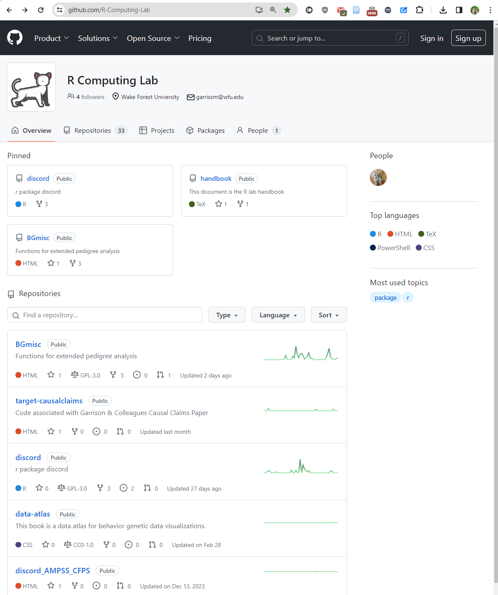
```
]
.pull-right[
```{r echo=FALSE, out.width="45%"}
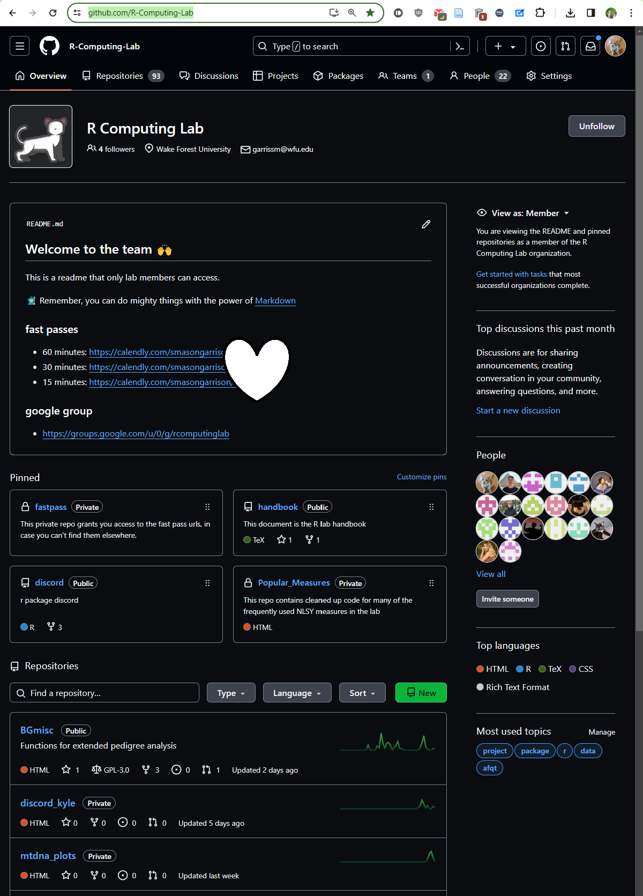
```
]
---

.pull-left[
```{r echo=FALSE, out.width="90%"}

```
]
.pull-right[
```{r echo=FALSE, out.width="90%"}

```
]


---

## Teaching Courses

.pull-left[
- **Interactive Learning:** GitHub provides a platform for sharing up-to-date course materials and notes, making learning more interactive and engaging.
- **Version Control for Syllabi:** Easily update and revise syllabi policies, dates etc. (https://smasongarrison.github.io/syllabi/)
- **Examples:** The [Data Science for Psychologists course repository](https://github.com/DataScience4Psych) repository showcases how GitHub can be used to enhance the teaching and learning experience.
]

--
.pull-right[
```{r echo=FALSE, out.width="85%"}
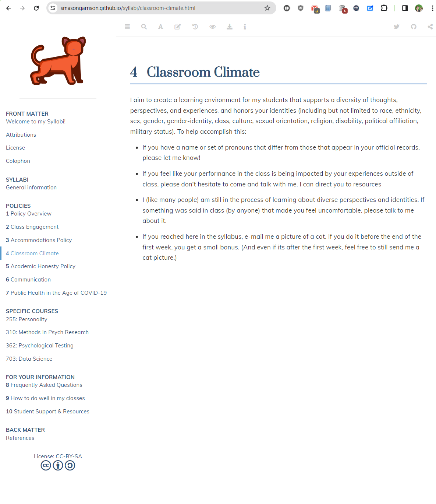
```
]
---

### Data Science for Psychologists

.pull-left[
```{r echo=FALSE, out.width="85%"}
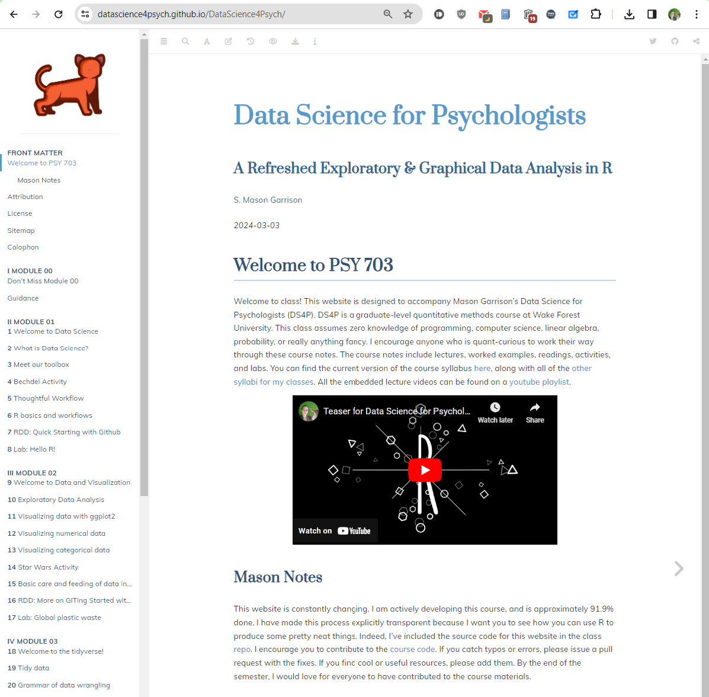
```
]
.pull-right[
```{r echo=FALSE, out.width="85%"}
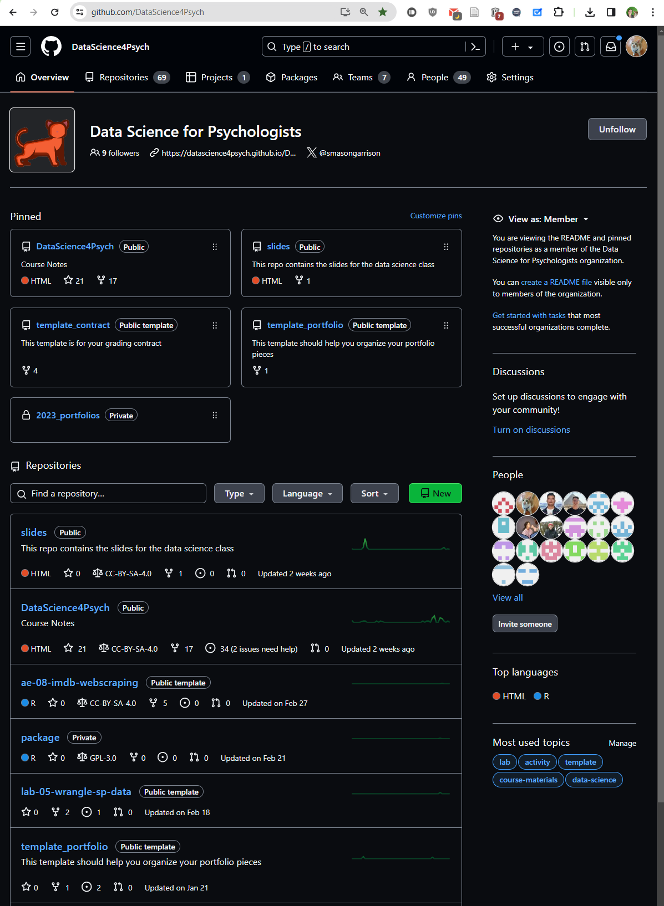
```
]

---

## Publishing Academic Papers

- **Streamlined Publication Process:** GitHub supports the publishing process with version control and collaboration, making the development and review of manuscripts more efficient.
- **Open Collaboration:** Encourages open and collaborative peer review and feedback from the global community.
- **Example:** The Journal of Open Source Software (JOSS) uses GitHub to manage submissions, reviews, and publication processes.  https://joss.theoj.org/papers/10.21105/joss.06203

--
.pull-left[
```{r echo=FALSE, out.width="100%"}
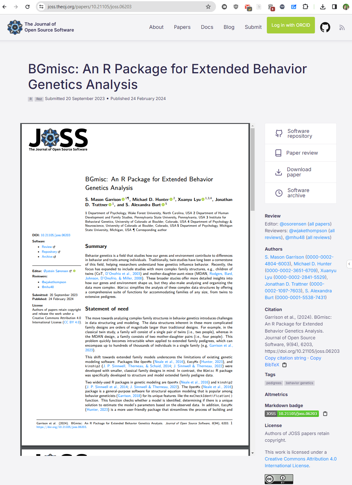
```
]
.pull-right[
```{r echo=FALSE, out.width="100%"}
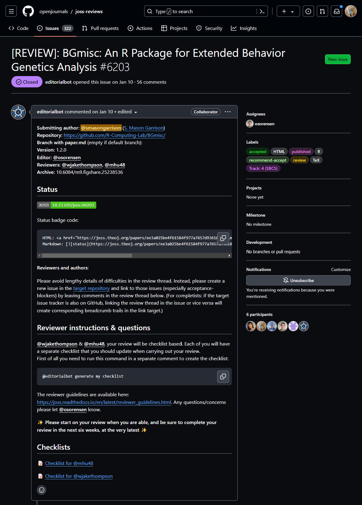
```
]
---

## Website Hosting with GitHub

<!-- Beyond code and collaboration, GitHub serves as an efficient host for personal academic websites, CVs, and even presentations like this one. -->

- **Showcase Your Work:** GitHub Pages allows researchers and academics to host their professional portfolios, CVs, and even project pages for free.
- **Example:** Visit [S. Mason Garrison's CV](https://smasongarrison.github.io/CV-Tex/SMasonGarrisonCV.pdf) hosted on GitHub for an example of how you can use GitHub Pages to host your academic CV.


.pull-left[
```{r echo=FALSE, out.width="100%"}
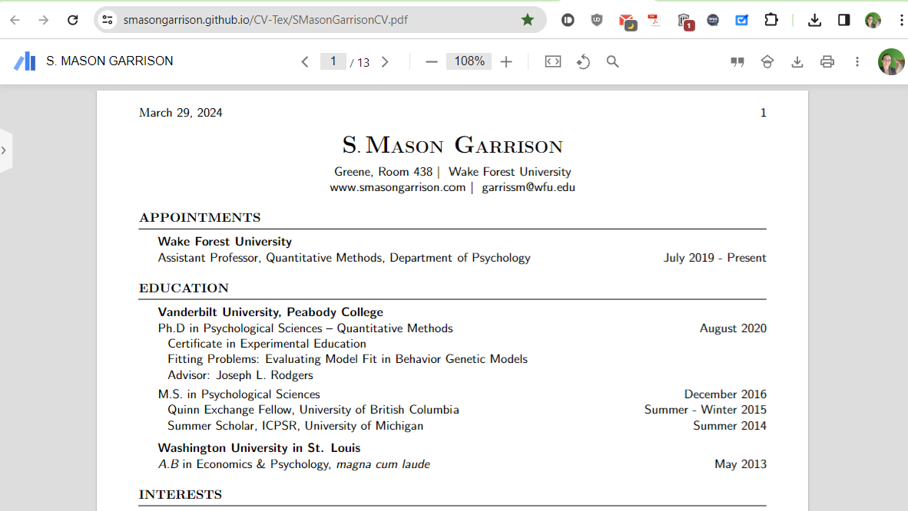
```
]
.pull-right[
```{r echo=FALSE, out.width="100%"}
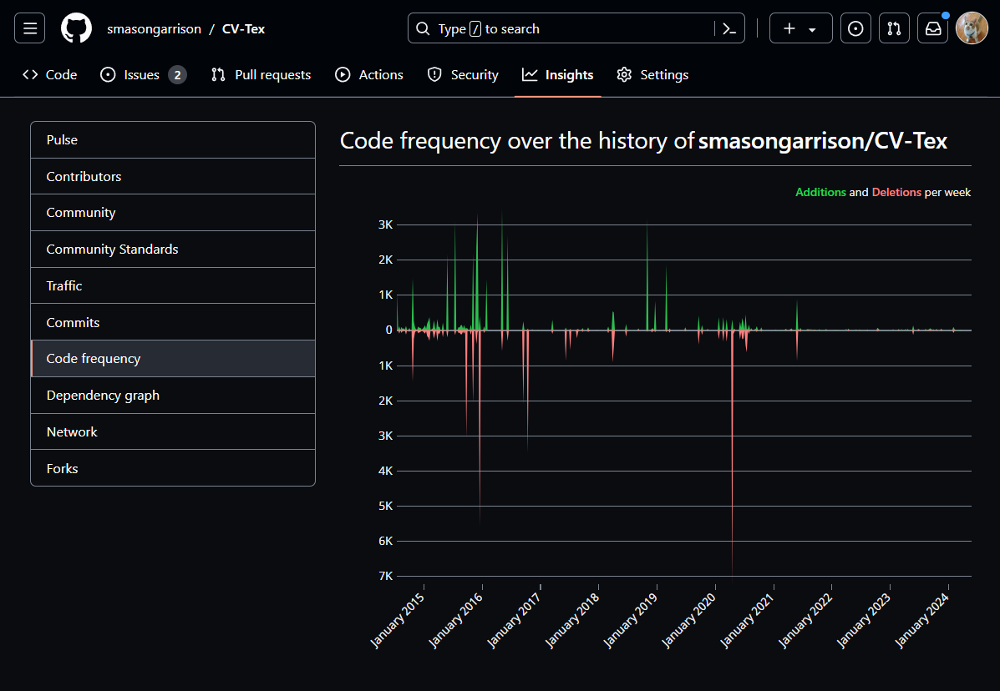
```
]


---

# Intriguing, right?


---


# GitHub toolkit overview

---

```{r echo=FALSE, out.width="100%"}
knitr::include_graphics("img/whole-game-01.png")
```

---

```{r echo=FALSE, out.width="100%"}
knitr::include_graphics("img/whole-game-02.png")
```

---

```{r echo=FALSE, out.width="100%"}
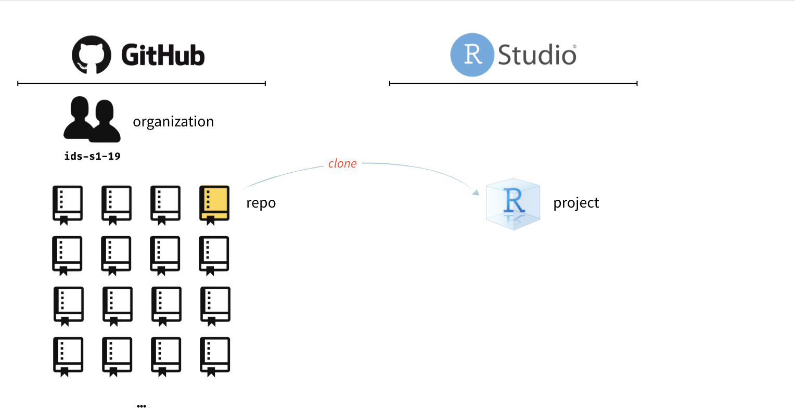
```

---

```{r echo=FALSE, out.width="100%"}
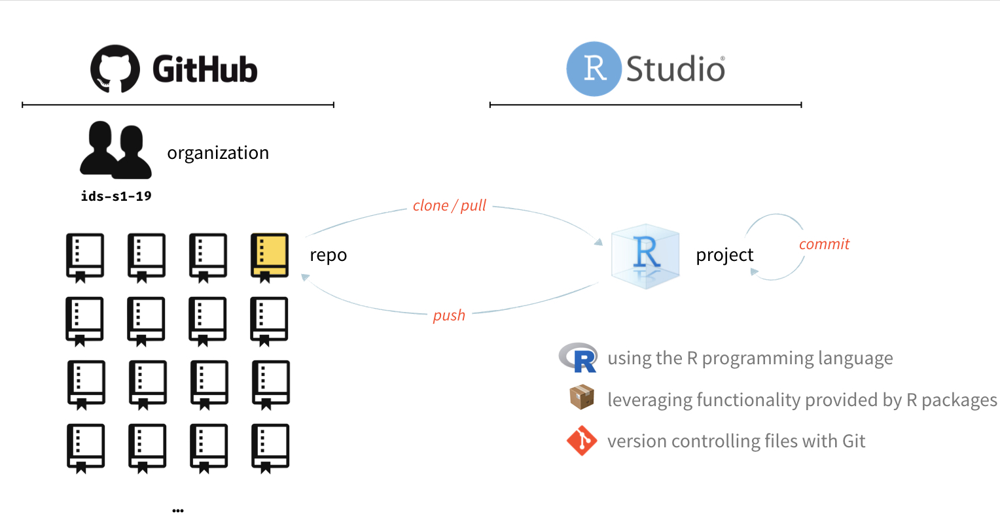
```

---

## Terminology Cheat Sheet

- Repositories (Repo)
  - Store your projects in repositories, including all files, revisions, and documentation.

-Branches
  - Work on different versions of a repository at the same time, allowing for parallel development.

- Commits
  - Save changes to your project, creating a transparent history of your work and decisions.

- Pull Requests
  - Propose changes to a project and discuss those changes with project collaborators before merging them.

- Issues
  - Track ideas, enhancements, tasks, or bugs for your projects. Organize with labels, assignees, and milestones.

---

class: middle

# Git and GitHub

---

## Version control

- We introduced GitHub as a platform for collaboration
- But it's much more than that...
- It's actually designed for version control

---

## Versioning

```{r echo=FALSE, fig.align = "center", out.width = "70%"}
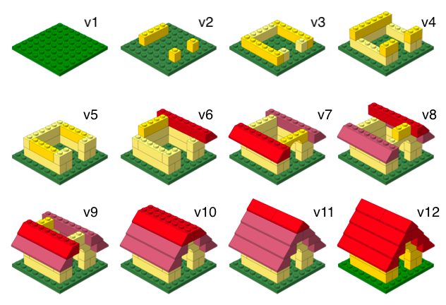
```

---

## Versioning with human readable messages

```{r echo=FALSE, fig.align = "center", out.width = "70%"}

```

---

## Why do we need version control?

```{r echo=FALSE, fig.align = "center", out.width="40%"}

```

---

# Git and GitHub tips

- Git is a version control system -- like “Track Changes” features from Microsoft Word on steroids. GitHub is the home for your Git-based projects on the internet -- like DropBox but much, much better).

--
- There are millions of git commands -- ok, that's an exaggeration, but there are a lot of them -- and very few people know them all. 99% of the time you will use git to add, commit, push, and pull.

--
- We will be doing Git things and interfacing with GitHub through RStudio, but if you google for help you might come across methods for doing these things in the command line -- skip that and move on to the next resource unless you feel comfortable trying it out.

--
- There is a great resource for working with git and R: [happygitwithr.com](http://happygitwithr.com/). Some of the content in there is beyond the scope of this talk, but it's a good place to look for help.

---

## Let's take a tour - Git and GitHub

.center[

]

- Connect an R project to Github repository
- Working with a local and remote repository
- Making a change locally, committing, and pushing
- Making a change on GitHub and pulling


---

## Create a GitHub account

.small[
.instructions[
Go to [github.com](https://github.com/), and create an account (unless you already have one). 
]
]

Tips for selecting a username:<sup>✦</sup>

.small[
- Incorporate your actual name.
- Reuse username from other contexts, e.g., Twitter or Slack.
- Pick a username you'll be comfortable revealing to your future boss.
- Shorter is better than longer.
- Be as unique as possible in as few characters as possible.
- Make it timeless. Don't highlight your current university, employer, etc.
- Avoid words laden with special meaning in programming, like `NA`.
]


--
.small[ 
<sup>✦</sup> Source: [Happy git with R](http://happygitwithr.com/github-acct.html#username-advice) by Jenny Bryan
]

---

class: middle

## Practical Demonstrations

---


# Getting Started with GitHub

1. **Sign Up on GitHub**
   - Visit [GitHub.com](https://github.com/) and create a new account.
   
2. **Create Your First Repository**
   - Click the "+" icon in the top right corner and select "New repository".
   - Name your repository and optionally add a description.

3. **Install Git**
   - Download and install Git from [git-scm.com](https://git-scm.com/).

4. **Configure Git with RStudio**
   - In RStudio, go to Tools > Global Options > Git/SVN and make sure Git is recognized.

5. **Clone a Repository**
   - Use the "New Project" wizard in RStudio to clone your repository for local work.

6. **Resources to Learn More**
   - [GitHub Guides](https://guides.github.com/)
   - [Happy Git and GitHub for the useR](http://happygitwithr.com/)

Start experimenting with small projects to get comfortable with the workflow. Happy coding!

---

# Practical Demonstrations: Connecting R to GitHub


## Step 1: Create a New Repository on GitHub

- Go to [GitHub](https://github.com/) and click on "New" in the Repositories tab.
- Name your repository and add a brief description.
- Choose to initialize with a README for an easy start.

## Step 2: Clone the Repository in RStudio

- In RStudio, go to File > New Project > Version Control > Git.
- Paste the URL of your GitHub repository.
- Choose a directory to store the project on your computer.

## Step 3: Make Changes and Commit

- Modify an existing file or create a new file in the RStudio project.
- Go to the Git tab in RStudio, check the files you've changed, and click "Commit".
- Write a commit message describing the changes and commit.

## Step 4: Push Changes to GitHub

- After committing your changes, click the "Push" button in RStudio to update your GitHub repository.
- Your changes are now on GitHub!

## Step 5: Pull Changes from GitHub

- If changes are made on GitHub (by you or collaborators), you can update your local repository by clicking "Pull" in RStudio.

.footnote[For a detailed guide, check out [Happy Git and GitHub for the useR](http://happygitwithr.com/)]


---


class: middle

# Conclusion and Q&A

- Today, we explored how GitHub can revolutionize research and collaboration in psychology.
- We've seen its potential from managing labs to hosting websites.
- Remember, the journey of a thousand miles begins with a single step. Start small and explore!

---

## Any Questions?

Feel free to ask any questions now, or reach out to me after the talk via email garrissm@wfu.edu or on github github.com/smasongarrison.

```{r qr_ds4p, echo=FALSE, fig.align = "center", out.width = "30%"}
library(qrcode)
code <- qr_code("https://DataScience4Psych.github.io/DataScience4Psych/")
plot(code)
```

