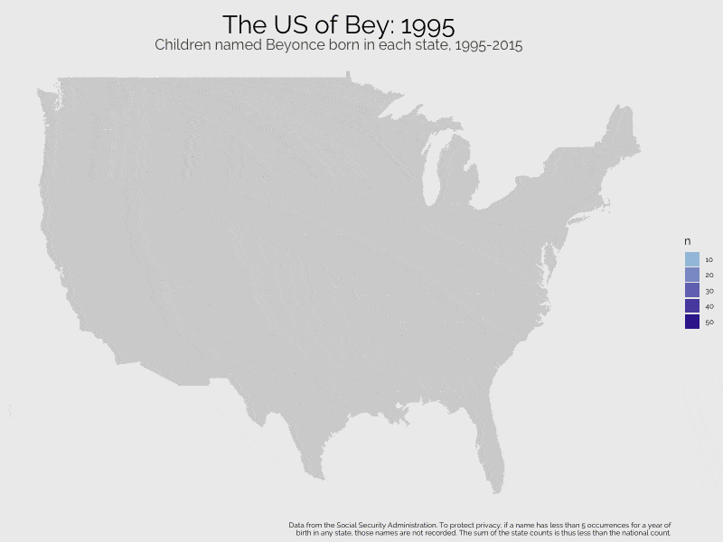
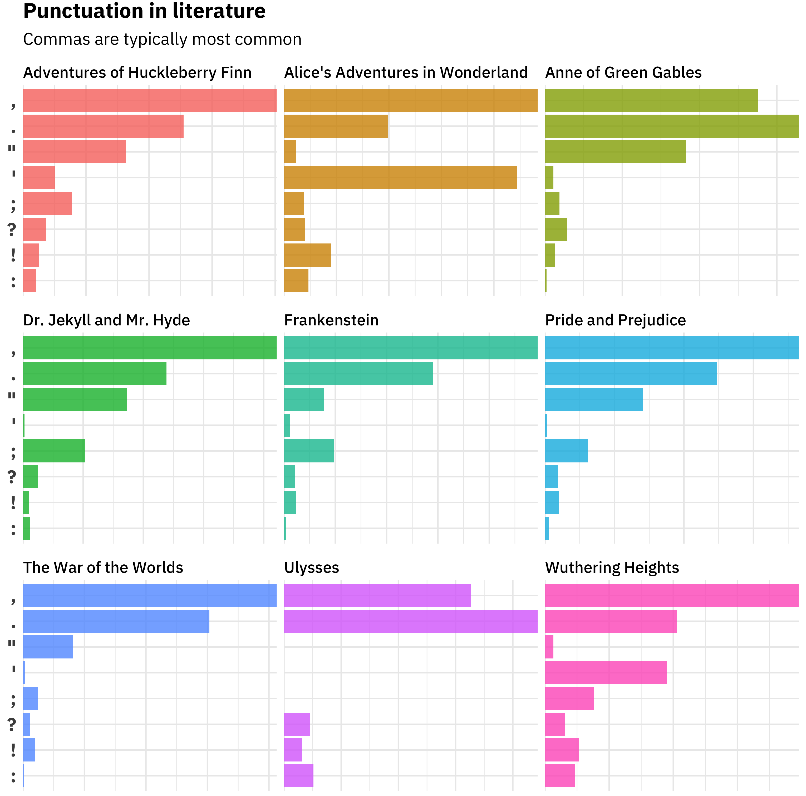
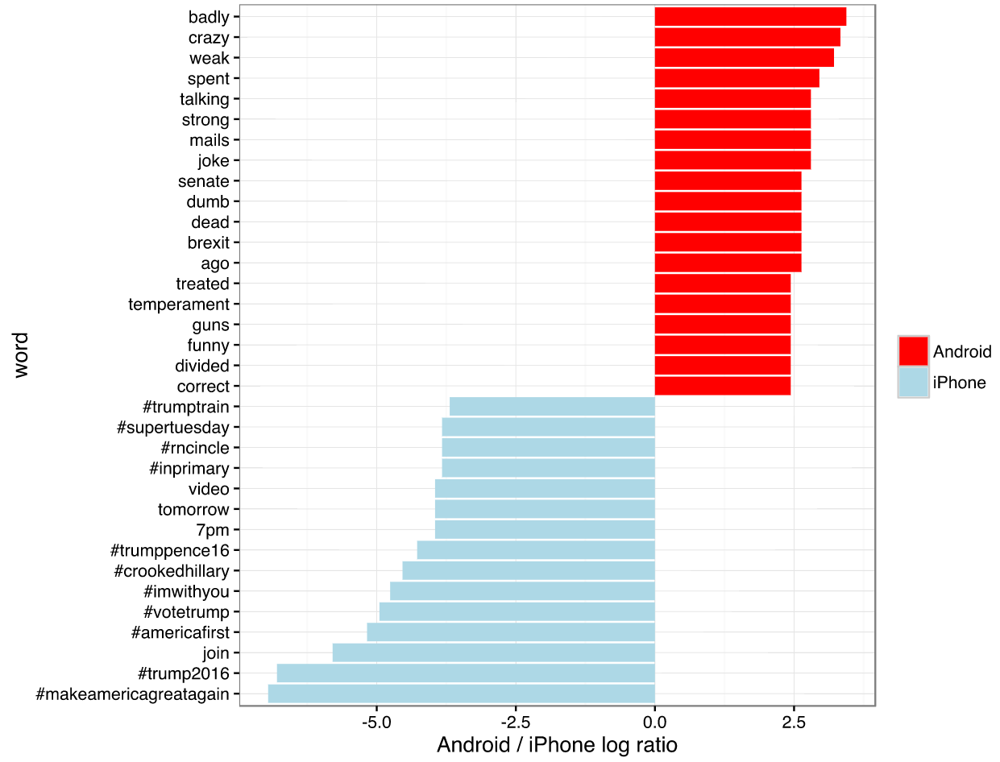
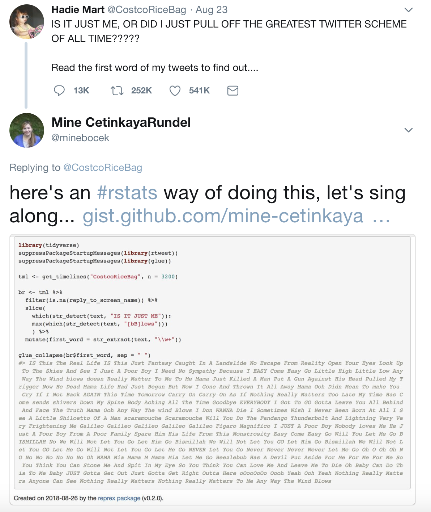
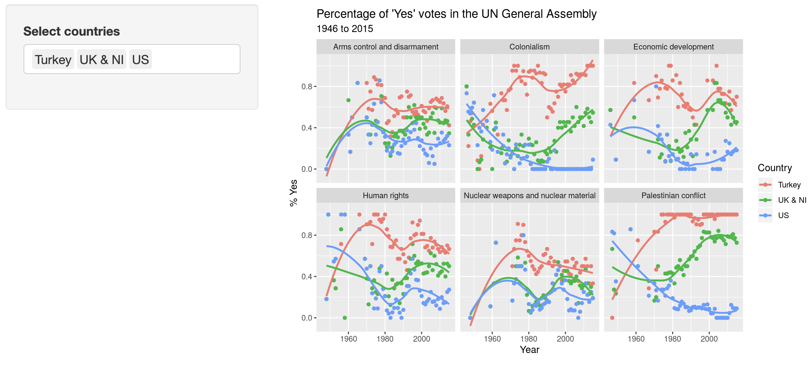

```{r child = "../setup.Rmd"}
```

```{r packages, echo=FALSE, message=FALSE, warning=FALSE}
knitr::opts_chunk$set(knitr.duplicate.label = "allow")
library(tidyverse)
if (!require("emo")) devtools::install_github("hadley/emo")
library(emo)
if (!require("jasmines")) devtools::install_github("djnavarro/jasmines")
if (!require("mathart")) devtools::install_github("marcusvolz/mathart")
```

## Hello world!

## What is data science?

- <i class="fa fa-database fa"></i> + <i class="fa fa-flask fa"></i> = data science?
- <i class="fa fa-database fa"></i> + <i class="fa fa-code fa"></i> = data science?
- <i class="fa fa-database fa"></i> + <i class="fa fa-user fa"></i> + <i class="fa fa-code fa"></i> = data science?
- <i class="fa fa-database fa"></i> + <i class="fa fa-users fa"></i> + <i class="fa fa-code fa"></i> = data science?

.large[
Data science is an exciting discipline that allows you to turn raw data into understanding, insight, and knowledge. We're going to learn to do this in a `tidy` way -- more on that later!
]

## What is this course?

This course is an introduction to data science that is designed for psychologists. It emphasizes statistical thinking and best practices.

**Q - What data science background does this course assume?**  
A - None.

**Q - Is this an intro CS course?**  
A - Although statistics and computer science ≠ data science, they are very closely related and have tremendous overlap. Hence, this course is a great way to get comfortable with those topics. However this course is **not** your typical course.

**Q - Will we be doing computing?**   
A - Yes.

**Q - What computing language will we learn?**  
A - R.

**Q: Why not language X?**  
A: We can discuss that *remotely* over `r emo::ji("coffee")`.

## Where is this course?

.large[
.center[
[DataScience4Psych.github.io/DataScience4Psych/](https://DataScience4Psych.github.io/DataScience4Psych/)
]
]

## Wrapping up... Hello world!

## Data in the wild

## The US of Bey

```{r fig.align="center", echo=FALSE, out.width="55%"}

```

.footnote[Brooke Watson, [blog.brooke.science/posts/the-us-of-bey](https://blog.brooke.science/posts/the-us-of-bey)
]

## Punctuation in literature

```{r fig.align="center", echo=FALSE, out.width="45%"}

```

.footnote[ Julia Silge, [juliasilge.com/blog/punctution-literature](https://juliasilge.com/blog/punctution-literature/)]

## Text analysis of Trump's tweets

```{r fig.align="center", echo=FALSE, out.width="61%"}

```

.footnote[David Robinson, [varianceexplained.org/r/trump-tweets](http://varianceexplained.org/r/trump-tweets)
]

## Greatest Twitter scheme of all time

```{r fig.align="center", echo=FALSE,out.width="38%"}

```

.footnote[
[gist.github.com/mine-cetinkaya-rundel/03d7516dea1e5f2613a5d71c28edb08d](https://gist.github.com/mine-cetinkaya-rundel/03d7516dea1e5f2613a5d71c28edb08d)
]

## Voting patterns in the UN

[minecr.shinyapps.io/unvotes](https://minecr.shinyapps.io/unvotes/)

```{r echo=FALSE, out.width="100%"}

```

## Wrapping up... Data in the wild

## Course structure and policies

## Logistics

- PSY 703: Data Science for Psychologists (Flipped Classroom)
- S. Mason Garrison (Green 438/Zoom)
- Office Hours: [calendly.com/smasongarrison](http://www.calendly.com/smasongarrison/)
- Tukey `r emo::ji('cat_face')`, Archie `r emo::ji('smiley_cat')`, Annie `r emo::ji('pouting_cat')`

## Structure

- Interactive: Some lectures, lots of learn-by-doing
- Mondays: Face-to-Face Tutorials
- Wednesdays: Solidarity Sessions
- Bring your laptop! `r emo::ji('computer')`
- Flipped Lectures: Pre-recorded lectures, weekly modules

## Big Ideas

- Reproducibility
- Replication
- Robust Methods
- Really Nice Visualization
- R

```{r echo=FALSE, out.width="95%",fig.align = 'left'}
knitr::include_graphics("img/plot007w.png")
```

## Categories of Topics

- What
- How

```{r echo=FALSE, out.height="150%"}
knitr::include_graphics("img/p0.png")
```

.footnote[ adapted from: https://towardsdatascience.com/getting-started-with-generative-art-in-r-3bc50067d34b]

## Learning Outcomes

- Use R to visualize and model many kinds of data
- Given a dataset: visualize, hypothesize, analyze, and communicate

## Materials

- Textbook: R for Data Science (r4ds.had.co.nz)
- Coursenotes: [datascience4psych.github.io/DataScience4Psych](https://datascience4psych.github.io/DataScience4Psych/)
- Software: R, RStudio, GitHub

## Milestones

- Labs
- Portfolio

## Contract Grading

- Based on effort
- More representative of scientific process
- Details in syllabus and course notes

## Diversity & Inclusion

- Respectful of all identities
- Encouragement to speak up about classroom experiences

## How to get help

- Course forum over direct messages
- Office hours for in-person support

## Tips for asking questions

- Search before posting
- Describe context with concepts, not assignment numbers
- Be precise and code-formatted

## Sharing/reusing code

- Cite sources of copied/inspired code
- Collaborate, but don’t write code for others

## Wrapping Up...

## Your Turn!

## Voting patterns in the UN

```{r echo=FALSE, out.width="100%"}

```

## Create a GitHub account

- Go to [github.com](https://github.com/) and create an account

Tips for usernames:
- Include your name
- Be unique and timeless
- Avoid programming keywords

## Your Turn Option 1

- Visit: [github.com/DataScience4Psych/ae01a_unvotes](https://github.com/DataScience4Psych/ae01a_unvotes)
- Open and Knit `unvotes.Rmd`
- Change name and countries

## Your Turn Option 2

- Visit: [github.com/DataScience4Psych/ae01b_covid](https://github.com/DataScience4Psych/ae01b_covid)
- Open and Knit `covid.Rmd`
- Change name and countries

## Wrapping Up...
