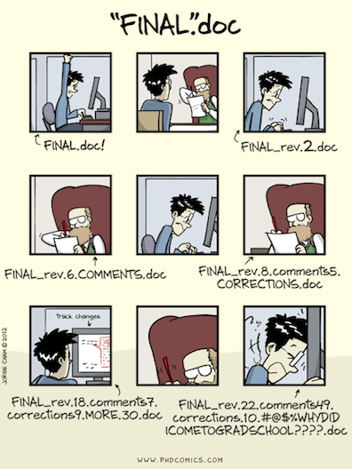
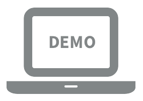
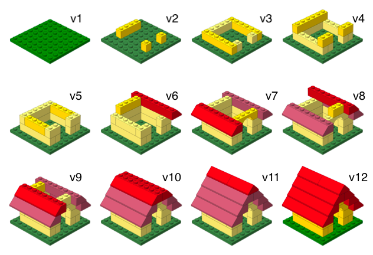

```{r child = "../setup.Rmd"}
```

```{r packages, echo=FALSE, message=FALSE, warning=FALSE}
# Remember to compile
# xaringan::inf_mr(cast_from = "..")
knitr::opts_chunk$set(knitr.duplicate.label = "allow")
library(tidyverse)
if (!require("emo")) devtools::install_github("hadley/emo")
library(emo)
if (!require("fontawesome")) devtools::install_github("rstudio/fontawesome")
library(fontawesome)
```

class: middle

# What even *is* GitHub?

---

## Learning Goals

By the end of this session, you will be able to...

- Describe what GitHub is and why people use it
- Explain the difference between Git and GitHub
- Navigate the GitHub interface
- Create and fork a repository
- Make commits and understand the basic Git workflow
- Connect a GitHub repository to RStudio
- Use the pull → stage → commit → push cycle in your own work

--

.small[
No coding required at first, just a web browser! `r emo::ji("globe")`
]

---

## A Problem You've Probably Had

.pull-left[
Have you ever saved files like this?

- `essay_draft.docx`
- `essay_draft2.docx`
- `essay_FINAL.docx`
- `essay_FINAL_v2.docx`
- `essay_FINAL_submit_this_one.docx`
- `essay_actually_final_FOR_REAL.docx`
]

--

.pull-right[
```{r echo=FALSE, fig.align="center", out.width="80%"}

```
]

---

## We've All Been There

.pull-left[
This happens with:
- Lab write-ups
- Research papers
- Data analysis scripts
- Thesis chapters

.question[
What's the problem with this approach?
]
]

--

.pull-right[
- Which version is the real one?
- What changed between versions?
- Can you go back to what you had last Tuesday?
- How do you share it with a collaborator?
]

---

## There's a Better Way

**Version control** solves this problem by:

--

- Keeping **one file** instead of 47 copies

--

- Recording **every change** you make, with a description

--

- Letting you **go back** to any previous version

--

- Making **collaboration** easier

--

<br>
.large[
**GitHub** is the most popular place to do this, and it's free.
]

---

class: middle

# Git and GitHub

---

## Git vs. GitHub

.pull-left[
**Git**
- A version control system
- Tracks changes to files
- Works on your computer
- Records project history
]

.pull-right[
**GitHub**
- A website built around Git
- Stores project repositories online
- Makes collaboration easier
- Lets you share and review work
]

--

.question[
Git is the tool. GitHub is a platform built around that tool.
]

---

## Think of GitHub Like Google Drive...

.pull-left[
**Google Drive**
- Store files in the cloud
- Share with others
- See who made changes
- Access from anywhere
]

.pull-right[
**GitHub**
- Store project files in the cloud
- Share with collaborators or the world
- See *exactly* what changed and when
- Access from anywhere
]

--

<br>
The big difference: GitHub is designed for **projects with code, text, and data**, and it keeps a **complete history** of changes.

---

## GitHub is Used By...

- Scientists sharing data and analysis code
- Software developers building apps and tools
- Writers collaborating on books and documentation
- **Psychologists** sharing reproducible research

--

.question[
You do not need to be a programmer to use GitHub.  
You just need a web browser.
]

---

class: middle

# Let's Take a Look

---

## The GitHub Homepage

When you go to [github.com](https://github.com), you'll see:

- A search bar at the top
- Trending projects
- Your feed, once you have an account

GitHub hosts **hundreds of millions of projects**, from tiny class assignments to major software systems.

---

## Step 1: Explore the GitHub Interface

.center[

]

Key areas to explore:

- Your **profile** and avatar
- The **search bar**
- The **Repositories** tab
- The **Explore** page

---

## Anatomy of a Repository

A GitHub repository page shows you:

- 📁 **Files and folders**
- 📝 **README** file
- 🕐 **Commits** and project history
- 🌿 **Branches**
- ⚙️ **Issues**
- 🔀 **Pull Requests**

--

.question[
A repository is more than a folder. It is a folder plus its full history.
]

---

class: middle

# Hands-On Activity 1: Explore GitHub

---

.your-turn[

**Browse GitHub like a tourist** `r emo::ji("palm_tree")`

Open [github.com](https://github.com) in your browser.

1. Go to [github.com/hadley/r4ds](https://github.com/hadley/r4ds)
2. Scroll through the files. Can you find the chapter files?
3. Click on `README.md` and read the first few lines
4. Find the commit count link near the top of the file list and click it
5. Click on any commit. What do you see?

⏱️ *Take 3 minutes to explore*

]

---

## What Did You See?

When you clicked on a commit, you probably saw something like this:

- Lines in **red** = text that was **removed**
- Lines in **green** = text that was **added**

--

This is called a **diff**.

--

.question[
Every single change to the book is recorded here.  
You can scroll back through years of history.
]

---

class: middle

# Three Key Ideas

---

## Idea 1: Repositories `r emo::ji("file_folder")`

A **repository** or **repo** is like a project folder, but smarter.

It contains:
- Your files
- The **complete history** of changes
- Notes about *who* changed *what* and *why*

--

Think of it as a folder that **remembers everything**.

---

## Idea 2: Commits `r emo::ji("camera")`

A **commit** is a saved snapshot of your project.

```{r echo=FALSE, fig.align="center", out.width="70%"}

```

Each step in building this LEGO set = one commit.  
You can always go back to any earlier step.

---

## What Makes Commits Special

```{r echo=FALSE, fig.align="center", out.width="70%"}

```

Each commit has a **message**, a short note explaining what changed and why.

Future you will be very grateful for these.

---

## Idea 3: README Files `r emo::ji("memo")`

Every good repository has a **README**.

A README usually explains:
- What is this project?
- How do I use it?
- Who made it and why?

--

README files are written in **Markdown**.  
You'll learn more about Markdown later in the course.

---

## The Building Blocks of GitHub

.pull-left[
**Repository (repo)**  
A project folder tracked by Git. Contains all your files and their history.

**Commit**  
A saved snapshot of your project at a point in time.

**Branch**  
A parallel version of your repo for separate work.
]

.pull-right[
**Fork**  
Your personal copy of someone else's repository on GitHub.

**Clone**  
Downloading a repository to your computer.

**Pull Request (PR)**  
A proposal to merge changes into another branch or repository.
]

---

class: middle

# Create Your GitHub Account

---

## Sign Up for GitHub

.instructions[
Go to [github.com](https://github.com) and click **Sign up** in the top right corner.
]

Fill in:
- **Email address**
- **Password**
- **Username**, choose carefully

--

**Tips for your username:**
- Use your real name or a professional variation
- Keep it short, lowercase, and easy to share
- Avoid spaces
- You can change it later, but URLs may break

--

.small[
Already have an account? Log in and follow along. `r emo::ji("check")`
]

---

## Verify Your Account

GitHub will send you a **verification email**.

1. Check your inbox or spam folder
2. Click the verification link
3. Complete the setup questions, or skip them

--

Once verified, you're in. `r emo::ji("tada")`

---

## Your GitHub Profile

Your profile page is like your **academic CV on GitHub**.

It shows:
- Repositories you've created or contributed to
- Activity over time
- Projects you've starred `r emo::ji("star")`

--

.instructions[
Click your avatar → **Your profile**
]

---

class: middle

# Your First Repository

---

## Create a New Repository

.instructions[
Click the **+** icon in the top right → **New repository**
]

Fill in the form:

- **Repository name**: `hello-github`
- **Description**: `My very first GitHub repository`
- Select **Public**
- ✅ Check **Add a README file**

Click **Create repository** `r emo::ji("rocket")`

---

## You Now Have a Repository

You should see a page with:

- Your repository name at the top
- A single file: `README.md`
- A green **Code** button
- Stats about commits and branches

--

.question[
This is your project's home on GitHub.
]

---

## What Is in the README?

GitHub automatically created a `README.md` with:

```md
# hello-github
My very first GitHub repository
```

The `#` makes a large heading. The next line is the description you typed.

--

Let's make it more personal.

---

## Editing a File on GitHub.com

You can edit files **right in the browser**.

1. Click on `README.md`
2. Click the **pencil icon** ✏️
3. You are now in an editor

---

## Add Some Text

In the editor, add a few lines below what is already there.

```md
## About Me

My name is MY-NAME-HERE.
I am studying psychology and learning data science.

## Why I'm Here

I want to learn how to share my research openly
and collaborate with other scientists.
```

---

## Save Your Changes with a Commit

Scroll down to the **Commit changes** section.

You'll see:
- A box for a **commit message**
- Replace the default with: `Add personal introduction to README`
- Leave **Commit directly to the main branch** selected
- Click **Commit changes**

--

.question[
🎉 You just made your first commit.
]

---

class: middle

# Forking and Cloning

---

## Forking: Getting Your Own Copy

**Forking** creates a copy of someone else's repository in your own GitHub account.

Use forking when you want to:
- Use someone's project as a starting point
- Contribute to an open-source project
- Complete a class assignment

--

.instructions[
Go to a classmate's or the instructor's repository and click **Fork**.
]

---

## Cloning: From GitHub to Your Computer

**Cloning** downloads a repository to your local machine so you can work on it in RStudio.

```bash
git clone https://github.com/YOUR-USERNAME/REPO-NAME.git
```

But we'll use RStudio's interface, not the command line.

---

## Clone a Repo in RStudio

.instructions[
**File → New Project → Version Control → Git**
]

1. Copy the repository URL from GitHub
2. Paste it into the **Repository URL** box in RStudio
3. Choose where to save it
4. Click **Create Project**

RStudio will download the repo and open it as a project.  
You should see a **Git** tab in the upper-right pane.

---

class: middle

# The Basic Git Workflow

---

## Pull → Work → Stage → Commit → Push

.center[
.large[
`r emo::ji("arrow_down")` **Pull** → ✏️ **Work** → ✅ **Stage** → `r emo::ji("floppy_disk")` **Commit** → `r emo::ji("arrow_up")` **Push**
]
]

<br>

| Step | What it does | Where in RStudio |
|------|--------------|------------------|
| Pull | Get latest changes | Blue ↓ arrow |
| Work | Edit your files | Editor pane |
| Stage | Select files to save | Check boxes in Git tab |
| Commit | Save a snapshot | Commit button + message |
| Push | Send to GitHub | Green ↑ arrow |

---

## The Workflow, Step by Step

**1. Pull**  
Get the latest changes from GitHub before you start working.

`r emo::ji("arrow_down")` Blue down arrow in RStudio's Git tab

--

**2. Work**  
Make changes to your files.

--

**3. Stage**  
Tell Git which changes to include in the next snapshot.

✅ Check the boxes next to files in the Git tab.

--

**4. Commit**  
Save a snapshot with a descriptive message.

`r emo::ji("floppy_disk")` Click Commit, write your message, click Commit.

--

**5. Push**  
Send your commits to GitHub.

`r emo::ji("arrow_up")` Green up arrow in RStudio's Git tab

---

## Writing Good Commit Messages

.pull-left[
**Bad commit messages** 😬

- `stuff`
- `fix`
- `asdfgh`
- `final`
- `final final`
- `I hate this`
]

.pull-right[
**Good commit messages** ✅

- `Add demographic summary table`
- `Fix typo in methods section`
- `Remove outliers with z-score > 3`
- `Update figure 2 to use color-blind palette`
- `Add bootstrap confidence intervals`
]

--

**Rule of thumb**: Complete the sentence,  
*"If applied, this commit will..."*

---

class: middle

# Hands-On Activity 2

---

.your-turn[

**Your First Full Git Workflow**

1. Open the project you cloned in RStudio
2. Click the blue **Pull** arrow
3. Open `README.md` and add your name and a fun fact
4. Save the file
5. In the Git tab, check the box next to `README.md`
6. Click **Commit**, write `Add my name and fun fact`
7. Click **Commit**, then click the green **Push** arrow
8. Go to GitHub and refresh the page

⏱️ *Take 5 minutes*

]

---

class: middle

# Collaborating on GitHub

---

## Issues: Tracking Tasks and Bugs

**Issues** are GitHub's built-in to-do list and bug tracker.

Use them to:
- Report a bug
- Request a feature
- Ask a question
- Assign tasks to collaborators

Every issue gets a number (`#1`, `#2`, etc.) and can be referenced in commit messages:

`Fix color palette, closes #7`

---

## Pull Requests: Proposing Changes

A **Pull Request (PR)** is how you propose merging changes from one branch or fork into another.

The workflow:
1. Fork the repo or create a branch
2. Make your changes
3. Push to GitHub
4. Click **New Pull Request**
5. Describe your changes
6. Get review
7. Merge or close the PR

---

## Branching: Working in Parallel

**Branches** let multiple people, or one person, work on different features without overwriting each other.

Common branch strategy:
- `main` = stable version
- `feature/new-analysis` = work in progress
- `fix/typo-in-methods` = quick fix

.small[
For many class projects, working on `main` is fine.
]

---

class: middle

# Hands-On Activity 3

---

.your-turn[

**Fork and Contribute**

1. Go to the course repository
2. **Fork** it to your own GitHub account
3. **Clone** your fork to RStudio
4. Create a new folder called `introductions/` if needed
5. Inside that folder, create `YOUR-GITHUB-USERNAME.md`
6. Write 2 to 3 sentences about yourself and your interest in data science
7. Stage, commit (`Add my introduction`), and push
8. Open a **Pull Request**

⏱️ *Take 5 minutes*

]

---

class: middle

# GitHub Tips and Troubleshooting

---

## GitHub in RStudio: Quick Reference

| Action | Where in RStudio |
|--------|------------------|
| Pull latest changes | Git tab → Blue ↓ arrow |
| Stage files | Git tab → Check boxes |
| Commit | Git tab → Commit button |
| Push to GitHub | Git tab → Green ↑ arrow |
| View history | Git tab → Clock icon |
| Diff | Git tab → Diff button |

---

## When Things Go Wrong

**"I can't push!"**  
→ Try pulling first.

**"My files aren't showing up in the Git tab"**  
→ Make sure you're inside the RStudio Project.

**"I committed the wrong thing"**  
→ Do not panic. Git history is usually recoverable.

**"I have merge conflicts"**  
→ Look for `<<<<<<`, `=======`, `>>>>>>`  
→ Edit the file, save, stage, and commit

---

# GitHub Best Practices

---

## The Golden Rule of Git

.large[
**Commit early, commit often.**
]

--

- Small commits are easier to understand, review, and undo
- Write messages your future self will thank you for
- Push to GitHub at the end of every work session

--

.question[
What questions do you have?
]

---

## Helpful Resources

- 📖 [Happy Git with R](https://happygitwithr.com/)
- 🐙 [GitHub Docs](https://docs.github.com)
- 🎒 [GitHub Student Developer Pack](https://education.github.com/pack)
- 📺 [GitHub Skills](https://skills.github.com/)
- 💬 [Stack Overflow](https://stackoverflow.com/questions/tagged/git)

---

class: middle

# Wrapping Up

---

## What We Covered

.pull-left[
### Concepts
- ✅ What Git and GitHub are
- ✅ Repositories, commits, branches, forks
- ✅ The pull → stage → commit → push workflow
- ✅ Issues and Pull Requests
]

.pull-right[
### Skills
- ✅ Create a GitHub account and repo
- ✅ Edit files on GitHub.com
- ✅ Clone a repo to RStudio
- ✅ Complete the full Git workflow
- ✅ Fork a repo and open a Pull Request
]

---

## Further Reading

- [Happy Git with R](https://happygitwithr.com/) by Jenny Bryan
- [Pro Git](https://git-scm.com/book/en/v2)
- [GitHub Docs: Getting Started](https://docs.github.com/en/get-started)
- *R for Data Science* workflow materials

---

# Sources

- Mine Çetinkaya-Rundel's Data Science in a Box ([link](https://datasciencebox.org/))
- Jenny Bryan's [Happy Git with R](https://happygitwithr.com/)
- [GitHub Docs](https://docs.github.com)
- PhD Comics [phdcomics.com](http://phdcomics.com)
