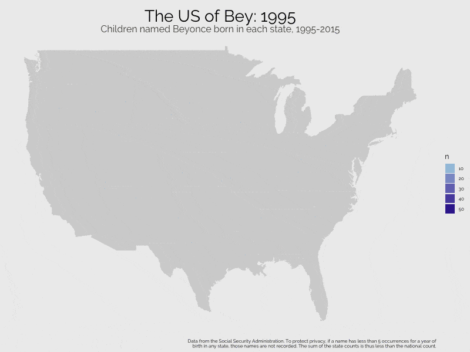
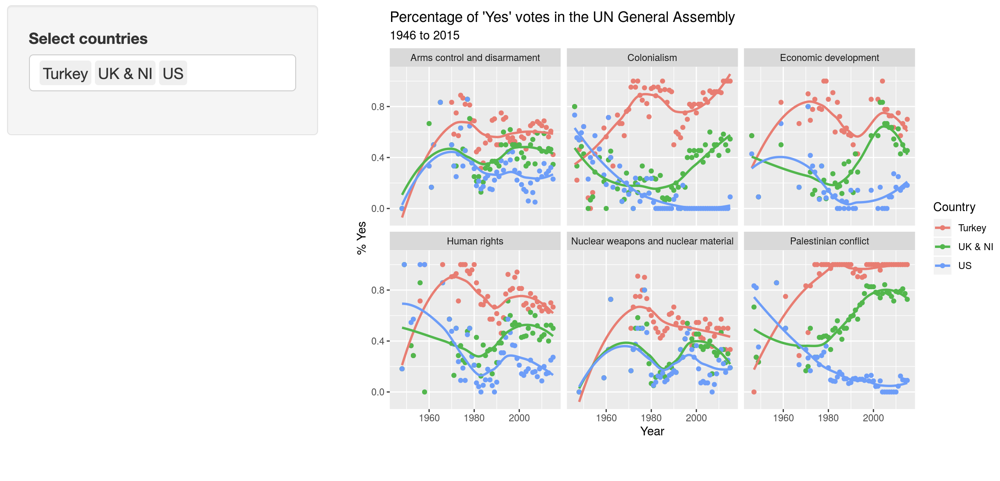

```{r child = "../setup.Rmd"}
```

```{css, echo = F}
.bg_orange {
  position: relative;
  z-index: 1;
}

.bg_orange::before {    
      content: "";
      background-image: url("../img/orangebook.png");
      background-size: contain;
      position: absolute;
      top: 0px;
      right: 0px;
      bottom: 0px;
      left: 0px;
      opacity: 0.10;
      z-index: -1;
}
```

```{r packages, echo=FALSE, message=FALSE, warning=FALSE}
# Remember to compile
#xaringan::inf_mr(cast_from = "..")
#       slideNumberFormat: ""  
knitr::opts_chunk$set(knitr.duplicate.label = "allow")
library(tidyverse)
if (!require("emo")) devtools::install_github("hadley/emo")
library(emo)
if (!require("jasmines")) devtools::install_github("djnavarro/jasmines")
if (!require("mathart")) devtools::install_github("marcusvolz/mathart")
library(magick); library(pdftools)
```


# Hello world!

---

## What is data science?

- <i class="fa fa-database fa"></i> + <i class="fa fa-flask fa"></i> = data science?
--

- <i class="fa fa-database fa"></i> + <i class="fa fa-code fa"></i> = data science?
--

- <i class="fa fa-database fa"></i> + <i class="fa fa-user fa"></i> + <i class="fa fa-code fa"></i> = data science?
--

- <i class="fa fa-database fa"></i> + <i class="fa fa-users fa"></i> + <i class="fa fa-code fa"></i> = data science?
--

<br>
<br>
.large[
Data science is an exciting discipline that allows you to turn raw data into understanding, insight, and knowledge. We're going to learn to do this in a `tidy` way -- more on that later!
]
---

# What is this course?

This course is an introduction to data science that is designed for psychologists. It emphasizes statistical thinking and best practices.
<br><br>
--

**Q - What data science background does this course assume?**  
A - None.
<br>
--

**Q - Is this an intro CS course?**  
A - Although statistics and computer science $\ne$ data science, they are very closely related and have tremendous of overlap. Hence, this course is a great way to get comfortable with those topics. However this course is **not** your typical course.
<br>
--

**Q - Will we be doing computing?**   
A - Yes.
<br>
--


**Q - What computing language will we learn?**  
A - R.
<br>
--

**Q: Why not language X?**  
A: We can discuss that *remotely* over `r emo::ji("coffee")`.


---

## Where is this course?

<br><br><br><br><br><br><br>

.large[
.center[
[DataScience4Psych.github.io/DataScience4Psych/](https://DataScience4Psych.github.io/DataScience4Psych/)
]
]
---

class: middle

# Wrapping up... Hello world!

---

class: middle

# Data in the wild

---

# The US of Bey

```{r fig.align="center", echo=FALSE, alt="The US of Bey", out.width="55%"}

```

.footnote[Brooke Watson, [blog.brooke.science/posts/the-us-of-bey](https://blog.brooke.science/posts/the-us-of-bey/)
]
---

# Punctuation in literature

```{r fig.align="center", echo=FALSE, alt="Punctuation", out.width="45%"}
knitr::include_graphics("img/julia-silge-punctuation.png")
```

.footnote[ Julia Silge, [juliasilge.com/blog/punctution-literature](https://juliasilge.com/blog/punctution-literature/)]

---

# Text analysis of Trump's tweets

```{r fig.align="center", echo=FALSE, alt="Trump tweets", out.width="61%"}
knitr::include_graphics("img/david-robinson-trump-tweets.png")
```

.footnote[David Robinson, [varianceexplained.org/r/trump-tweets](http://varianceexplained.org/r/trump-tweets)
]
---

## Greatest Twitter scheme of all time

```{r fig.align="center", echo=FALSE,out.width="38%"}
knitr::include_graphics("img/bohemian-rhapsody.png")
```

.footnote[
[gist.github.com/mine-cetinkaya-rundel/03d7516dea1e5f2613a5d71c28edb08d](https://gist.github.com/mine-cetinkaya-rundel/03d7516dea1e5f2613a5d71c28edb08d)
]

---

## Voting patterns in the UN

[minecr.shinyapps.io/unvotes](https://minecr.shinyapps.io/unvotes/)

```{r echo=FALSE, alt="UN Votes", out.width="100%"}

```


---

class: middle

# Wrapping up... Data in the wild

---

class: middle, bg_orange

# Course structure and policies

---

## Logistics
.pull-left-narrow[
.xlarge[
+ Course <br><br>
+ Professor <br><br>
+ Assistants <br><br>
]
]
.pull-right-wide[
.white[.]  
<br>
{{content}}

]

--
+ Data Science for Psychologists
  + Flipped Classroom
<br><br>
{{content}}

--
+ S. Mason Garrison
  + Green 438/Zoom
  + Office Hours [calendly.com/smasongarrison/](http://www.calendly.com/smasongarrison/)
<br><br>
{{content}}

--
+ Tukey `r emo::ji('cat_face')`
+ Archie `r emo::ji('smiley_cat')`
+ Annie `r emo::ji('pouting_cat')`

{{content}}

---

## Structure

- Interactive
  - Some lectures, lots of learn-by-doing
--

- Meet twice a week 
	- Tuesdays are Face-to-Face Tutorials
	- Thursdays are Solidarity Sessions
--

- Bring your laptop! `r emo::ji('computer')`

--
- Flipped Lectures
	- Pre-recorded Lectures
	- Module is finalized by the week's start


---

# Big Ideas
.pull-left[
- Reproducibility;
- Replication;
- Robust Methods;
- Really Nice Visualization; and
- R
]
.center.pull-right[

```{r echo=FALSE, out.width="95%",fig.align = 'left'}
# r code to generate this figure is plot_metro.R
knitr::include_graphics("img/plot007w.png")
```
]
---

# Categories of Topics

.pull-left-narrow[.large[
- What
- How
]


.tiny[
```{r echo=TRUE, out.height="200%", eval=FALSE}
library(dplyr) # or install.packages("dplyr") first
library(jasmines) # or devtools::install_github("djnavarro/jasmines")
p0 <- use_seed(1000) %>% # Set the seed of R‘s random number generator
  scene_discs(
    rings = 10,
    points = 50000,
    size = 50
  ) %>%
  mutate(ind = 1:n()) %>%
  unfold_warp(
    iterations = 10,
    scale = .5,
    output = "layer"
  ) %>%
  unfold_tempest(
    iterations = 5,
    scale = .015
  ) %>%
  style_ribbon(
    color =  "#ec2582",       #"#F26BAA",
    colour = "ind",
    alpha = c(1,1),
    background = "#34c9f4"
  )
ggsave("img/p0.png", p0, width = 20, height = 20, units = "in")

```
]
]

.pull-right-wide[
```{r echo=FALSE, out.height="150%"}
# r code to generate this figure is plot_jas.R
knitr::include_graphics("img/p0.png")
```
]
.footnote[ adapted from: https://towardsdatascience.com/getting-started-with-generative-art-in-r-3bc50067d34b]
---

# Learning Outcomes
.pull-left[
- Using R to visualize and model many kinds of data.
- Given a dataset,
	- able to visualize
	- generate hypotheses
	- investigate those hypotheses, &
	- communicate your results.
]
.pull-right[
```{r echo=FALSE, out.width="99%"}
# r code to generate this figure is plot_jas.R
magick::image_read_pdf("img/ggpedigree_plot-1.pdf",
                       pages = 1)
```

.footnote[Garrison, S. M. (recommended accept). ggpedigree: Visualizing Pedigrees with 'ggplot2' and 'plotly'. *Journal of Open Source Software, 9*(97), 5436. https://doi.org/10.21105/joss.09434
]
]

---

# Materials

- Textbook
  - R for Data Science: Import, Tidy, Transform, Visualize, and Model Data
  - Hadley Wickham & Garrett Grolemund
  - Online Edition
  - r4ds.had.co.nz

--
- Coursenotes
  - [datascience4psych.github.io/DataScience4Psych](https://datascience4psych.github.io/DataScience4Psych/)

--
- Software
	- R
	- Rstudio,
	- Github


---

# Milestones
.pull-left[
.large[
- Labs
- Portfolio
]
]
.pull-right[
```{r ref.label="qr",echo=FALSE,out.width="100%"}
```
.footnote[ [datascience4psych.github.io/DataScience4Psych](https://datascience4psych.github.io/DataScience4Psych/)]
]

---
# Contract Grading

- What is contract grading?
  - Assessment based on effort
  - More representative of the scientific process
  - Specifics are in the syllabus and course notes

---

## Diversity & Inclusion:

.medi[
**Intent:** Students from all diverse backgrounds and perspectives be well-served by this course, that students' learning needs be addressed both in and out of class, and that the diversity that the students bring to this class be viewed as a resource, strength and benefit. It is my intent to present materials and activities that are respectful of diversity: gender identity, sexuality, disability, age, socioeconomic status, ethnicity, race, nationality, religion, and culture. Let me know ways to improve the effectiveness of the course for you personally, or for other students or student groups.
]

--

.midi[
- If you have a name or set of pronouns that differ from those that appear in your official records, please let me know.
- If you feel your performance is being impacted by your experiences outside of class, please don't hesitate to come and talk with me. If you prefer to speak with someone outside of the course, your advisor is an excellent resource. 
- I (like many people) am still in the process of learning about diverse perspectives/identities. If something was said in class (by anyone) that made you feel uncomfortable, please talk to me about it.
]

---

## How to get help

- Course content, logistics, etc. discussion on the course discussion forum.
    - Please post on the FAQ instead of direct messaging.
    - Use proper formatting: When asking questions involving code, please make sure to use inline code formatting for short bits of code or code snippets for longer, multi-line chunks.
- Often it's a lot more pleasant an experience to get your questions answered in person. Make use of my *remote* office hours, I'm here to help!

---

## Tips for asking questions

- First search existing discussion for answers. If the question has already been answered, you're done! If it has already been asked but you're not satisfied with the answer, add to the thread. 
- Give your question context from course concepts not course assignments.
    - Good context: "I have a question on filtering"
    - Bad context: "I have a question on HW 1 question 4"
- Be precise in your description:
    - Good description: "I am getting the following error and I'm not sure how to resolve it - `Error: could not find function "ggplot"`"
    - Bad description: "R giving errors, help me! Aaaarrrrrgh!” 
    
---

## More Tips for asking questions

- You can edit a question after posting it.
- Format your questions nicely using markdown and code formatting.
- Where appropriate, provide links to specific files, or even lines.
    - Sharing code will help others understand your question.
    

---

## Sharing/reusing code

- I am well aware that a huge volume of code is available on the web to solve any number of problems.
- Unless I explicitly tell you not to use something, you can use any online resources (e.g. StackOverflow, RStudio Community), but you must explicitly cite where you obtained any code you directly use (or use as inspiration).
- You are welcome to discuss the problems together and ask for advice, but you may not create code for your classmates.
- You won't learn anything if other people write your code for you!

---

class: middle

# Wrapping Up...

```{r qr}
library(qrcode)
code <- qr_code("https://DataScience4Psych.github.io/DataScience4Psych/")
plot(code)
```
---

class: middle

# Your Turn!


---


## Voting patterns in the UN


[minecr.shinyapps.io/unvotes](https://minecr.shinyapps.io/unvotes/)


```{r echo=FALSE, alt="UN Votes", out.width="100%"}

```


---

## Create a GitHub account

.small[
.instructions[
Go to [github.com](https://github.com/), and create an account (unless you already have one). 
]
]

Tips for selecting a username:<sup>✦</sup>

.small[
- Incorporate your actual name.
- Reuse username from other contexts, e.g., Twitter or Slack.
- Pick a username you'll be comfortable revealing to your future boss.
- Shorter is better than longer.
- Be as unique as possible in as few characters as possible.
- Make it timeless. Don't highlight your current university, employer, etc.
- Avoid words laden with special meaning in programming, like `NA`.
]


--
.small[ 
<sup>✦</sup> Source: [Happy git with R](http://happygitwithr.com/github-acct.html#username-advice) by Jenny Bryan
]


---

.your-turn[

**Option 1.**

- On GitHub, navigate to the assignment repository called `ae01a_unvotes`, which you can find at [github.com/DataScience4Psych/ae01a_unvotes](https://github.com/DataScience4Psych/ae01a_unvotes).
- In the Files pane in the bottom right corner, spot the file called `unvotes.Rmd`. Open it, and then click on the "Knit" button.
- Go back to the file and change your name on top (in the `yaml` -- we'll talk about what this means later) and knit again.
- Change the country names to those you're interested in. Your spelling and capitalization should match how the countries appear in the data, so take a peek at the Appendix to confirm spelling. Knit again. Voila, your first data visualization!

]

---

.your-turn[

**Option 2.**

- On Github, download the assignment called called `ae01b_covid`, which you can find at [github.com/DataScience4Psych/ae01b_covid](https://github.com/DataScience4Psych/ae01b_covid).
- In the Files pane in the bottom right corner, spot the file called `covid.Rmd`. Open it, and then click on the "Knit" button.
- Go back to the file and change your name on top (in the `yaml` -- we'll talk about what this means later) and knit again.
- Change the country names to those you're interested in. Your spelling and capitalization should match how the countries appear in the data, so take a peek at the Appendix to confirm spelling. Knit again. Voila, your first data visualization!
]

---

class: middle

# Wrapping Up...


