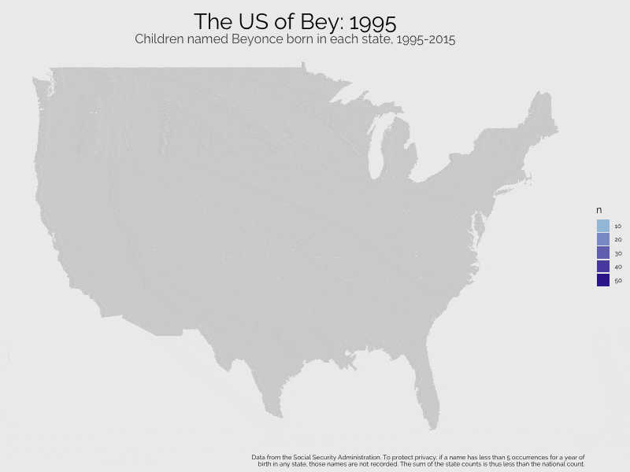
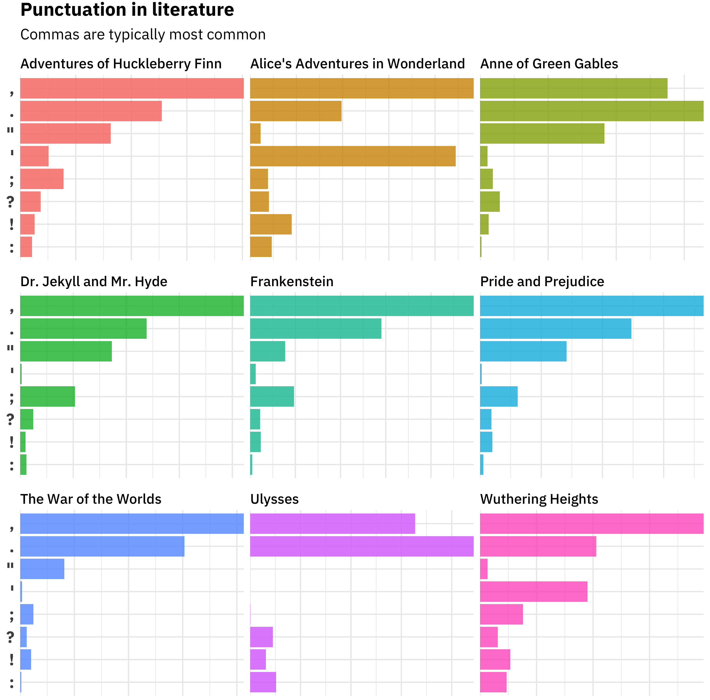
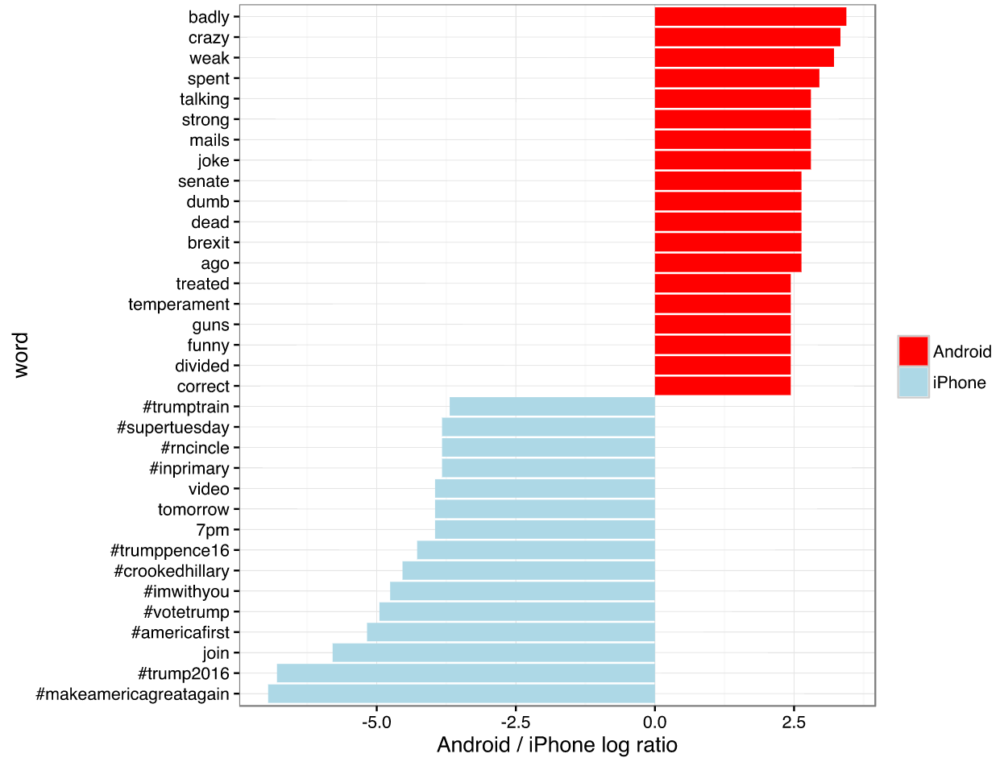
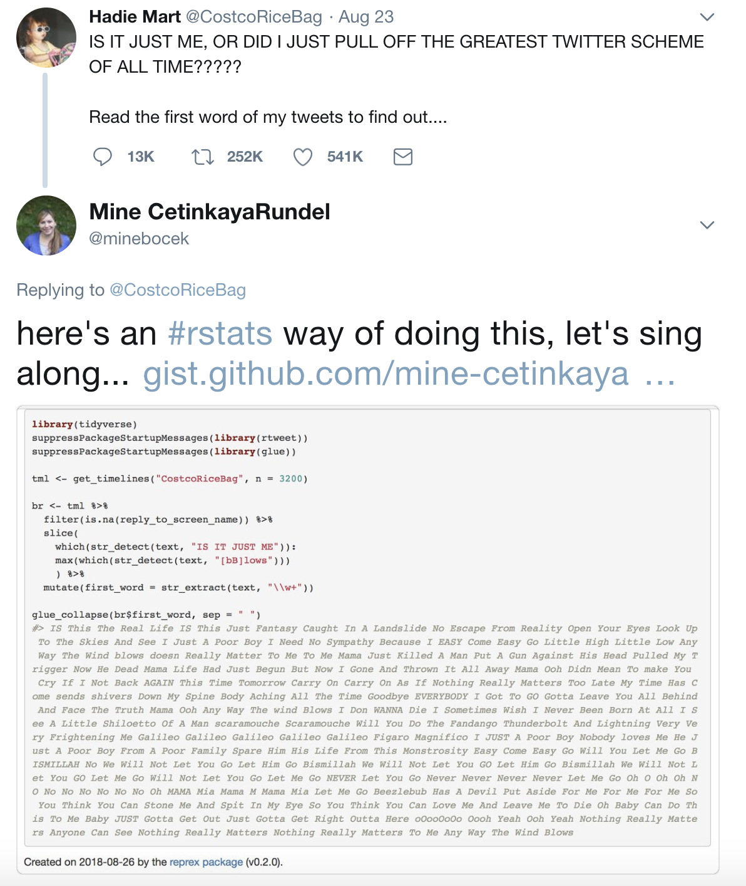
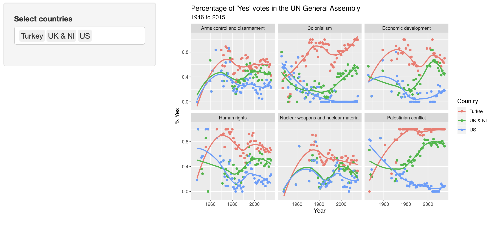
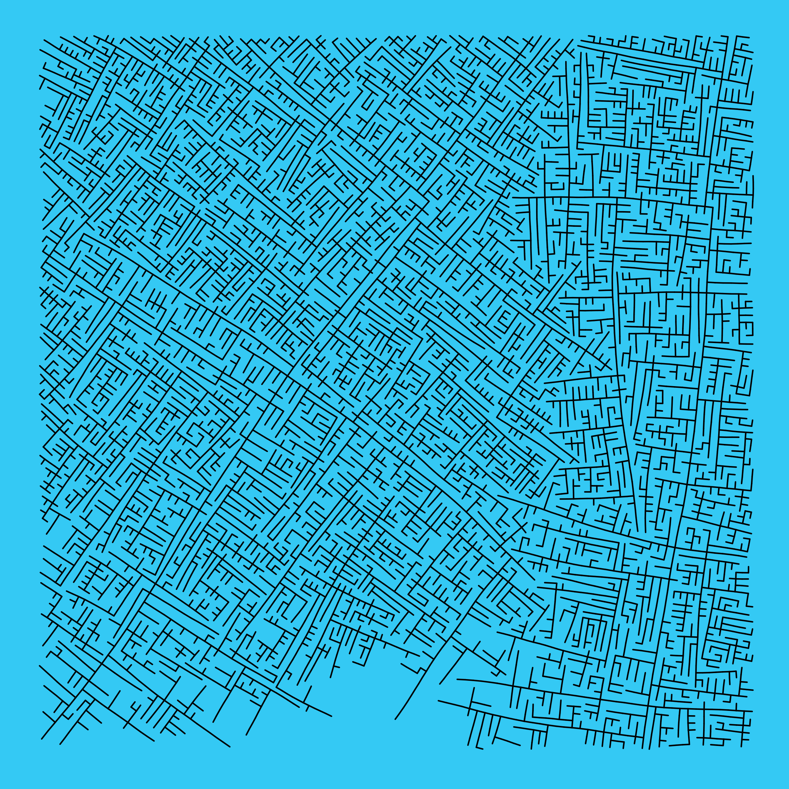

```{r child = "../setup.Rmd"}
```

```{css, echo = F}
.bg_orange {
  position: relative;
  z-index: 1;
}

.bg_orange::before {    
      content: "";
      background-image: url("../img/orangebook.png");
      background-size: contain;
      position: absolute;
      top: 0px;
      right: 0px;
      bottom: 0px;
      left: 0px;
      opacity: 0.10;
      z-index: -1;
}
```

```{r packages, echo=FALSE, message=FALSE, warning=FALSE}
# Remember to compile
#xaringan::inf_mr(cast_from = "..")
#       slideNumberFormat: ""  
knitr::opts_chunk$set(knitr.duplicate.label = "allow")
library(tidyverse)
if (!require("emo")) devtools::install_github("hadley/emo")
library(emo)
if (!require("jasmines")) devtools::install_github("djnavarro/jasmines")
if (!require("mathart")) devtools::install_github("marcusvolz/mathart")
library(magick); library(pdftools)
```


# Hello world!

---

class: middle

# Learning Goals

---

## Learning Goals

By the end of this session, you will be able to...

- Explain what data science means and how it combines data, domain expertise, and coding
- Recognize data science in the wild through real-world examples
- Identify the five core principles ("Big 5") that guide this course
- Understand the key learning outcomes and materials for this course

---

## What is data science?

- <i class="fa fa-database fa"></i> + <i class="fa fa-flask fa"></i> = data science?
--

- <i class="fa fa-database fa"></i> + <i class="fa fa-code fa"></i> = data science?
--

- <i class="fa fa-database fa"></i> + <i class="fa fa-user fa"></i> + <i class="fa fa-code fa"></i> = data science?
--

- <i class="fa fa-database fa"></i> + <i class="fa fa-users fa"></i> + <i class="fa fa-code fa"></i> = data science?
--

<br>
<br>
.large[
Data science is an exciting discipline that allows you to turn raw data into understanding, insight, and knowledge. We're going to learn to do this in a `tidy` way -- more on that later!
]
---

# What is this course?

This course is an introduction to data science that is designed for psychologists. It emphasizes statistical thinking and best practices.
<br><br>
--

**Q - What data science background does this course assume?**  
A - None.
<br>
--

**Q - Is this an intro CS course?**  
A - Although statistics and computer science $\ne$ data science, they are very closely related and have tremendous of overlap. Hence, this course is a great way to get comfortable with those topics. However this course is **not** your typical course.
<br>
--

**Q - Will we be doing computing?**   
A - Yes.
<br>
--


**Q - What computing language will we learn?**  
A - R.
<br>
--

**Q: Why not language X?**  
A: We can discuss that *remotely* over `r emo::ji("coffee")`.


---

## Where is this course?

<br><br><br><br><br><br><br>

.large[
.center[
[DataScience4Psych.github.io/DataScience4Psych/](https://DataScience4Psych.github.io/DataScience4Psych/)
]
]
---

class: middle

# Wrapping up... Hello world!

---

class: middle

# Data in the wild

---

# The US of Bey

```{r fig.align="center", echo=FALSE, alt="The US of Bey", out.width="55%"}

```

.footnote[Brooke Watson, [blog.brooke.science/posts/the-us-of-bey](https://blog.brooke.science/posts/the-us-of-bey/)
]
---

# Punctuation in literature

```{r fig.align="center", echo=FALSE, alt="Punctuation", out.width="45%"}

```

.footnote[ Julia Silge, [juliasilge.com/blog/punctution-literature](https://juliasilge.com/blog/punctution-literature/)]

---

# Text analysis of Trump's tweets

```{r fig.align="center", echo=FALSE, alt="Trump tweets", out.width="61%"}

```

.footnote[David Robinson, [varianceexplained.org/r/trump-tweets](http://varianceexplained.org/r/trump-tweets)
]
---

## Greatest Twitter scheme of all time

```{r fig.align="center", echo=FALSE,out.width="38%"}

```

.footnote[
[gist.github.com/mine-cetinkaya-rundel/03d7516dea1e5f2613a5d71c28edb08d](https://gist.github.com/mine-cetinkaya-rundel/03d7516dea1e5f2613a5d71c28edb08d)
]

---

## Voting patterns in the UN

[minecr.shinyapps.io/unvotes](https://minecr.shinyapps.io/unvotes/)

```{r echo=FALSE, alt="UN Votes", out.width="100%"}

```


---

class: middle

# Wrapping up... Data in the wild

---

# Big Ideas
.pull-left[
- Reproducibility;
- Replication;
- Robust Methods;
- Really Nice Visualization; and
- R
]
.center.pull-right[

```{r echo=FALSE, out.width="95%",fig.align = 'left'}
# r code to generate this figure is plot_metro.R

```
]
---

# Categories of Topics

.pull-left-narrow[.large[
- What
- How
]


.tiny[
```{r echo=TRUE, out.height="200%", eval=FALSE}
library(dplyr) # or install.packages("dplyr") first
library(jasmines) # or devtools::install_github("djnavarro/jasmines")
p0 <- use_seed(1000) %>% # Set the seed of R‘s random number generator
  scene_discs(
    rings = 10,
    points = 50000,
    size = 50
  ) %>%
  mutate(ind = 1:n()) %>%
  unfold_warp(
    iterations = 10,
    scale = .5,
    output = "layer"
  ) %>%
  unfold_tempest(
    iterations = 5,
    scale = .015
  ) %>%
  style_ribbon(
    color =  "#ec2582",       #"#F26BAA",
    colour = "ind",
    alpha = c(1,1),
    background = "#34c9f4"
  )
ggsave("img/p0.png", p0, width = 20, height = 20, units = "in")

```
]
]

.pull-right-wide[
```{r echo=FALSE, out.height="150%"}
# r code to generate this figure is plot_jas.R
knitr::include_graphics("img/p0.png")
```
]
.footnote[ adapted from: https://towardsdatascience.com/getting-started-with-generative-art-in-r-3bc50067d34b]
---

# Learning Outcomes
.pull-left[
- Using R to visualize and model many kinds of data.
- Given a dataset,
	- able to visualize
	- generate hypotheses
	- investigate those hypotheses, &
	- communicate your results.
]
.pull-right[
```{r echo=FALSE, out.width="99%"}
# r code to generate this figure is plot_jas.R
magick::image_read_pdf("img/ggpedigree_plot-1.pdf",
                       pages = 1)
```

.footnote[Garrison, S. M. (recommended accept). ggpedigree: Visualizing Pedigrees with 'ggplot2' and 'plotly'. *Journal of Open Source Software, 9*(97), 5436. https://doi.org/10.21105/joss.09434
]
]

---

# Materials

- Textbook
  - R for Data Science: Import, Tidy, Transform, Visualize, and Model Data
  - Hadley Wickham & Garrett Grolemund
  - Online Edition
  - r4ds.had.co.nz

--
- Coursenotes
  - [datascience4psych.github.io/DataScience4Psych](https://datascience4psych.github.io/DataScience4Psych/)

--
- Software
	- R
	- Rstudio,
	- Github


---

# Milestones
.pull-left[
.large[
- Labs
- Portfolio
]
]
.pull-right[
```{r ref.label="qr",echo=FALSE,out.width="100%"}
```
.footnote[ [datascience4psych.github.io/DataScience4Psych](https://datascience4psych.github.io/DataScience4Psych/)]
]

---

class: middle

# Summary: Learning Goals Achieved

---

## What We've Learned

Today, you should now be able to...

.pull-left[
### Understanding
- ✅ Explain what data science means
- ✅ Recognize data science in the wild
]

.pull-right[
### Course Foundations
- ✅ Identify the "Big 5" principles
- ✅ Understand key learning outcomes and materials
]

---

class: middle

# Wrapping Up...


