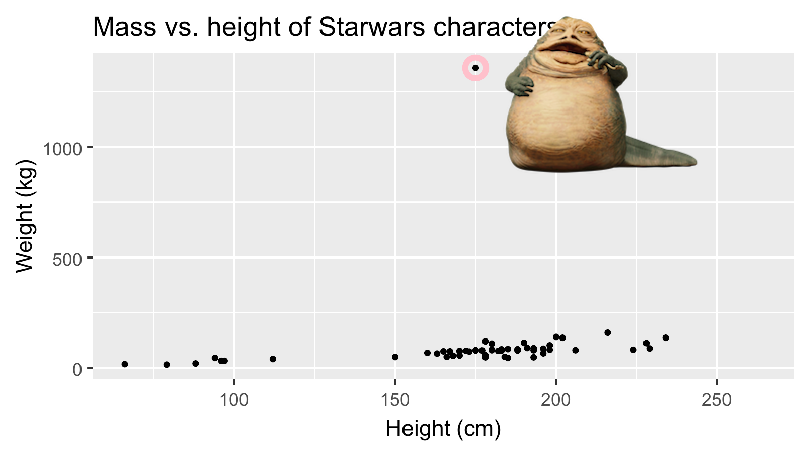

```{r child = "../setup.Rmd"}
```

```{r packages, echo=FALSE, message=FALSE, warning=FALSE}
library(emo)
library(tidyverse)
library(fontawesome)
library(magick)
library(Tmisc)
if (!require("dsbox")) devtools::install_github("rstudio-education/dsbox")
if (!require("gradethis")) devtools::install_github("rstudio-education/gradethis")
library(dsbox)

# Remember to compile
#xaringan::inf_mr(cast_from = "..")
```

class: middle

# Exploratory data analysis

---


.pull-left[ 
> "We will be exploring numbers. We need to handle them easily and look at them effectively. Techniques for handling and looking — whether graphical, arithmetic, or intermediate — will be important."
]

.pull-right[
```{r echo=FALSE, out.width="90%"}
knitr::include_graphics("../img/orangebook.png")
```
] 


---


## What is EDA?

- Exploratory data analysis (EDA) is an approach to analyzing data sets to summarize its main characteristics.
- Today, we'll be focusing on the visual aspects
- But we might also calculate summary statistics and perform data wrangling/ manipulation/transformation at (or before) this stage of the analysis. 
  - That's what we'll focus on next.

---

class: middle

# Data visualization

---

## Data visualization


> "The simple graph has brought more information to the data analyst's mind than any other device."

> John Tukey

- Data visualization is the creation and study of the visual representation of data.
- Many tools for visualizing data (R is one of them) exist, as do many approaches/systems within R for making data visualizations (**ggplot2** is one of them, and that's what we're going to use).

---

## ggplot2 $\in$ tidyverse

.pull-left[
```{r echo=FALSE, out.width="80%"}
knitr::include_graphics("img/ggplot2-part-of-tidyverse.png")
```
] 
.pull-right[ 
- **ggplot2** is tidyverse's data visualization package 
- `gg` in "ggplot2" stands for Grammar of Graphics 
- Inspired by the book **Grammar of Graphics** by Leland Wilkinson
]

---

## Grammar of Graphics

.pull-left-narrow[
A grammar of graphics is a tool to concisely describe the components of a graphic
]
.pull-right-wide[
```{r echo=FALSE, out.width="90%"}
knitr::include_graphics("img/grammar-of-graphics.png")
```
]

.footnote[ Source: [BloggoType](http://bloggotype.blogspot.com/2016/08/holiday-notes2-grammar-of-graphics.html)]

---

class: middle

# A First (and Reproducible) Example

---

## Reading in the Data

+ Heights of the highest points by state

```{r echo=TRUE}
## 
## load required packages and data
library(tidyverse)
options(tibble.print_min = 10)
heights = read_csv("data/highest-points-by-state.csv")
## switch from feet to meters
heights$elevation = heights$elevation * .3048
```
---
## Taking a look
```{r echo=TRUE}
heights
```

---
## Taking another look
```{r echo=TRUE}
arrange(heights, elevation)
```

---
## Taking another another look
```{r echo=TRUE}
arrange(heights, desc(elevation))
```

---
## Taking another³ look... thoughtfully

Goals:
+ Write down the set of numbers, keeping as much detail as
possible
+ Pack the numbers efficiently, so you can see all of them at once


---

## Taking another³ look: Stem and Leaf
.pull-left[
```{r echo=TRUE, out.width="80%"}
stem(heights$elevation)
```
]
--

.pull-right[ 
<br><br><br><br>
+ Notice that parts of the numbers (the beginnings) are
repeated.
+ The first digit of each number is printed at the beginning
of the line, the remainder at the ends.
+ The first digit is the "stem", the remainder are the "leaves".
]
---

# What have we learned?

The stem-and-leaf plot shows that there are three groups of
states:
+ Alaska
+ The western and Rocky Mountain states (California, Colorado, Washington, Wyoming, Hawaii, Utah, New Mexico, Nevada, Montana, Idaho, Arizona, Oregon)
+ All the other states

--
```{r echo=FALSE}
stem(heights$elevation)
```
---

## Taking another⁴ look: Density

Compare the stem-and-leaf plot with a density estimate

```{r echo=TRUE, out.width="60%"}
ggplot(heights, aes(x = elevation)) + geom_density()
```
--

Alaska?

---
## Taking another⁴ look: Density+

Compare the stem-and-leaf plot with a density estimate

```{r echo=TRUE, out.width="60%"}
ggplot(heights, aes(x = elevation)) + geom_density()+ geom_rug()
```


Alaska!

---
class: middle

# Wrapping Up... 

---

class: middle

# What is in a dataset?

---

## Dataset terminology

- Each row is an **observation**
- Each column is a **variable**

.small[

```{r message=FALSE}
starwars
```

]

---

## Luke Skywalker


---

## What's in the Star Wars data?

Take a `glimpse` at the data:

```{r}
glimpse(starwars)
```

---

.question[
How many rows and columns does this dataset have?
What does each row represent?
What does each column represent?
]

```{r eval = FALSE}
?starwars
```

```{r echo=FALSE}
knitr::include_graphics("img/starwars-help.png")
```

---

.question[
How many rows and columns does this dataset have?
]

.pull-left[
```{r}
nrow(starwars) # number of rows
ncol(starwars) # number of columns
dim(starwars)  # dimensions (row column)
```
]

---

## Mass vs. height

.question[ 
How would you describe the relationship between mass and height of Starwars characters?
What other variables would help us understand data points that don't follow the overall trend?
Who is the not so tall but really chubby character?
]

```{r fig.width = 8, warning = FALSE, echo=FALSE, out.width = "50%"}
ggplot(data = starwars, mapping = aes(x = height, y = mass)) +
  geom_point() +
  labs(title = "Mass vs. height of Starwars characters",
       x = "Height (cm)", y = "Weight (kg)") +
  geom_point(data = starwars %>% filter(name == "Jabba Desilijic Tiure"), size = 5, pch = 1, color = "pink", stroke = 3)
```

---

## Jabba!

```{r echo = FALSE, warning = FALSE, cache = TRUE, out.width = "80%"}
jabba <- image_read("img/jabba.png")

fig <- image_graph(width = 1600, height = 900, res = 200)
ggplot(data = starwars, mapping = aes(x = height, y = mass)) +
  geom_point() +
  labs(title = "Mass vs. height of Starwars characters",
       x = "Height (cm)", y = "Weight (kg)") +
  geom_point(data = starwars %>% filter(name == "Jabba Desilijic Tiure"), size = 5, pch = 1, color = "pink", stroke = 3)
dev.off()

out <- fig %>% image_composite(jabba, offset = "+1000+30")

image_write(out, "img/jabbaplot.png", format = "png")

```

---


## Mass vs. height

```{r mass-height, fig.width = 8, out.width = "50%"}
ggplot(data = starwars, mapping = aes(x = height, y = mass)) +
  geom_point() +
  labs(title = "Mass vs. height of Starwars characters",
       x = "Height (cm)", y = "Weight (kg)")
```

---

.question[ 
- What are the functions doing the plotting?
- What is the dataset being plotted?
- Which variables map to which features (aesthetics) of the plot?
- What does the warning mean?<sup>+</sup>
]

```{r ref.label="mass-height", fig.show = "hide"}
```

.footnote[
<sup>+</sup>Suppressing warning to subsequent slides to save space
]

---

## Hello ggplot2!

.pull-left-wide[
- `ggplot()` is the main function in ggplot2
- Plots are constructed in layers
- Structure of the code for plots can be summarized as

```{r eval = FALSE}
ggplot(data = [dataset], 
       mapping = aes(x = [x-variable], y = [y-variable])) +
   geom_xxx() +
   other options
```

- The ggplot2 package comes with the tidyverse

```{r}
library(tidyverse)
```

- For help with ggplot2, see [ggplot2.tidyverse.org](http://ggplot2.tidyverse.org/)
]

---
class: middle

# Wrapping Up... 


---

class: middle

# Why do we visualize?

---

## Anscombe's quartet

```{r quartet-for-show, eval = FALSE, echo = FALSE}
library(Tmisc)
quartet
```

.pull-left[
```{r quartet-view1, echo = FALSE}
quartet[1:22,]
```
] 
.pull-right[
```{r quartet-view2, echo = FALSE}
quartet[23:44,]
```
]

---

## Summarising Anscombe's quartet

```{r quartet-summary}
quartet %>%
  group_by(set) %>%
  summarise(
    mean_x = mean(x), 
    mean_y = mean(y),
    sd_x = sd(x),
    sd_y = sd(y),
    r = cor(x, y)
  )
```

---

## Visualizing Anscombe's quartet

```{r quartet-plot, echo = FALSE, out.width = "80%", fig.asp = 0.5}
ggplot(quartet, aes(x = x, y = y)) +
  geom_point() +
  facet_wrap(~ set, ncol = 4)
```

---

## Age at first kiss

.question[ 
Do you see anything out of the ordinary?
]

```{r echo = FALSE, warning = FALSE}
ggplot(student_survey, aes(x = first_kiss)) +
  geom_histogram(binwidth = 1) +
  labs(
    title = "How old were you when you had your first kiss?", 
    x = "Age (years)", y = NULL
    )
```

---

## Facebook visits

.question[ 
How are people reporting lower vs. higher values of FB visits?
]

```{r echo = FALSE, warning = FALSE}
ggplot(student_survey, aes(x = fb_visits_per_day)) +
  geom_histogram(binwidth = 1) +
  labs(
    title = "How many times do you go on Facebook per day?", 
    x = "Number of times", y = NULL
    )
```


---
# Sources

- Mine Çetinkaya-Rundel's Data Science in a Box ([link](https://datasciencebox.org/))
- Jenny Bryan's Stat545 ([link](https://stat545.com))
- Julia Fukuyama's EDA ([link](https://jfukuyama.github.io/))


---
class: middle

# Wrapping Up...


