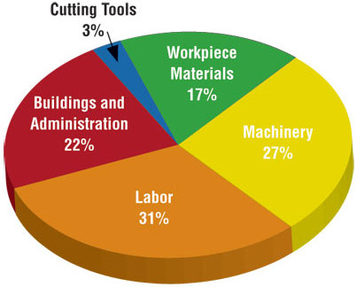

```{r child = "../setup.Rmd"}
```

```{r packages, echo=FALSE, message=FALSE, warning=FALSE}
library(tidyverse)
library(scales)
library(DT)
library(here)

# Remember to compile
#xaringan::inf_mr(cast_from = "..")

```

class: middle

# Designing effective visualizations

---

## Keep it simple

.pull-left-narrow[
```{r pie-3d, echo = FALSE, out.width="100%"}

```
]
.pull-right-wide[
```{r pie-to-bar, echo = FALSE, out.width="100%"}
d <- tribble(
  ~category, ~value,
  "Cutting tools", 0.03,
  "Buildings and administration", 0.22,
  "Labor", 0.31,
  "Machinery", 0.27,
  "Workplace materials", 0.17
)
ggplot(d, aes(x = fct_reorder(category, value), y = value)) +
  geom_col() +
  theme_minimal() +
  coord_flip() +
  labs(x = "", y = "")
```
]


---

## Use	color	to	draw	attention


.pull-left[
```{r echo = FALSE, out.width="100%"}
d %>%
  mutate(category = str_replace(category, " ", "\n")) %>%
  ggplot(aes(x = category, y = value, fill = category)) +
  geom_col() +
  theme_minimal() +
  labs(x = "", y = "") +
  theme(legend.position = "none")
```
]
.pull-right[
```{r echo = FALSE, out.width="100%"}
ggplot(d, aes(x = fct_reorder(category, value), y = value, fill = category)) +
  geom_col() +
  theme_minimal() +
  coord_flip() +
  labs(x = "", y = "") +
  scale_fill_manual(values = c("red", rep("gray", 4))) +
  theme(legend.position = "none")
```
]


---

## Tell a story

```{r echo = FALSE, out.width = "80%"}
knitr::include_graphics("img/time-series.story.png")
```

.footnote[
Credit: Angela Zoss and Eric Monson, Duke DVS
]

---

class: middle

# Principles for effective visualizations

---

## Principles	for	effective	visualizations

- Order matters
- Put long categories on the y-axis
- Keep	scales consistent
- Select meaningful colors
- Use meaningful and nonredundant labels

---

## Data

In September 2019, YouGov survey asked 1,639 GB adults the following question:
.pull-left[
> In hindsight, do you think Britain was right/wrong to vote to leave EU?
>
>- Right to leave  
>- Wrong to leave  
>- Don't know
]
.pull-right[
```{r echo=FALSE}
brexit <- tibble(
  opinion = c(
    rep("Right", 664), rep("Wrong", 787), rep("Don't know", 188)
    ),
  region = c(
    rep("london", 63), rep("rest_of_south", 241), rep("midlands_wales", 145), rep("north", 176), rep("scot", 39),
    rep("london", 110), rep("rest_of_south", 257), rep("midlands_wales", 152), rep("north", 176), rep("scot", 92),
    rep("london", 24), rep("rest_of_south", 49), rep("midlands_wales", 57), rep("north", 48), rep("scot", 10)
    )
)
```

```{r echo = FALSE, out.width="100%"}
ggplot(brexit, aes(x = opinion)) +
  geom_bar()
```
]

.footnote[ 
Source: [YouGov Survey Results](https://d25d2506sfb94s.cloudfront.net/cumulus_uploads/document/x0msmggx08/YouGov%20-%20Brexit%20and%202019%20election.pdf), retrieved Oct 7, 2019
]

---

class: middle

# Order matters

---

## Alphabetical order is rarely ideal

```{r out.width="85%"}
ggplot(brexit, aes(x = opinion)) +
  geom_bar()
```

---

## Order by frequency

`fct_infreq`: Reorder factors' levels by frequency

```{r out.width="75%"}
ggplot(brexit, aes(x = fct_infreq(opinion))) +
  geom_bar()
```

---

## Clean up labels

```{r out.width="80%"}
ggplot(brexit, aes(x = opinion)) +
  geom_bar() +
  labs( #<<
    x = "Opinion", #<<
    y = "Count" #<<
  ) #<<
```

---

## Alphabetical order is rarely ideal

```{r out.width="85%"}
ggplot(brexit, aes(x = region)) +
  geom_bar()
```

---

## Use inherent level order

`fct_relevel`: Reorder factor levels using a custom order

.midi[
```{r eval=TRUE}
brexit <- brexit %>%
  mutate(
    region = fct_relevel( #<<
      region,
      "london", "rest_of_south", "midlands_wales", "north", "scot"
    )
  )
```
]

```{r echo=FALSE, out.width="55%"}
ggplot(brexit, aes(x = region)) +
  geom_bar()
```

---

## Clean up labels

`fct_recode`: Change factor levels by hand

```{r}
brexit <- brexit %>%
  mutate(
    region = fct_recode( #<<
      region,
      London = "london",
      `Rest of South` = "rest_of_south",
      `Midlands / Wales` = "midlands_wales",
      North = "north",
      Scotland = "scot"
    )
  )
```

---

## Clean up labels (cont.)

```{r out.width="85%"}
ggplot(brexit, aes(x = region)) +
  geom_bar()
```

---

class: middle

# Put long categories on the y-axis

---

## Long categories can be hard to read

```{r out.width="85%"}
ggplot(brexit, aes(x = region)) +
  geom_bar()
```

---

## Move them to the y-axis

```{r out.width="80%"}
ggplot(brexit, aes(x = region)) +
  geom_bar() +
  coord_flip()  #<<
```

---

## Move them to the y-axis

```{r out.width="80%"}
ggplot(brexit, aes(y = region)) + #<<
  geom_bar()
```


---

## And reverse the order of levels
`fct_rev`: Reverse order of factor levels


```{r out.width="80%"}
ggplot(brexit, aes(y = fct_rev(region))) + #<<
  geom_bar()
```

---

## Clean up labels

```{r out.width="80%"}
ggplot(brexit, aes(y = fct_rev(region))) +
  geom_bar() +
  labs( #<<
    x = "Count", #<<
    y = "Region" #<<
  ) #<<
```

---

class: middle

# Pick a purpose

---

## Segmented bar plots can be hard to read

```{r out.width="80%"}
ggplot(brexit, aes(y = region, fill = opinion)) + #<<
  geom_bar()
```

---

## Use facets

```{r out.width="80%"}
ggplot(brexit, aes(y = opinion, fill = region)) +
  geom_bar() +
  facet_wrap(~region, nrow = 1) #<<
```

---

## Avoid redundancy?

```{r out.width="80%"}
ggplot(brexit, aes(y = opinion)) +
  geom_bar() +
  facet_wrap(~region, nrow = 1)
```

## Redundancy can help tell a story


```{r facet-fill}
ggplot(brexit, aes(y = opinion, fill = opinion)) +
  geom_bar() +
  facet_wrap(~region, nrow = 1)
```


---

## Be selective with redundancy


```{r hide-legend}
ggplot(brexit, aes(y = opinion, fill = opinion)) +
  geom_bar() +
  facet_wrap(~region, nrow = 1) +
  guides(fill = FALSE) #<<
```

---

## Informative labels

```{r informative-label}
ggplot(brexit, aes(y = opinion, fill = opinion)) +
  geom_bar() +
  facet_wrap(~region, nrow = 1) +
  guides(fill = FALSE) +
  labs(
    title = "Was Britain right/wrong to vote to leave EU?", #<<
    x = NULL, y = NULL
  )
```


---

## A bit more info

```{r more-info}
ggplot(brexit, aes(y = opinion, fill = opinion)) +
  geom_bar() +
  facet_wrap(~region, nrow = 1) +
  guides(fill = FALSE) +
  labs(
    title = "Was Britain right/wrong to vote to leave EU?",
    subtitle = "YouGov Survey Results, 2-3 September 2019", #<<
    caption = "Source: https://d25d2506sfb94s.cloudfront.net/cumulus_uploads/document/x0msmggx08/YouGov%20-%20Brexit%20and%202019%20election.pdf", #<<
    x = NULL, y = NULL
  )
```

---

## Let's do better

```{r short-link}
ggplot(brexit, aes(y = opinion, fill = opinion)) +
  geom_bar() +
  facet_wrap(~region, nrow = 1) +
  guides(fill = FALSE) +
  labs(
    title = "Was Britain right/wrong to vote to leave EU?",
    subtitle = "YouGov Survey Results, 2-3 September 2019",
    caption = "Source: bit.ly/2lCJZVg", #<<
    x = NULL, y = NULL
  )
```

---


## Fix up facet labels

```{r label-wrap}
ggplot(brexit, aes(y = opinion, fill = opinion)) +
  geom_bar() +
  facet_wrap(~region,
    nrow = 1,
    labeller = label_wrap_gen(width = 12) #<<
  ) + 
  guides(fill = FALSE) +
  labs(
    title = "Was Britain right/wrong to vote to leave EU?",
    subtitle = "YouGov Survey Results, 2-3 September 2019",
    caption = "Source: bit.ly/2lCJZVg",
    x = NULL, y = NULL
  )
```


class: middle

# Select meaningful colors

---

## Rainbow colors are not always the right choice

```{r out.width="85%"}
ggplot(brexit, aes(y= region, fill = opinion)) +
  geom_bar(position = "fill") 
```

---
## Manually choose colors when needed


```{r red-green}
ggplot(brexit, aes(y = opinion, fill = opinion)) +
  geom_bar() +
  facet_wrap(~region, nrow = 1, labeller = label_wrap_gen(width = 12)) +
  guides(fill = FALSE) +
  labs(title = "Was Britain right/wrong to vote to leave EU?",
       subtitle = "YouGov Survey Results, 2-3 September 2019",
       caption = "Source: bit.ly/2lCJZVg",
       x = NULL, y = NULL) +
  scale_fill_manual(values = c( #<<
    "Wrong" = "red", #<<
    "Right" = "green", #<<
    "Don't know" = "gray" #<<
  )) #<<
```


---

## Choosing better colors

.center.large[
[colorbrewer2.org](https://colorbrewer2.org/)
]

```{r echo = FALSE, out.width = "60%"}
knitr::include_graphics("img/color-brewer.png")
```

---

## Use better colors


```{r color-brewer}
ggplot(brexit, aes(y = opinion, fill = opinion)) +
  geom_bar() +
  facet_wrap(~region, nrow = 1, labeller = label_wrap_gen(width = 12)) +
  guides(fill = FALSE) +
  labs(title = "Was Britain right/wrong to vote to leave EU?",
       subtitle = "YouGov Survey Results, 2-3 September 2019",
       caption = "Source: bit.ly/2lCJZVg",
       x = NULL, y = NULL) +
  scale_fill_manual(values = c(
    "Wrong" = "#ef8a62", #<<
    "Right" = "#67a9cf", #<<
    "Don't know" = "gray" #<<
  ))
```


---

## Select theme


```{r theme,}
ggplot(brexit, aes(y = opinion, fill = opinion)) +
  geom_bar() +
  facet_wrap(~region, nrow = 1, labeller = label_wrap_gen(width = 12)) +
  guides(fill = FALSE) +
  labs(title = "Was Britain right/wrong to vote to leave EU?",
       subtitle = "YouGov Survey Results, 2-3 September 2019",
       caption = "Source: bit.ly/2lCJZVg",
       x = NULL, y = NULL) +
  scale_fill_manual(values = c("Wrong" = "#ef8a62",
                               "Right" = "#67a9cf",
                               "Don't know" = "gray")) +
  theme_minimal() #<<
```


---


## Viridis scale works well with ordinal data 

```{r out.width="85%"}
ggplot(brexit, aes(x = region, fill = opinion)) +
  geom_bar(position = "fill") +
  coord_flip() +
  scale_fill_viridis_d()
```

---

## Clean up labels

```{r echo=FALSE, out.width="85%"}
ggplot(brexit, aes(x = region, fill = opinion)) +
  geom_bar(position = "fill") +
  coord_flip() +
  scale_fill_viridis_d() +
  labs(
    title = "Was Britain right/wrong to vote to leave EU?",
    subtitle = "YouGov Survey Results, 2-3 September 2019",
    caption = "Source: bit.ly/2lCJZVg",
    x = "", 
    y = "",
    fill = ""
)
```


.your-turn[
### .hand[Your turn!]
.midi[
- RStudio Cloud > `AE 07 - Brexit + Telling stories with dataviz` > `brexit.Rmd`. 
- Change the visualization in three different ways to tell slightly different stories with it each time.
]
]

---

# Sources

- Mine Çetinkaya-Rundel's Data Science in a Box([link](https://datasciencebox.org/))

---

class: middle

# Wrapping Up...
