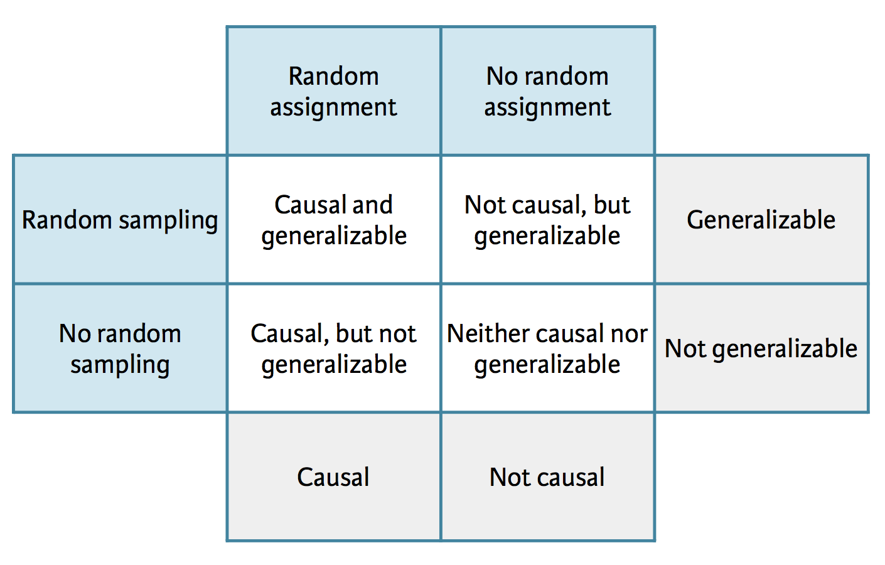

```{r child = "../setup.Rmd"}
```

```{r packages, echo=FALSE, message=FALSE, warning=FALSE}
library(tidyverse)
library(scales)
library(here)
library(kableExtra)
library(dsbox)

# Remember to compile
#xaringan::inf_mr(cast_from = "..")
```

class: middle

# Learning Goals

---

## Learning Goals

By the end of this session, you will be able to...

- Distinguish between observational studies and experiments
- Identify confounding variables and understand Simpson's Paradox
- Calculate conditional probabilities and assess independence
- Evaluate causal claims from study designs

---

class: middle

# Scientific studies

---

## Scientific studies

.pull-left[
**Observational**  
- Collect data in a way that does not interfere with how the data arise ("observe")
- Establish associations
]
.pull-right[
**Experimental**  
- Randomly assign subjects to treatments
- Establish causal connections
]

<br>

--
.question[
Obviously -- there is more to causal inference, but for the sake of time...
]

---

.question[
What type of study is the following, observational or experiment? What does that mean in terms of causal conclusions?]

- Researchers studying the relationship between exercising and energy levels asked participants in their study how many times a week they exercise and whether they have high or low energy when they wake up in the morning.
- Based on responses to the exercise question the researchers grouped people into three categories (no exercise, exercise 1-3 times a week, and exercise more than 3 times a week).
- The researchers then compared the proportions of people who said they have high energy in the mornings across the three exercise categories.


---

.question[
What type of study is the following, observational or experiment? What does that mean in terms of causal conclusions?]

- Researchers studying the relationship between exercising and energy levels randomly assigned participants in their study into three groups: no exercise, exercise 1-3 times a week, and exercise more than 3 times a week.
- After one week, participants were asked whether they have high or low energy when they wake up in the morning.
- The researchers then compared the proportions of people who said they have high energy in the mornings across the three exercise categories.


---

class: middle

# Case study: Breakfast cereal keeps girls slim

---

.medi[
> *Girls who ate breakfast of any type had a lower average body mass index (BMI), a common obesity gauge, than those who said they didn't. The index was even lower for girls who said they ate cereal for breakfast, according to findings of the study conducted by the Maryland Medical Research Institute with funding from the National Institutes of Health (NIH) and cereal-maker General Mills.* [...]
]

--

.medi[
> *The results were gleaned from a larger NIH survey of 2,379 girls in California, Ohio, and Maryland who were tracked between the ages of 9 and 19.* [...]
]

--

.medi[
>*As part of the survey, the girls were asked once a year what they had eaten during the previous three days.* [...]
]

--

.footnote[
Souce: [Study: Cereal Keeps Girls Slim](https://www.cbsnews.com/news/study-cereal-keeps-girls-slim/)
]

---

## Explanatory and response variables

- Explanatory variable: Whether the participant ate breakfast or not
- Response variable: BMI of the participant


---

## Three possible explanations

--

1. Eating breakfast causes girls to be slimmer 


--
2. Being slim causes girls to eat breakfast


--
3. A third variable is responsible for both -- a **confounding** variable: 
  - an extraneous variable that affects both the explanatory and the response variable, 
  - and that makes it seem like there is a relationship between them

---

## Correlation != causation
.center[
```{r echo=FALSE, out.height="100%"}
knitr::include_graphics("img/xkcdcorrelation.png")
```
]
.footnote[
Randall Munroe CC BY-NC 2.5 http://xkcd.com/552/
]

---

## Studies and conclusions

```{r echo=FALSE, out.height="70%",out.width="70%"}

```

---
class: middle

# Wrapping Up... 

---

class: middle

# Climate change survey: 
A Conditional Probability Case Study

---

## Survey question

>A July 2019 YouGov survey asked 1633 GB and 1333 USA randomly selected adults 
which of the following statements about the global environment best describes 
their view:
>
>- The climate is changing and human activity is mainly responsible  
>- The climate is changing and human activity is partly responsible, together with other factors  
>- The climate is changing but human activity is not responsible at all  
>- The climate is not changing  

---

## Survey data

<br>

.small[
```{r echo=FALSE, message=FALSE}
yougov_climate_table <- read_csv("data/yougov-climate.csv")

response_levels <- names(yougov_climate_table)[-1]

yougov_climate <- yougov_climate_table %>%
  pivot_longer(cols = -country, names_to = "response", values_to = "count") %>%
  uncount(count) %>%
  mutate(response = fct_relevel(response, response_levels))
```

```{r climate-table, echo=FALSE}
table(yougov_climate) %>% 
  stats::addmargins() %>%
  knitr::kable(format = "html", booktabs = TRUE) %>%
  kableExtra::column_spec(column = 2:5, width = "0.5 in")
```
]

.footnote[
Source: [YouGov - International Climate Change Survey](https://d25d2506sfb94s.cloudfront.net/cumulus_uploads/document/epjj0nusce/YouGov%20-%20International%20climate%20change%20survey.pdf)
]

---

.question[
What percent of **all respondents** think the climate is changing and  
human activity is mainly responsible?  
]

.small[
```{r ref.label="climate-table", echo=FALSE}
```
]

--

```{r}
(all <- 1340 / 2966)
```


---

.question[
What percent of **GB respondents** think the climate is changing and  
human activity is mainly responsible?  
]

.small[
```{r ref.label="climate-table", echo=FALSE}
```
]

--

```{r}
(gb <- 833 / 1633)
```

---

.question[
What percent of **US respondents** think the climate is changing and  
human activity is mainly responsible?  
]

.small[
```{r ref.label="climate-table", echo=FALSE}
```
]

--

```{r}
(us <- 507 / 1333)
```

---

.question[
- Based on the percentages we calculated, does there appear to be a relationship between country and beliefs about climate change? 
- If yes, could there be another variable that explains this relationship?
]

.pull-left[
```{r}
all
gb
us
```
]

---

# Abridged Properties of Probabilities

- $0 ≤ P(A) ≤1$
- $P(S) = 1$
    - Probability of sample space must be 1
- $P (A$ or $B) = P(A) + P(B)$ IF disjoint
- Disjoint  (A and B don't overlap)
- $P (not A) = 1- P(A)$


---

## Unabridged Properties of Probabilities
.midi[- Any probability is a number between 0 and 1. 
  - $0 ≤ P(A) ≤1$
- All possible outcomes together must have probability 1. 
  - Because some outcome must occur on every trial, the sum of the probabilities for all possible outcomes must be exactly 1
  - $P(S) = 1$
     - Probability of sample space must be 1
- If two events have no outcomes in common (disjoint), the probability that one or the other occurs is the sum of their individual probabilities.
  - $P (A$ or $B) = P(A) + P(B)$ IF disjoint
  - Disjoint  (A and B don't overlap)
- The probability that an event does not occur is 1 minus the probability that the event does occur. 
  - The probability that an event occurs and the probability that it does not occur always add to 1, or 100%.
 - $P (not A) = 1- P(A)$
]

---

# Abridged Properties of Probabilities

- $0 ≤ P(A) ≤1$
- $P(S) = 1$
    - Probability of sample space must be 1
- $P (A$ or $B) = P(A) + P(B)$ IF disjoint
- Disjoint  (A and B don't overlap)
- $P (not A) = 1- P(A)$

---

## Conditional probability

**Notation**: $P(A | B)$: Probability of event A given event B

The probability we assign to an event can change if we know that some other event has occurred. 
- If the occurrence of event B, depends in some sense on the occurrence of event A, 
  - then we can talk about the conditional probability of B, given A.
- $P(B | A)$ 
  - B given A
---

# Examples

- Weather
  - $B$ = event, John carries an umbrella
  - $A$ = weather forecast predicted rain
  - So tied to together that $P(B|A)$ is likely = $P(A)$
--

- Drawing a King
 - $P (K) = 4/52$
 - $P($ 2nd card is a king $|$ 1st card was a king $) = 3/51$
 - $P($ 2nd card is a king $|$ 1st card not king $) = 4/51$

---

## Independence

- Two events are independent if $P(A|B) = P(A)$, $P(B|A)= P(B)$
- Two events $A$ and $B$ are independent,
  - if knowing that one occurs does not change the probability that the other occurs
--

- Card Example
  - A = heart; B = Jack
  - $P(H)= 13/52$
  - $P(H|J) = 1/4$; 
  - are independent
--

- Be careful not to confuse disjointness and independence. 
    - If $A$ and $B$ are disjoint, 
    - then the fact that $A$ occurs tell us that $B$ cannot occur 
    - very dependent!


---

class: middle

# Wrapping Up...

---


class: middle

# Introducing Simpson's Paradox

---

## Relationships between variables

- Relationship between two variables: Fitness $\rightarrow$ Heart health
- Relationship between multiple variables: Calories + Age + Fitness $\rightarrow$ Heart health

---

## Relationship between two variables

<br>

.pull-right-narrow[
```{r echo=FALSE, message=FALSE}
df <- tribble(
  ~x, ~y, ~z,
  2,   4,  "A",
  3,   3,  "A",
  4,   2,  "A",
  5,   1,  "A",
  6,   11, "B",
  7,   10, "B",
  8,   9,  "B",
  9,   8,  "B"
)
df %>% 
  select(x, y) %>% 
  t() %>% 
  knitr::kable() %>%
  column_spec(1, bold = T, border_right = T)
```
]

---

## Relationship between two variables

<br>

.pull-left-wide[
```{r echo=FALSE, message=FALSE, out.width = "100%"}
ggplot(data = df) +
  geom_point(aes(x = x, y = y), color = "darkgray") +
  theme_minimal()
```
]

.pull-right-narrow[
```{r echo=FALSE, message=FALSE}
df <- tribble(
  ~x, ~y, ~z,
  2,   4,  "A",
  3,   3,  "A",
  4,   2,  "A",
  5,   1,  "A",
  6,   11, "B",
  7,   10, "B",
  8,   9,  "B",
  9,   8,  "B"
)
df %>% 
  select(x, y) %>% 
  t() %>% 
  knitr::kable() %>%
  column_spec(1, bold = T, border_right = T)
```
]


---

## Relationship between two variables

<br>

.pull-left-wide[
```{r echo=FALSE, message=FALSE, out.width = "100%"}
ggplot(data = df) +
  geom_point(aes(x = x, y = y), color = "darkgray") +
  geom_smooth(aes(x = x, y = x), color = "darkgray") +
  theme_minimal()
```
]
.pull-right-narrow[
```{r echo=FALSE, message=FALSE}
df %>% 
  select(x, y) %>% 
  t() %>% 
  knitr::kable() %>%
  column_spec(1, bold = T, border_right = T)
```
]

---

## Considering a third variable

<br>

.pull-left-wide[
```{r echo=FALSE, message=FALSE, out.width = "100%"}
ggplot(data = df) +
  geom_point(aes(x = x, y = y, color = z)) +
  geom_smooth(aes(x = x, y = x), method = "lm", color = "darkgray") +
  theme_minimal()
```
]

.pull-right-narrow[
```{r echo=FALSE, message=FALSE}
df %>% 
  select(x, y, z) %>% 
  t() %>% 
  knitr::kable() %>%
  column_spec(1, bold = T, border_right = T)
```
]

---

## Relationship between three variables

<br>

.pull-left-wide[
```{r echo=FALSE, message=FALSE, out.width = "100%"}
ggplot(data = df) +
  geom_point(aes(x = x, y = y, color = z)) +
  geom_smooth(aes(x = x, y = x), method = "lm", color = "darkgray") +
  geom_smooth(aes(x = x, y = y, color = z), method = "lm") +
  theme_minimal()
```
]

.pull-right-narrow[
```{r echo=FALSE, message=FALSE}
df %>% 
  select(x, y, z) %>% 
  t() %>% 
  knitr::kable() %>%
  column_spec(1, bold = T, border_right = T)
```
]

---

class: middle

# Wrapping Up... 

---

class:middle 

# Case study: Berkeley admission data

---

## Berkeley admission data

- Study carried out by the Graduate Division of the University of California, Berkeley in the early 1970s to evaluate whether there was a gender bias in graduate admissions.
- The data come from six departments. For confidentiality we'll call them A-F. 
- We have information on whether the applicant was male or female and whether they were admitted or rejected. 
- First, we will evaluate whether the percentage of males admitted is indeed higher than females, overall. Next, we will calculate the same percentage for each department.

---

## Data

.pull-left[
```{r message=FALSE, echo=FALSE}
ucbadmit %>%
  print(n = 15)
```
]
.medi[.pull-right[
```{r message=FALSE, echo=FALSE}
ucbadmit %>%
  count(gender)

ucbadmit %>%
  count(dept)

ucbadmit %>%
  count(admit)
```
]
]
---

.question[
What can you say about the overall gender distribution?
]

.small.tip[Calculate the following probabilities: $P(Admit | Male)$ and $P(Admit | Female)$.
]

```{r}
ucbadmit %>%
  count(gender, admit)
```

---

```{r ucbadmit-overall-prop}
ucbadmit %>%
  count(gender, admit) %>%
  group_by(gender) %>%
  mutate(prop_admit = n / sum(n))
```

- $P(Admit | Female)$ = 0.304
- $P(Admit | Male)$ = 0.445

---

## Overall gender distribution

.pull-left[
```{r ref.label="gender-admit", echo = FALSE, out.width = "100%"}
```
]

.medi[.pull-right[
```{r gender-admit, fig.show = "hide"}
ggplot(ucbadmit, aes(y = gender, 
                     fill = admit)) +
  geom_bar(position = "fill") + 
  labs(title = "Admit by gender",
       y = NULL, x = NULL)
```
]
]

---

.question[
What can you say about the gender distribution by department ?
]
.center[
```{r}
ucbadmit %>%
  count(dept, gender, admit)
```
]
---

.question[
Let's try again... What can you say about the gender distribution by department?
]

```{r}
ucbadmit %>%
  count(dept, gender, admit) %>%
  pivot_wider(names_from = dept, values_from = n)
```

---

## Gender distribution, by department

.pull-left[
```{r ref.label="gender-dept-admit", echo = FALSE,out.width = "100%"}
```
]

.midi.pull-right[
```{r gender-dept-admit, fig.show = "hide"}
ggplot(ucbadmit, aes(y = gender, fill = admit)) +
  geom_bar(position = "fill") +
  facet_wrap(. ~ dept) +
  scale_x_continuous(labels = label_percent()) +
  labs(title = "Admissions by gender and department",
       x = NULL, y = NULL, fill = NULL) +
  theme(legend.position = "bottom")
```
]


---

## Case for gender discrimination?

.pull-left[
```{r ref.label="gender-admit", echo=FALSE, out.width="100%"}
```
]
.pull-right[
```{r ref.label="gender-dept-admit", echo=FALSE, out.width="100%"}
```
]

---

## Closer look at departments

.pull-left-wide[
```{r ref.label="gender-dept-admit-table", echo = FALSE}
```
]

.pull-right-narrow.midi[
```{r gender-dept-admit-table, eval = FALSE}
ucbadmit %>%
  count(dept, gender, admit) %>%
  group_by(dept, gender) %>%
  mutate(
    n_applied  = sum(n),
    prop_admit = n / n_applied
    ) %>%
  filter(admit == "Admitted") %>%
  rename(n_admitted = n) %>%
  select(-admit) %>%
  print(n = 12)
```

]

---

class:middle

# Wrapping Up...

---

class: middle

# Revisting Simpson's Paradox

---

## Relationship between two variables

.pull-left-narrow[
```{r echo=FALSE, message=FALSE}
df <- tribble(
  ~x, ~y, ~z,
  2,   4,  "A",
  3,   3,  "A",
  4,   2,  "A",
  5,   1,  "A",
  6,   11, "B",
  7,   10, "B",
  8,   9,  "B",
  9,   8,  "B"
)
df
```
]
.pull-right-wide[
```{r echo=FALSE, out.width="100%"}
ggplot(df) +
  geom_point(aes(x = x, y = y), color = "darkgray", size = 5) +
  theme_minimal()
```
]

---

## Relationship between two variables

.pull-left-narrow[
```{r echo=FALSE, message=FALSE}
df
```
]
.pull-right-wide[
```{r echo=FALSE, out.width="100%"}
ggplot(data = df) +
  geom_point(aes(x = x, y = y), color = "darkgray", size = 5) +
  geom_smooth(aes(x = x, y = x), color = "darkgray") +
  theme_minimal()
```
]

---

## Considering a third variable

.pull-left-narrow[
```{r echo=FALSE, message=FALSE}
df
```
]
.pull-right-wide[
```{r echo=FALSE, out.width="100%"}
ggplot(data = df) +
  geom_point(aes(x = x, y = y, color = z), size = 5) +
  geom_smooth(aes(x = x, y = x), method = "lm", color = "darkgray") +
  theme_minimal()
```
]

---

## Relationship between three variables

.pull-left-narrow[
```{r echo=FALSE, message=FALSE}
df
```
]
.pull-right-wide[
```{r echo=FALSE, out.width="100%"}
ggplot(data = df) +
  geom_point(aes(x = x, y = y, color = z), size = 5) +
  geom_smooth(aes(x = x, y = x), method = "lm", color = "darkgray") +
  geom_smooth(aes(x = x, y = y, color = z), method = "lm") +
  theme_minimal()
```
]

---

# Simpson's paradox

- Not considering an important variable when studying a relationship can result in **Simpson's paradox**
- Simpson's paradox illustrates 
  - the effect that omission of an explanatory variable can have 
  - on the measure of association between 
  - another explanatory variable and a response variable
- The inclusion of a third variable in the analysis can change 
  - the apparent relationship between the other two variables

---

class: middle

# Aside: `group_by()` and `count()`

---

## What does group_by() do?

`group_by()` takes an existing data frame and converts it into a grouped data frame where subsequent operations are performed "once per group"

.medi.pull-left[
```{r}
ucbadmit
```
]
.medi.pull-right[
```{r}
ucbadmit %>% 
  group_by(gender)
```
]

---

## What does group_by() not do?

`group_by()` does not sort the data, `arrange()` does

.medi.pull-left[
```{r}
ucbadmit %>% 
  group_by(gender)
```
]
.medi.pull-right[
```{r}
ucbadmit %>% 
  arrange(gender)
```
]

---

## What does group_by() not do?

`group_by()` does not create frequency tables, `count()` does

.medi.pull-left[
```{r}
ucbadmit %>% 
  group_by(gender)
```
]
.medi.pull-right[
```{r}
ucbadmit %>% 
  count(gender)
```
]

---

## Undo grouping with ungroup()

.medi.pull-left[
```{r}
ucbadmit %>%
  count(gender, admit) %>%
  group_by(gender) %>%
  mutate(prop_admit = n / sum(n)) %>%
  select(gender, prop_admit)
```
]
.medi.pull-right[
```{r}
ucbadmit %>%
  count(gender, admit) %>%
  group_by(gender) %>%
  mutate(prop_admit = n / sum(n)) %>%
  select(gender, prop_admit) %>%
  ungroup()
```
]

---

## count() is a short-hand

`count()` is a short-hand for `group_by()` and then `summarize()` to count the number of observations in each group

.pull-left[
```{r}
ucbadmit %>%
  group_by(gender) %>%
  summarize(n = n()) 
```
]
.pull-right[
```{r}
ucbadmit %>%
  count(gender)
```
]

---

## count can take multiple arguments

.pull-left[
```{r}
ucbadmit %>%
  group_by(gender, admit) %>%
  summarize(n = n()) 
```
]
.pull-right[
```{r}
ucbadmit %>%
  count(gender, admit)
```
]

---

## `summarize()` after `group_by()`

- `count()` ungroups after itself
- `summarize()` peels off one layer of grouping by default, or you can specify a different behavior

.medi[
```{r message=TRUE}
ucbadmit %>%
  group_by(gender, admit) %>%
  summarize(n = n()) 
```
]

---

class: middle

# Summary: Learning Goals Achieved

---

## What We've Learned

Today, you should now be able to...

.pull-left[
### Concepts
- ✅ Observational vs. experimental studies
- ✅ Confounding variables
- ✅ Simpson's Paradox
]

.pull-right[
### Skills
- ✅ Calculate conditional probabilities
- ✅ Assess independence
- ✅ Evaluate causal claims
]

---

class: middle

# Wrapping Up... 

<br>

Sources:
- Mine Çetinkaya-Rundel's Data Science in a Box ([link](https://datasciencebox.org/))


