```{r child = "../setup.Rmd"}
```

```{r packages, echo=FALSE, message=FALSE, warning=FALSE}
library(tidyverse)
library(scales)
library(here)
library(rvest)
library(DT)


# Remember to compile
#xaringan::inf_mr(cast_from = "..")

```

class: middle

# Scraping the web

---

## Scraping the web: what? why?

- Increasing amounts of data are available on the web
--

- These data are provided in an unstructured format: you can always copy&paste, 
  - but it's time-consuming and prone to errors

--
- Web scraping is the process of extracting this information automatically and transform it into a structured dataset

--
- Two different scenarios:
    - Screen scraping: extract data from source code of website, with html parser (easy) or regular expression matching (less easy).
    - Web APIs (application programming interface): website offers a set of structured http requests that return JSON or XML files.
---

class: middle

# Web Scraping with rvest

---

## Hypertext Markup Language

- Most of the data on the web is still largely available as HTML 
- It is structured (hierarchical / tree based), but it''s often not available in a form useful for analysis (flat / tidy).

```html
<html>
  <head>
    <title>This is a title</title>
  </head>
  <body>
    <p align="center">Hello world!</p>
  </body>
</html>
```

---

## rvest

.pull-left[
- The **rvest** package makes basic processing and manipulation of HTML data straight forward
- It's designed to work with pipelines built with `%>%`
]
.pull-right[
```{r echo=FALSE,out.width=230,fig.align="right"}
knitr::include_graphics("img/rvest.png")
```
]

---

## Core rvest functions

- `read_html`   - Read HTML data from a url or character string
- `html_node `  - Select a specified node from HTML document
- `html_nodes`  - Select specified nodes from HTML document
- `html_table`  - Parse an HTML table into a data frame
- `html_text`   - Extract tag pairs' content
- `html_name`   - Extract tags' names
- `html_attrs`  - Extract all of each tag's attributes
- `html_attr`   - Extract tags' attribute value by name

---
class: middle

# Wrapping Up...

---

class: middle

# Using the SelectorGadget

---

## SelectorGadget

.pull-left-narrow[
- Open source tool that eases CSS selector generation and discovery
- Easiest to use with the [Chrome Extension](https://chrome.google.com/webstore/detail/selectorgadget/mhjhnkcfbdhnjickkkdbjoemdmbfginb) 
- Find out more on the [SelectorGadget vignette](https://cran.r-project.org/web/packages/rvest/vignettes/selectorgadget.html)
- Note: Our class is about 50-50 (Apple-Microsoft) 
  - I have screen shots from a Mac in the slides,
  - and screen captures from my PC
]
.pull-right-wide[
```{r echo=FALSE, out.width="75%"}
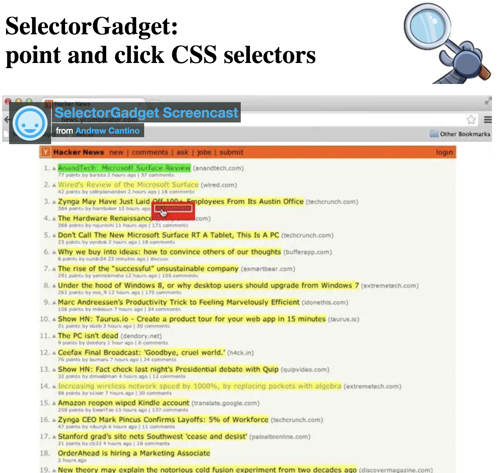
```
]

---

class: middle

# Using the SelectorGadget (MAC)

---
## Using the SelectorGadget (MAC)


```{r echo=FALSE, out.width="80%"}
knitr::include_graphics("img/selector_gadget/selector-gadget.gif")
```

---

```{r echo=FALSE, out.width="95%"}
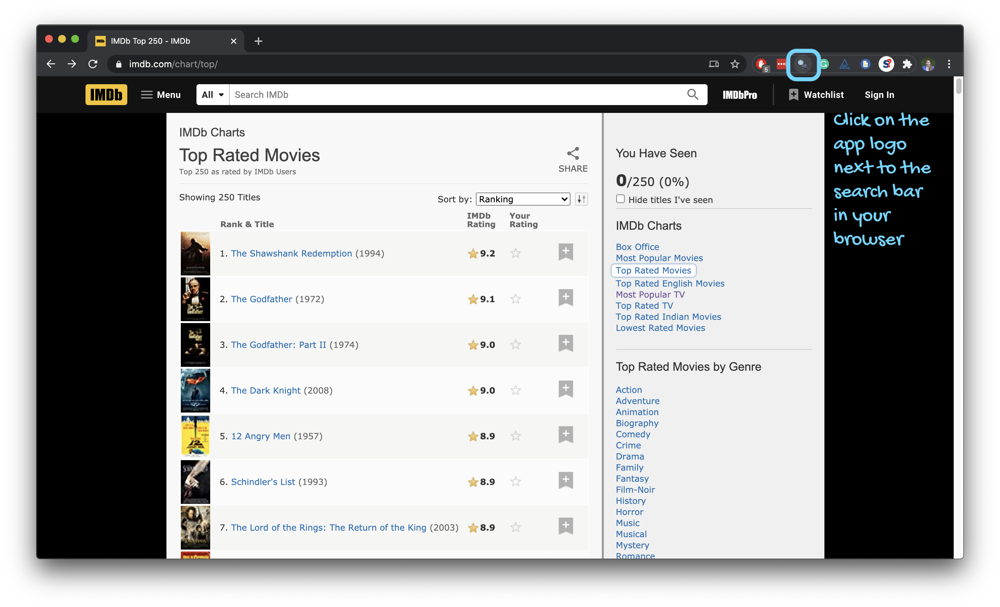
```

---

```{r echo=FALSE, out.width="95%"}
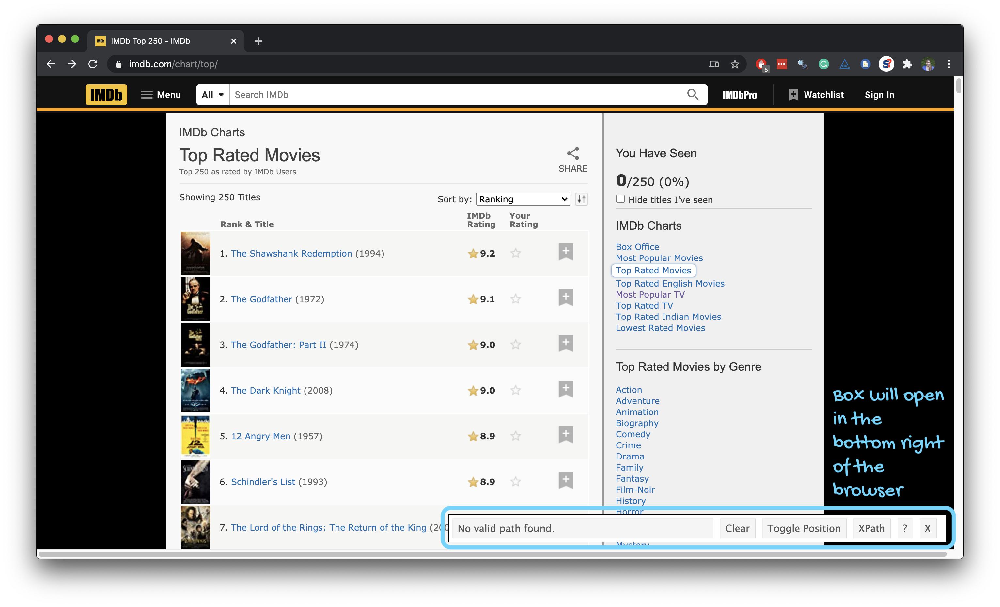
```

---

```{r echo=FALSE, out.width="95%"}
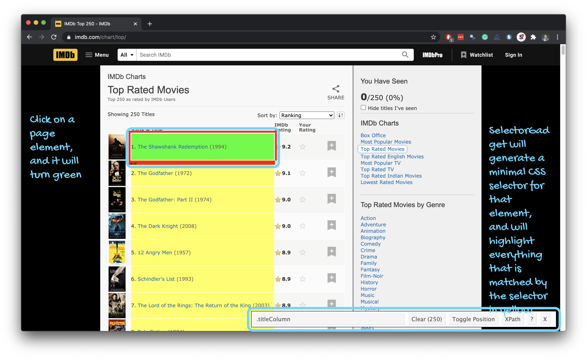
```

---

```{r echo=FALSE, out.width="95%"}
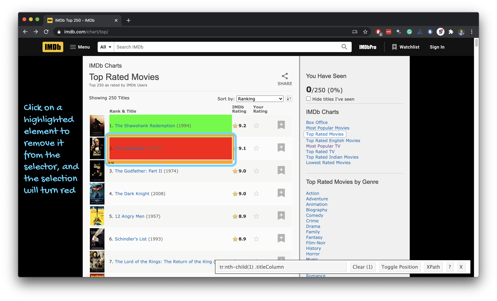
```

---

```{r echo=FALSE, out.width="95%"}
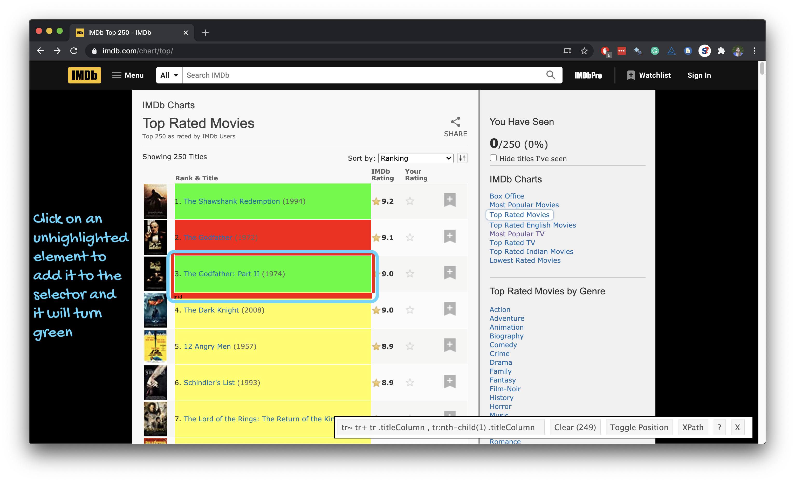
```

---
## Using the SelectorGadget (MAC)
Through this process of selection and rejection, 
SelectorGadget helps you find the appropriate CSS selector for your needs

```{r echo=FALSE, out.width="65%"}
knitr::include_graphics("img/selector_gadget/selector-gadget.gif")
```
---

class: middle

# Using the SelectorGadget (PC)

---

## Using the SelectorGadget (PC)
.small.pull-left-narrow[
- Click on the logo next to the search bar
- A box will open in the bottom right of the website
- Click on a page element (it will turn green), 
  - SelectorGadget will generate a minimal CSS selector for that element, 
  - and will highlight (yellow) everything that is matched by the selector
- Click on a highlighted element to remove it from the selector (red), 
  - or click on an unhighlighted element to add it to the selector
- This process of selection and rejection, 
  - helps you find the appropriate CSS selector for your needs

]
---
class: middle

# Wrapping Up...

---


class: middle

# Top 250 movies on IMDB

---

## Top 250 movies on IMDB

Take a look at the source code, look for the tag `table` tag:
<br>
http://www.imdb.com/chart/top

```{r echo=FALSE, out.width="65%"}
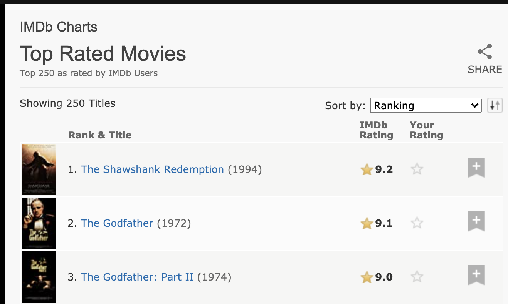
```

---

## First check if you're allowed!

```{r warning=FALSE}
library(robotstxt)
paths_allowed("http://www.imdb.com")
```

vs.

```{r warning=FALSE}
paths_allowed("http://www.facebook.com")
```


---

.your-turn[
- [class git repo](https://github.com/DataScience4Psych) > `AE 08 - IMDB + Webscraping`.
- Open `01-imdb-250movies.R`.
- Follow along, and fill in the blanks as we go based on upcoming slides.
]


---

## Plan

```{r echo=FALSE, out.width="90%"}
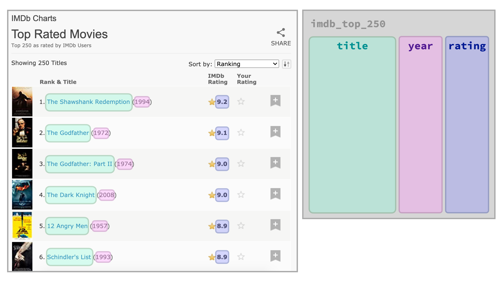
```

---

## Plan

1. Read the whole page

2. Scrape movie titles and save as `titles` 

3. Scrape years movies were made in and save as `years`

4. Scrape IMDB ratings and save as `ratings`

5. Create a data frame called `imdb_top_250` with variables `title`, `year`, and `rating`

---

class: middle

# Step 1. Read the whole page

---

## Read the whole page

```{r}
page <- read_html("https://www.imdb.com/chart/top/")
page
```

---

## A webpage in R

- Result is a list with 2 elements

```{r}
typeof(page)
```

--

- that we need to convert to something more familiar, like a data frame....

```{r}
class(page)
```

---

class: middle

# Step 2. Scrape movie titles and save as `titles` 

---

## Scrape movie titles

```{r echo=FALSE, out.width="70%"}
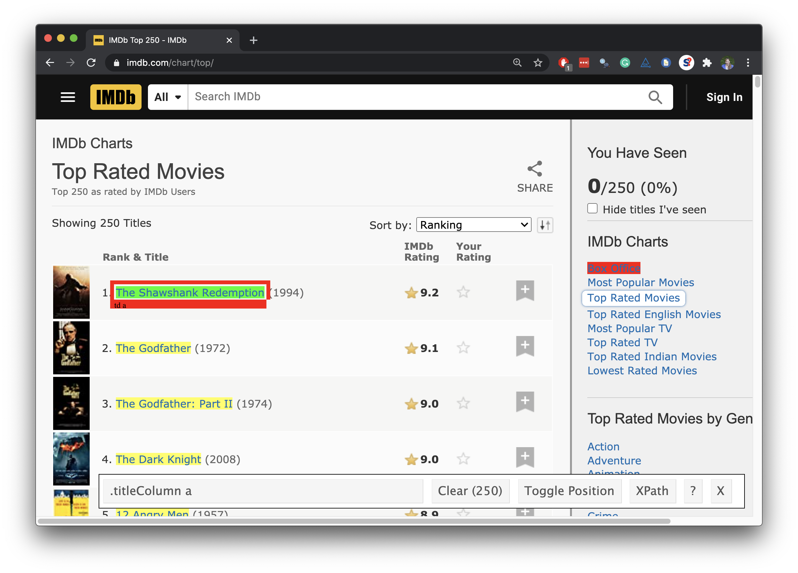
```

---

## Scrape the nodes

.pull-left[
```{r output.lines=17}
page %>%
  html_nodes(".titleColumn a")
```
]
.pull-right[
```{r echo=FALSE, out.width="100%"}

```
]

---

## Extract the text from the nodes

.pull-left[
```{r output.lines=16}
page %>%
  html_nodes(".titleColumn a") %>%
  html_text()
```
]
.pull-right[
```{r echo=FALSE, out.width="100%"}

```
]

---

## Save as `titles`

.pull-left[
```{r output.lines=14}
titles <- page %>%
  html_nodes(".titleColumn a") %>%
  html_text()

titles
```
]
.pull-right[
```{r echo=FALSE, out.width="100%"}

```
]

---

class: middle

# Step 3. Scrape year movies were made and save as `years`

---

## Scrape years movies were made in

```{r echo=FALSE, out.width="70%"}
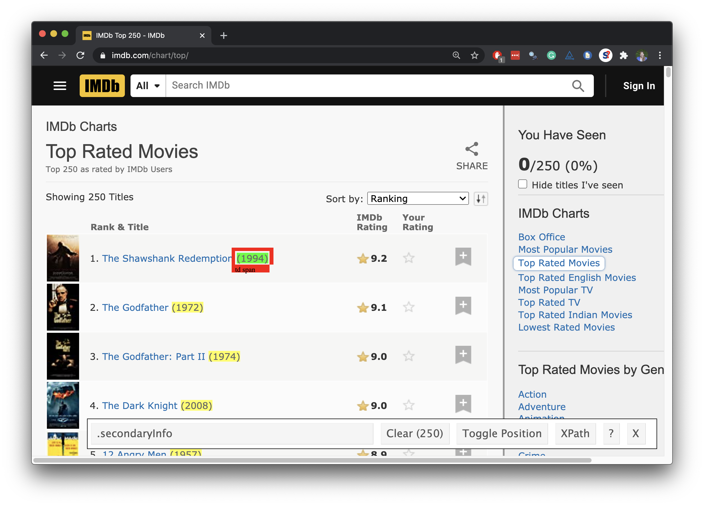
```

---

## Scrape the nodes

.pull-left[
```{r output.lines=17}
page %>%
  html_nodes(".secondaryInfo")
```
]
.pull-right[
```{r echo=FALSE, out.width="100%"}

```
]

---

## Extract the text from the nodes

.pull-left[
```{r output.lines=16}
page %>%
  html_nodes(".secondaryInfo") %>%
  html_text()
```
]
.pull-right[
```{r echo=FALSE, out.width="100%"}

```
]

---

## Clean up the text

We need to go from `"(1994)"` to `1994`:

- Remove `(` and `)`: string manipulation
- Convert to numeric: `as.numeric()`

---

## stringr

.pull-left-wide[
- **stringr** provides a cohesive set of functions designed to make working with strings as easy as possible
- Functions in stringr start with `str_*()`, e.g.
  - `str_remove()` to remove a pattern from a string
```{r}
str_remove(string = "jello", pattern = "el")
```
  - `str_replace()` to replace a pattern with another
  .midi[
```{r}
str_replace(string = "jello", pattern = "j", replacement = "h")
```
] 
]
.pull-right-narrow[
```{r echo=FALSE, fig.align="left", out.width="100%"}

```
]

---

## Clean up the text

```{r output.lines=15}
page %>%
  html_nodes(".secondaryInfo") %>%
  html_text() %>%
  str_remove("\\(") # remove (
```

---

## Clean up the text

```{r output.lines=13}
page %>%
  html_nodes(".secondaryInfo") %>%
  html_text() %>%
  str_remove("\\(") %>% # remove (
  str_remove("\\)") # remove )
```

---

## Convert to numeric

```{r output.lines=11}
page %>%
  html_nodes(".secondaryInfo") %>%
  html_text() %>%
  str_remove("\\(") %>% # remove (
  str_remove("\\)") %>% # remove )
  as.numeric()
```

---

## Save as `years`

.pull-left[
```{r output.lines=11}
years <- page %>%
  html_nodes(".secondaryInfo") %>%
  html_text() %>%
  str_remove("\\(") %>% # remove (
  str_remove("\\)") %>% # remove )
  as.numeric()

years
```
]
.pull-right[
```{r echo=FALSE, out.width="100%"}

```
]

---

class: middle

# Step 4. Scrape IMDB ratings and save as `ratings`

---

## Scrape IMDB ratings

```{r echo=FALSE, out.width="70%"}
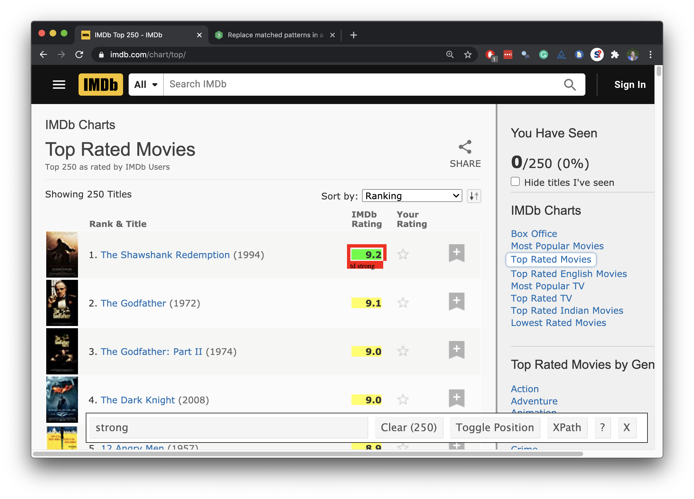
```

---

## Scrape the nodes

.pull-left[
```{r output.lines=17}
page %>%
  html_nodes("strong")
```
]
.pull-right[
```{r echo=FALSE, out.width="100%"}

```
]

---

## Extract the text from the nodes

.pull-left[
```{r output.lines=16}
page %>%
  html_nodes("strong") %>%
  html_text()
```
]
.pull-right[
```{r echo=FALSE, out.width="100%"}

```
]

---

## Convert to numeric

.pull-left[
```{r output.lines=15}
page %>%
  html_nodes("strong") %>%
  html_text() %>%
  as.numeric()
```
]
.pull-right[
```{r echo=FALSE, out.width="100%"}

```
]

---

## Save as `ratings`

.pull-left[
```{r output.lines=12}
ratings <- page %>%
  html_nodes("strong") %>%
  html_text() %>%
  as.numeric()

ratings
```
]
.pull-right[
```{r echo=FALSE, out.width="100%"}

```
]

---

class: middle

# Step 5. Create a data frame called `imdb_top_250`

---

## Create a data frame: `imdb_top_250`

```{r}
imdb_top_250 <- tibble(
  title = titles, 
  year = years, 
  rating = ratings
  )

imdb_top_250
```

---

```{r echo=FALSE}
imdb_top_250 %>% datatable(options(list(dom = "p", pageLength = 8)), height = 400)
```

---

## Clean up / enhance

May or may not be a lot of work depending on how messy the data are

- See if you like what you got:

```{r}
glimpse(imdb_top_250)
```

- Add a variable for rank
```{r}
imdb_top_250 <- imdb_top_250 %>%
  mutate(rank = 1:nrow(imdb_top_250)) %>%
  relocate(rank)
```

---

```{r echo=FALSE}
imdb_top_250 %>%
  print(n = 20)
```

---

class: middle

# What next?

---

.question[
Which years have the most movies on the list?
]

--

```{r}
imdb_top_250 %>% 
  count(year, sort = TRUE)
```

---

.question[
Which 1995 movies made the list?
]

--

```{r}
imdb_top_250 %>% 
  filter(year == 1995) %>%
  print(n = 8)
```

---

.question[
Visualize the average yearly rating for movies that made it on the top 250 list over time.
]

--

.pull-left[
```{r ref.label = "yearly-avg", echo = FALSE, out.width = "100%"}
```
]
.medi.pull-right[
```{r yearly-avg, fig.show = "hide"}
imdb_top_250 %>% 
  group_by(year) %>%
  summarize(avg_score = mean(rating)) %>%
  ggplot(aes(y = avg_score, x = year)) +
  geom_point() +
  geom_smooth(method = "lm", se = FALSE) +
  labs(x = "Year", y = "Average score")
```
]

---

## Potential challenges
.pull-left[
- Unreliable formatting at the source
- Data broken into many pages
- ...

.question[
Compare the display of information at [gumtree.com/cars-vans-motorbikes/london](https://www.gumtree.com/cars-vans-motorbikes/london) to the IMDB top 250 list.] 
- What challenges can you foresee in scraping a list of the available cars?

]
---

.your-turn[
- [class git repo](https://github.com/DataScience4Psych) > `AE 08 - IMDB + Webscraping`.
- Open `02-imdb-tvshows.R`.
- Scrape the names, scores, and years of most popular TV shows on IMDB:
[www.imdb.com/chart/tvmeter](http://www.imdb.com/chart/tvmeter).
- Create a data frame called `tvshows` with four variables: `rank`, `name`, `score`, `year`.
- Examine each of the **first three** TV shows to also obtain genre, runtime, how many episodes so far, first five plot keywords.
- Add this information to the `tvshows` data frame you created earlier.
]

---

# Sources

- Mine Çetinkaya-Rundel's Data Science in a Box([link](https://datasciencebox.org/))

---

class: middle

# Wrapping Up...
