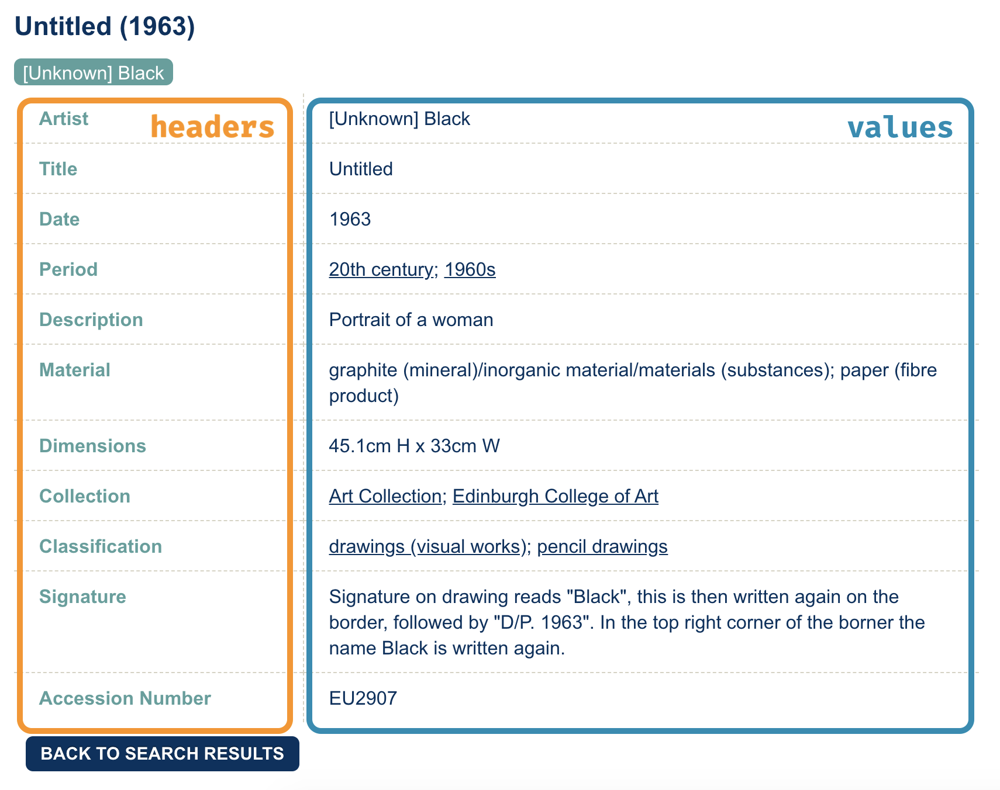
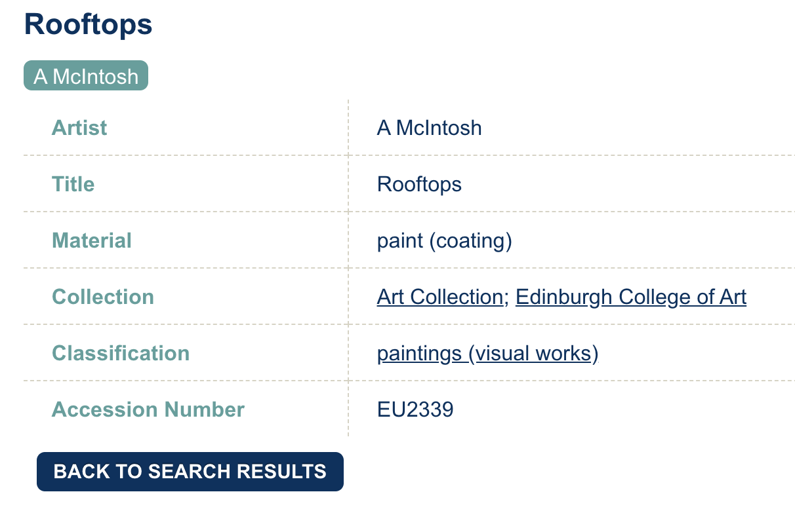

```{r child = "../setup.Rmd"}
```

```{r packages, echo=FALSE, message=FALSE, warning=FALSE}
library(tidyverse)
library(scales)
library(here)
library(rvest)
library(DT)


# Remember to compile
#xaringan::inf_mr(cast_from = "..")
```


class: middle

# Edinburgh College of Art Collection
Extra Scaffolding

---

```{r include=FALSE}
uoe_art <- read_csv("data/uoe-art.csv")
```


```{r echo=FALSE}
#uoe_art %>% 
#  datatable()

knitr::kable(head(uoe_art), format = 'html')
```


---

```{r echo=FALSE, out.width="70%"}
knitr::include_graphics("img/untitled-1963.png")
```

---

```{r echo=FALSE, out.width="70%"}

```

---

```{r echo=FALSE, out.width="100%"}
knitr::include_graphics("img/untitled-1963-to-df.png")
```

---

.your-turn[
- [class git repo](https://github.com/DataScience4Psych) > `AE 09 - UoE Art + Functions`.
- Open `01-individual-pieces.R`
- Follow along, and fill in the blanks as we go.
]

---


.small[
```{r eval=FALSE}
# load packages ----------------------------------------------------------------
library(tidyverse)
library(rvest)

# first url --------------------------------------------------------------------

## set url ----
first_info_url <- "https://collections.ed.ac.uk/art/record/22024?highlight=*:*"

## read page at url ----
page <- read_html(first_info_url)

## scrape headers ----
headers <- page %>%
  html_nodes("th") %>%
  html_text()

## scrape values ----
values <- page %>%
  html_nodes("td") %>%
  html_text() %>%
  str_squish()

## put together in a tibble and add link to help keep track ----
tibble(headers, values) %>%
  pivot_wider(names_from = headers, values_from = values) %>%
  add_column(link = first_info_url)
```
]

---

# Setting Up
.medi[
```{r}
# load packages 

library(tidyverse)
library(rvest)

# first url

## set url 
first_info_url <- "https://collections.ed.ac.uk/art/record/22024?highlight=*:*"

## read page at url ----
page <- read_html(first_info_url)

```
]
---

# Scrape headers

```{r}
headers <- page %>%
  html_nodes("th") %>%
  html_text()
```

---

# Scrape Values

```{r}

values <- page %>%
  html_nodes("td") %>%
  html_text() %>%
  str_squish()
```

---

# Put it together

```{r}

## put together in a tibble and add link to help keep track 

tibble(headers, values) %>%
  pivot_wider(names_from = headers, 
              values_from = values) %>%
  add_column(link = first_info_url)
```


---

class: middle

# Wrapping Up...

---

class: middle

# Functions

---

## When should you write a function?
<br>
--
.pull-left[
```{r echo=FALSE, out.width="100%"}
knitr::include_graphics("img/funct-all-things.png")
```
]
--
.pull-right[

- When you've copied and pasted a block of code more than twice.
]

--

<br>
.question[
How many times will we need to copy and paste the code we developed to scrape data on all of the art??
]

---

## Why functions?

- Automate common tasks in a more powerful and general way than copy-and-pasting:
  - Give your function an evocative name that makes your code easier to understand
  - As requirements change, only need to update code in one place, instead of many
  - Eliminate chance of making incidental mistakes when you copy and paste
      - (for example... updating a variable name in one place, but not in another)
      
--

- Long-term
  - Improve your reach as a data scientist by writing functions (and packages!) that others use
  - Useful for internal lab management as well...


---

## Inputs

.question[
How many inputs does the following code have?
]

.midi[
```{r eval=FALSE}
## set url ----
first_info_url <- "https://collections.ed.ac.uk/art/record/22024?highlight=*:*"

## read page at url ----
page <- read_html(first_info_url)

## scrape headers ----
headers <- page %>%
  html_nodes("th") %>%
  html_text()

## scrape values ----
values <- page %>%
  html_nodes("td") %>%
  html_text() %>%
  str_squish()

## put together in a tibble and add link to help keep track ----
tibble(headers, values) %>%
  pivot_wider(names_from = headers, values_from = values) %>%
  add_column(link = first_info_url)
```
]

---

## Inputs

.question[
How many inputs does the following code have?
]

.midi[
```{r eval=FALSE}
## set url ----
first_info_url <- "https://collections.ed.ac.uk/art/record/22024?highlight=*:*" #<<

## read page at url ----
page <- read_html(first_info_url) #<<

## scrape headers ----
headers <- page %>%
  html_nodes("th") %>%
  html_text()

## scrape values ----
values <- page %>%
  html_nodes("td") %>%
  html_text() %>%
  str_squish()

## put together in a tibble and add link to help keep track ----
tibble(headers, values) %>%
  pivot_wider(names_from = headers, values_from = values) %>%
  add_column(link = first_info_url) #<<
```
]

---

## Turn your code into a function
.pull-left[
- Pick a short but informative **name**, preferably a verb.
]

.pull-right[
```{r eval=FALSE}
scrape_art_info <- 
  
  
  
  
  
  
```
]
---

## Turn your code into a function

.pull-left[
- Pick a short but informative **name**, preferably a verb.
- List inputs, or **arguments**, to the function inside `function`. If we had more arguments the call would look like `function(x, y, z)`.

]

.pull-right[

```{r eval=FALSE}
scrape_art_info <- function(x){
  
  
  
  
  
}  
```
]
---

## Turn your code into a function
.pull-left[
- Pick a short but informative **name**, preferably a verb.
- List inputs, or **arguments**, to the function inside `function`. If we had more the call would look like `function(x, y, z)`.
- Place the **code** you have developed in body of the function, a `{}` block that immediately follows `function(...)`.
]
.pull-right[
```{r eval=FALSE}
scrape_art_info <- function(x){

  # code we developed earlier 
  # to scrape info 
  # on single art piece goes here
  
}
```
]
---

.your-turn[
- [class git repo](https://github.com/DataScience4Psych) > `AE 09 - UoE Art + Functions`.
- Open `02-functionalize.R`
- Follow along, and fill in the blanks if you like
]

---

.midi[
```{r}
scrape_art_info <- function(x){
  
  # read page at url ----
  page <- read_html(x)
  
  # scrape headers ----
  headers <- page %>%
    html_nodes("th") %>%
    html_text()
  
  # scrape values ----
  values <- page %>%
    html_nodes("td") %>%
    html_text() %>%
    str_squish()

  # put together in a tibble and add link to help keep track ----
  tibble(headers, values) %>%
    pivot_wider(names_from = headers, values_from = values) %>%
    add_column(link = x)
  
}
```
]

---

## Function in action

.midi[
```{r cache=FALSE}
scrape_art_info(uoe_art$link[1]) %>%
  glimpse()
```
]


---

## Function in action

```{r cache=FALSE}
scrape_art_info(uoe_art$link[2]) %>%
  glimpse()
```



---

## Function in action

.midi[
```{r cache=FALSE}
scrape_art_info(uoe_art$link[3]) %>%
  glimpse()
```
]


---

class: middle

# Wrapping Up...


---

class: middle

# Writing functions

---

## What goes in / what comes out?

- They take input(s) defined in the function definition

.medi[
```{r eval=FALSE}
function([inputs separated by commas]){
  # what to do with those inputs
}
```
]

- By default they return the last value computed in the function

.medi[
```{r eval=FALSE}
scrape_page <- function(x){
  # do bunch of stuff with the input...
  # return a tibble
  tibble(...)
}
```
]

 - You can define more outputs to be returned in a list as well as nice print methods 
   - (but we won't go there for now...)


---

.question[
What is going on here?
]

```{r}
add_2 <- function(x){
  x + 2
  1000
}
```

```{r}
add_2(3)
add_2(10)
```

---


## Naming functions

> "There are only two hard things in Computer Science: cache invalidation and naming things." 

>  -- Phil Karlton

---

## Naming functions

- Names should be short but clearly evoke what the function does

--
- Names should be verbs, not nouns

--
- Multi-word names should be separated by underscores (`snake_case` as opposed to `camelCase`)

--
- A family of functions should be named similarly (`scrape_page()`, `scrape_speech()` OR `str_remove()`, `str_replace()` etc.)

--
- Avoid overwriting existing (especially widely used) functions

```{r eval=FALSE}
# JUST DON'T
mean <- function(x){ 
  x * 3 
  }
```


---

class: middle

# Wrapping Up


---

class: middle

# Automation

---

## Define the task

- Goal: Scrape info on all 2909 art pieces in the collection
- So far:
.small[
```{r eval=FALSE}
scrape_art_info(uoe_art$link[1])
scrape_art_info(uoe_art$link[2])
scrape_art_info(uoe_art$link[3])
```
]
- What else do we need to do?
  - Run the `scrape_art_info()` function on all 2909 links
  - Combine the resulting data frames from each run into one giant data frame with 2909 rows
  
---

## Inputs

.question[
You now have a function that will scrape the relevant info on art pieces given the URL of its individual info page. Where can we get a list of URLs of each of the art pieces in the collection?
]

--

From the data frame you constructed previously: `uoe_art$link`

---

## Iteration

.question[
How can we tell R to apply the `scrape_art_info()` function to each link in `uoe_art$link`?
]

--

- Option 1: Write a **for loop**, i.e. explicitly tell R to visit a link, apply the function, store the result, then visit the next link, apply the function, append the result to the stored result from the previous link, and so on and so forth.
--

- Option 2: **Map** the function to each element in the list of links, and let R take care of the storing and appending of results.
--

- We'll go with Option 2!

---

## How does mapping work?

Suppose we have exam 1 and exam 2 scores of 4 students stored in a list...

```{r}
exam_scores <- list(
  exam1 <- c(80, 90, 70, 50),
  exam2 <- c(85, 83, 45, 60)
)
```

--

...and we find the mean score in each exam

```{r}
map(exam_scores, mean)
```

---

...and suppose we want the results as a numeric (double) vector

```{r}
map_dbl(exam_scores, mean)
```

...or as a character string

```{r}
map_chr(exam_scores, mean)
```

---

## `map_something`

Functions for looping over an object and returning a value (of a specific type):

* `map()` - returns a list
* `map_lgl()` - returns a logical vector
* `map_int()` - returns an integer vector
* `map_dbl()` - returns a double vector
* `map_chr()` - returns a character vector
* `map_df()` / `map_dfr()` - returns a data frame by row binding
* `map_dfc()` - returns a data frame by column binding
* ...

---

.your-turn[
- [class git repo](https://github.com/DataScience4Psych) > `AE 09 - UoE Art + Functions`.
- Open `03-iterate.R`.
- Follow along, and fill in the blanks as we go.
]

---

## Go to each page, scrape art info 

- Map the `scrape_art_info()` function
- to each element of `uoe_art$link`
- and return a data frame by row binding

```{r eval=FALSE}
uoe_art_info <- map_df(uoe_art$link, scrape_art_info)
```

---

```{r include=FALSE}
uoe_art_info_1 <- read_csv("data/uoe-art-info-1.csv")
```

```{r echo=FALSE}
#uoe_art_info_1 %>% 
#  datatable()

knitr::kable(head(uoe_art_info_1), format = 'html')
```

---

## What could go wrong?

```{r eval=FALSE}
uoe_art_info <- map_df(uoe_art$link, scrape_art_info)
```

- This code will take a while to run
- If you get `HTTP Error 429 (Too many requests)` you might want to slow down your hits by modifying your function to slow it down by adding a random wait (sleep) time between hitting each link

```{r eval=FALSE}
scrape_art_info <- function(x){
  
  # Sleep for randomly generated number of seconds
  # Generated from a uniform distribution between 0 and 1
  Sys.sleep(runif(1)) #<<
  
  # Rest of your function code goes here...
}
```
---

class: middle

# Wrapping Up...


---

class: middle

# Deeper Dive into Functions...

---

## Writing and calling functions

- Why?
--

  - Make your code more readable.
--
  - Allows you to re-use related lines of code for slightly different tasks.

--

  - Makes testing your code easier.

---

## What is a function?

- A way of turning some inputs into some outputs.

- A way of tying together related pieces of code.

- An object.

---

## Function creation

Syntax for function creation:

```
f = function(arguments) {
	body
}
```

- `arguments` are assignments of values to variables.

- `body` is the code you want to execute.

---

So for example, if we return to our steak-cooking example from the first week, we might define the following function:

```{r}
steak_directions = function(temp, steak_type) {
    if(steak_type == "rare" & temp > 115) {
        return("take your steak off!")
    } else if(steak_type == "med_rare" & temp > 125) {
        return("take your steak off!")        
    } 
    "you can keep cooking"
}

```

--

We can see the arguments and body of the function using `formals` and `body`, respectively.

```{r}
formals(steak_directions)
body(steak_directions)

---

## Function arguments

Once you have a function, you call it by specifying the values for all of the arguments.

The values can be specified in two ways:

- By position: first argument is assigned to the first variable in the function definition, second argument to the second variable in the function definition, and so on

- By name: arguments are specified by name instead of being inferred based on position.

The two can be combined.
---

So for example, the following are all the same:

```{r}
steak_directions(temp = 120, steak_type = "rare")
steak_directions(steak_type = "rare", temp = 120)
steak_directions(120, "rare")
```

But this is of course different and will not work:
```{r}
simulate_birthdays("rare", 120)
```

---

## Default arguments

When you define a function, you can set default values for any/all of the arguments.

When you call such a function, if you don't specify a value for that argument, it will automatically go to the default value.

--

For example, in the following function the default argument for `steak_type` is `"rare"`.

```{r}
steak_directions = function(temp, steak_type = "rare") {
    if(steak_type == "rare" & temp > 115) {
        return("take your steak off!")
    } else if(steak_type == "med_rare" & temp > 125) {
        return("take your steak off!")        
    } 
    "you can keep cooking"
}

--
If we don't specify `steak_type`, we will get results as if we had specified it to be `"rare"`, but we can also over-ride that argument if we set it explicitly:

```{r}
steak_directions(120, "rare")
steak_directions(120)
steak_directions(120, steak_type = "med_rare")
```


---

## Return values

When a function is called, the commands in the body of the function are executed, and a value is returned.

The return value is either:

- The value of last command executed, or

- A value set explicitly using the `return` syntax.

The commands in the body of the function are executed until a `return` statement is encountered or the the end of the body is reached, whichever comes first.

---


Let's think through what happens when we call the function these two ways:

```{r}
steak_directions = function(temp, steak_type = "rare") {
    if(steak_type == "rare" & temp > 115) {
        return("take your steak off!")
    } else if(steak_type == "med_rare" & temp > 125) {
        return("take your steak off!")        
    } 
    "you can keep cooking"
}
steak_directions(steak_type = "rare", temp = 120)
steak_directions(steak_type = "med_rare", temp = 120)
```
---
## Invisible return

Invisible return is a bit R-specific:

- If you use `invisible` instead of `return` in a function definition, the result will be discarded unless it is assigned.

- Although return is not usually something that you will use, some of the built-in functions use them.

--


```{r}
square_invisible = function(x) invisible(x^2)
square = function(x) x^2
```

--

If we call `square(4)` we get output: 16

```{r}
square(4)
```

--
But if we call `square_invisible(4)`, we don't see any output!
```{r}
square_invisible(4)
```

--

The square was computed though, and we can see this if we assign the output:

```{r}
xsquared = square_invisible(4)
xsquared
```

---

Another example: compare the two versions of oddcount:

```{r}
oddcount = function(x) {
    k = 0
    for(n in x) {
        if (n %% 2 == 1) k = k + 1
    }
    return(k)
}
oddcount(c(0, 5))
```

--


```{r}
oddcount = function(x) {
    k = 0
    for(n in x) {
        if (n %% 2 == 1) k = k + 1
    }
}
oddcount(c(0, 5))
oddcount_output = oddcount(c(0, 5))
oddcount_output
```

We get `NULL` for the value of `oddcount_output` because the last function to be evaluated in `oddcount` was technically the `for` function.

`for` returns `NULL` invisibly, so the second version of `oddcount` also returns `NULL` invisibly.

## Return values can be anything

- If you want to return multiple related pieces of information, you can put them in a list or other type of object.

--

- Your return value can even be another function!

```{r}
g = function() {
    t = function(x) x^2
    return(t)
}
g
g()
formals(g)
formals(g())
body(g)
body(g())
```

---

## Environments and scope

When you call a function, the commands in the function body are executed, but not in exactly the same way they would be if you simply ran them one at a time in an interactive R session.

The commands are executed in the function's _environment_.

## Environments

Ok, so what is an environment?

- An environment binds names to values.

--

- Every environment has a parent (except for the empty environment).

--

What are they good for?

- The purpose of environments is to describe where to look for variables.

- When you refer to any object, R first looks in the current environment for an object with that name.

- If it doesn't find an object with that name in the current environment, it looks in the parent environment, and continues until it runs out of parents or finds an object with the right name.

---

For example, have you ever wondered how R finds functions?

The function `lm` is not in the global environment, as we can see if we just call `ls`:

```{r}
ls()
```

---

But we are able to access it and, for instance, ask what its arguments are:

```{r}
head(formals(lm))
```

---

Functions live in environments corresponding to the package they are defined in. For `lm`, this is `stats`.

```{r}
environment(lm)
```

Package environments are all ancestral to the global environment, so when R found that lm wasn't defined in the global environment, it looked through the packages until it found lm defined in stats.


---

## Function environments

. . .

When a function is called, its body is evaluated in an execution environment whose parent is the function's environment.

```{r}
w = 12
f = function(y) {
    d = 8
    h = function() {
        return(d * (w + y))
    }
    cat("h's environment: ", "\n")
    print(environment(h))
    cat("h's parent environment:", "\n")
    print(parent.env(environment(h)))
    return(h())
}
f(1)
environment(f)
```

---
Compare with:

```{r}
f = function(y) {
    d = 8
    return(h())
}

h = function() {
    cat("h's environment:", "\n")
    print(environment(h))
    cat("h's parent environment:", "\n")
    print(parent.env(environment(h)))
    return(d * (w + y))
}
f(5)
```


---

This perhaps seems overly baroque, but the take-home points about environments (and the reason why they are set up the way they are) are:

- Commands called in the body of the function usually have access to values of the variables in that function plus variables at higher levels.

- Variables defined in the body of a function go away after the function exits.

---

## Side effects

A function has a _side effect_ if it does anything other than compute a return value, for instance, if it changes the values of other variables in the environment it is defined in, or adds variables to the environment.

We generally don't want functions to have side effects, because they make code more confusing and more difficult to test.

In R, functions _can_ have side effects, but it is discouraged by both the language itself and by programming norms.


---

. . .

Remember that functions can see variables defined in the parent environments.

What they can't do is change the values of those variables (except with a special operator).

For example:


```{r}
w = 12
f = function(y) {
   d = 8
   w = w + 1
   y = y - 2
   cat(sprintf("Value of w: %i", w))
   h = function() {
      return(d*(w+y))
   }
   return(h())
}
t = 4
f(t)
w
```

It looks like the value of `w` changed inside the function, but the value in the global environment was not actually changed.


---
# Sources

- Mine Çetinkaya-Rundel's Data Science in a Box([link](https://datasciencebox.org/))
- Julia Fukuyama's EDA ([link](https://jfukuyama.github.io/))


---

class: middle

# Wrapping Up...
