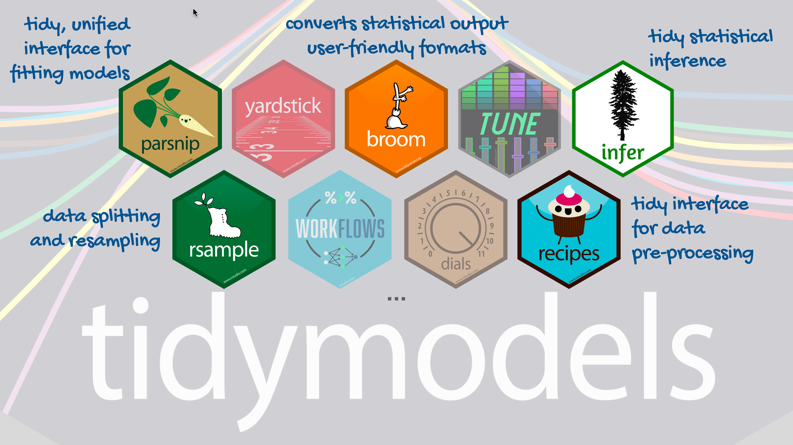

```{r child = "../setup.Rmd"}
```

```{r packages, echo = FALSE, message=FALSE, warning=FALSE}
library(tidyverse)
library(tidymodels)
library(ggtext)
library(knitr)
library(kableExtra)
set.seed(1234)
options(dplyr.print_min = 10, dplyr.print_max = 6)
```

class: middle

# Models with numerical explanatory variables

---


## Data: Paris Paintings

```{r message=FALSE}
pp <- read_csv("data/paris-paintings.csv", na = c("n/a", "", "NA"))
```

- Number of observations: `r nrow(pp)`
- Number of variables: `r ncol(pp)`

---

## Goal: Predict height from width

$$\widehat{height}_{i} = \beta_0 + \beta_1 \times width_{i}$$

```{r height-width-plot, echo=FALSE, warning=FALSE}
ggplot(data = pp, aes(x = Width_in, y = Height_in)) +
  geom_point() +
  geom_smooth(method = "lm", se = FALSE, color = "#8E2C90") + 
  labs(
    title = "Height vs. width of paintings",
    subtitle = "Paris auctions, 1764 - 1780",
    x = "Width (inches)",
    y = "Height (inches)"
  )
```


---

```{r out.width="98%", echo=FALSE}

```

---

## Step 1: Specify model

```{r}
linear_reg()
```

---

## Step 2: Set model fitting *engine*

```{r}
linear_reg() %>%
  set_engine("lm") # lm: linear model
```

---

## Step 3: Fit model & estimate parameters

... using **formula syntax**

```{r fit-model}
linear_reg() %>%
  set_engine("lm") %>%
  fit(Height_in ~ Width_in, data = pp)
```

---

## A closer look at model output

```{r ref.label="fit-model", echo=FALSE}
```

.large[
$$\widehat{height}_{i} = 3.6214 + 0.7808 \times width_{i}$$
]

---

## A tidy look at model output

```{r}
linear_reg() %>%
  set_engine("lm") %>%
  fit(Height_in ~ Width_in, data = pp) %>%
  tidy()
```

.large[
$$\widehat{height}_{i} = 3.62 + 0.781 \times width_{i}$$
]

---

## Slope and intercept

.large[
$$\widehat{height}_{i} = 3.62 + 0.781 \times width_{i}$$
]

--

- **Slope:** For each additional inch the painting is wider, the height is expected to be higher, on average, by 0.781 inches.

--
- **Intercept:** Paintings that are 0 inches wide are expected to be 3.62 inches high, on average. (Does this estimate make sense?)

---

## Correlation does not imply causation

Remember this adage when interpreting model coefficients

```{r echo=FALSE, out.width="90%"}
knitr::include_graphics("img/cell_phones.png")
```

.footnote[
Source: XKCD, [Cell phones](https://xkcd.com/925/)
]

---

class: middle

# Parameter estimation

---

## Linear model with a single predictor

- We're interested in $\beta_0$ (population parameter for the intercept) and $\beta_1$ (population parameter for the slope) in the following model:

$$\hat{y}_{i} = \beta_0 + \beta_1~x_{i}$$

--
- Tough luck, you can't have them...

--
- So we use sample statistics to estimate them:

$$\hat{y}_{i} = b_0 + b_1~x_{i}$$

---

## Least squares regression

- The regression line minimizes the sum of squared residuals.

--
- If $e_i = y_i - \hat{y}_i$, then, the regression line minimizes 
$\sum_{i = 1}^n e_i^2$.

---

## Visualizing residuals

```{r vis-res-1, echo=FALSE, out.width="70%"}
ht_wt_fit <- linear_reg() %>%
  set_engine("lm") %>%
  fit(Height_in ~ Width_in, data = pp)

ht_wt_fit_tidy <- tidy(ht_wt_fit$fit) 
ht_wt_fit_aug  <- augment(ht_wt_fit$fit) %>%
  mutate(res_cat = ifelse(.resid > 0, TRUE, FALSE))

p <- ggplot(data = ht_wt_fit_aug, 
            aes(x = Width_in, y = Height_in)) +
  geom_point(alpha = 0.2) + 
  labs(
    title = "Height vs. width of paintings",
    subtitle = "Just the data",
    x = "Width (inches)",
    y = "Height (inches)"
    ) +
  coord_cartesian(xlim = c(0, 250), ylim = c(0, 200)) +
  theme(plot.subtitle = element_text(color = "#E48957", face = "bold", size = rel(1.5)))
p
```

---

## Visualizing residuals (cont.)

```{r vis-res-2, echo=FALSE, out.width="70%"}
p <- p + 
  geom_smooth(method = "lm", color = "#8E2C90", se = FALSE) +
  geom_point(mapping = aes(y = .fitted), color = "#E48957") +
  labs(subtitle = "Data + least squares line")
p
```

---

## Visualizing residuals (cont.)

```{r vis-res-3, echo = FALSE, out.width="70%"}
p + 
  geom_segment(mapping = aes(xend = Width_in, yend = .fitted), color = "#E48957", alpha = 0.4) +
  labs(subtitle = "Data + least squares line + residuals")
```

---

## Properties of least squares regression

- The regression line goes through the center of mass point, the coordinates corresponding to average $x$ and average $y$, $(\bar{x}, \bar{y})$:  

$$\bar{y} = b_0 + b_1 \bar{x} ~ \rightarrow ~ b_0 = \bar{y} - b_1 \bar{x}$$

--
- The slope has the same sign as the correlation coefficient: $b_1 = r \frac{s_y}{s_x}$

--
- The sum of the residuals is zero: $\sum_{i = 1}^n e_i = 0$

--
- The residuals and $x$ values are uncorrelated

---


## Assumptions of least squares regression

From your earlier statistics courses, you remember linear models...

Recall the assumptions for a linear model:

- Normality of the errors

- Same variance of errors within each group (homoscedasticity)
--- 

class: middle

# Wrapping Up...


---

class: middle

# A More Technical Worked Example

---


## Singer example

Load our standard libraries:

```{r}
library(lattice)
library(ggplot2)
library(tidyverse)
```


If you've taken a regression course, you might recognize this model as a special case of a linear model.

If you haven't, well, it doesn't really matter much except... we can use the `lm()` function to fit the model.
The advantage is that `lm()` easily splits the data into **fitted values** and **residuals**:

Observed value = Fitted value + residual

---

Let's get the fitted values and residuals for each voice part:

```{r}
singer_lm = lm(height ~ 0 + voice.part, data=singer)
```

We can extract the fitted values using `fitted.values(singer.lm)` and the residuals with `residuals(singer.lm)` or `singer.lm$residuals`.

For convenience, we create a data frame with two columns: the voice parts and the residuals.


```{r}
singer_res = data.frame(voice_part = singer$voice.part, residual = residuals(singer_lm))
```

We can also do this with `group_by` and `mutate`:
```{r}
fits = singer %>%
    group_by(voice.part) %>%
    mutate(fit = mean(height),
           residual = height - mean(height))
```

---
## Does the linear model fit?

To asssess whether the linear model is a good fit to the data, we need to know whether the errors look like they come from normal distributions with the same variance.

The residuals are our estimates of the errors, and so we need to check both normality and homoscedasticity.

---
## Homoscedasticity

There are a few ways we can look at the residuals. Side-by-side boxplots give a broad overview:

```{r}
ggplot(singer_res, aes(x = voice_part, y = residual)) + geom_boxplot()
```

--

We can also look at the ecdfs of the residuals for each voice part.
```{r}
ggplot(singer_res, aes(x = residual, color = voice_part)) + stat_ecdf()
```

--

From these plots, it seems like the residuals in each group have approximately the same variance.

---
## Normality

We also want to examine normality of the residuals, broken up by voice part. We can do this by faceting:

```{r, fig.width = 6}
ggplot(singer_res, aes(sample = residual)) +
  stat_qq() + facet_wrap(~ voice_part, ncol=4) 
```

Not only do the lines look reasonably straight, the scales look similar for all eight voice parts.
This suggests a model where all of the errors are normal with the *same* standard deviation.
This is convenient because it is the form of a standard linear model:

Singer height = Average height for their voice part + Normal($0, \sigma^2$) error.

---

## Normality of pooled residuals

If the linear model holds, then all the residuals come from the same normal distribution.

We've already checked for normality of the residuals within each voice part, but to get a little more power to see divergence from normality, we can pool the residuals and make a normal QQ plot of all the residuals together.


```{r}
ggplot(singer_res, aes(sample = residual)) +
  stat_qq()
```

---

It's easier to check normality if we plot the line that the points should fall on: if we think the points come from a $N(\mu, \sigma^2)$ distribution, they should lie on a line with intercept $\mu$ and slope $\sigma$ (the standard deviation).

In the linear model, we assume that the mean of the error terms is zero.
We don't know what their variance should be, but we can estimate it using the variance of the residuals.

Therefore, we add a line with the mean of the residuals (which should be zero) as the intercept, and the SD of the residuals as the slope.
This is:

```{r}
ggplot(singer_res, aes(sample = residual)) +
    stat_qq() +
    geom_abline(aes(intercept = 0, slope = sd(singer_res$residual)))
```

---
## The actually correct way

Pedantic note: We should use an $n-8$ denominator instead of $n-1$ in the SD calculation for degrees of freedom reasons. We can get this directly from the linear model:

```{r}
sd(singer_res$residual)
round(summary(singer_lm)$sigma, 3)
```

However, the difference between this and the SD above is negligible.

Add the line:

```{r}
ggplot(singer_res, aes(sample = residual)) +
  stat_qq() + geom_abline(intercept = mean(singer_res$residual), slope=summary(singer_lm)$sigma)
```

The straight line isn't absolutely perfect, but it's doing a pretty good job.

---

## Our final model

Since the errors seem to be pretty normal, our final model is:

Singer height = Average height for their voice part + Normal($0, 2.5^2$) error.

Note: While normality (or lack thereof) can be important for probabilistic prediction or (sometimes) for inferential data analysis, it's relatively unimportant for EDA.
If your residuals are about normal that's nice, but as long as they're not horribly skewed they're probably not a problem.

---

## What have we learned?

About singers:

- We've seen that average height increases as the voice part range decreases.

- Within each voice part, the residuals look like they come from a normal distribution with the same variance for each voice part.
This suggests that there's nothing further we need to do to explain singer heights: we have an average for each voice part, and there is no suggestion of systematic differences beyond that due to voice part.

--
About data analysis:

- We can use some of our univariate visualization tools, particularly boxplots and ecdfs, to look for evidence of heteroscedasticity.

- We can use normal QQ plots on both pooled and un-pooled residuals to look for evidence of non-normality.

- If we wanted to do formal tests or parameter estimation for singer heights, we would feel pretty secure using results based on normal theory.


--- 

class: middle

# Wrapping Up...


---

class: middle

# Models with categorical explanatory variables

---

## Categorical predictor with 2 levels

.pull-left-narrow[
.small[
```{r echo=FALSE}
pp %>% 
  select(name, Height_in, landsALL) %>%
  print(n = 20)
```
]
]
.pull-right-wide[
- `landsALL = 0`: No landscape features
- `landsALL = 1`: Some landscape features
]

---

## Height & landscape features

```{r ht-lands-fit}
linear_reg() %>%
  set_engine("lm") %>%
  fit(Height_in ~ factor(landsALL), data = pp) %>%
  tidy()
```

---

## Height & landscape features

$$\widehat{Height_{in}} = 22.7 - 5.645~landsALL$$

- **Slope:** Paintings with landscape features are expected, on average, to be 5.645 inches shorter than paintings that without landscape features
  - Compares baseline level (`landsALL = 0`) to the other level (`landsALL = 1`)
    
- **Intercept:** Paintings that don't have landscape features are expected, on average, to be 22.7 inches tall

---

## Relationship between height and school

```{r ht-school}
linear_reg() %>%
  set_engine("lm") %>%
  fit(Height_in ~ school_pntg, data = pp) %>%
  tidy()
```

---

## Dummy variables

```{r ref.label="ht-school", echo = FALSE}
```

- When the categorical explanatory variable has many levels, 
  - they're *often* encoded to **dummy variables**
- Each coefficient describes the expected difference between heights in that particular school compared to the baseline level

---

## Categorical predictor with 3+ levels

.pull-left-wide[
```{r echo=FALSE}
dummy_df <- pp %>% 
  select(school_pntg) %>% 
  group_by(school_pntg) %>% 
  sample_n(1) %>%
  mutate(
    D_FL = as.integer(ifelse(school_pntg == "D/FL", 1L, 0)),
    F    = as.integer(ifelse(school_pntg == "F", 1L, 0)),
    G    = as.integer(ifelse(school_pntg == "G", 1L, 0)),
    I    = as.integer(ifelse(school_pntg == "I", 1L, 0)),
    S    = as.integer(ifelse(school_pntg == "S", 1L, 0)),
    X    = as.integer(ifelse(school_pntg == "X", 1L, 0))
  )

dummy_df %>%
  kable(align = "lcccccc") %>%
  kable_styling() %>%
  column_spec(2, width = "10em", background = spec_color(dummy_df$D_FL[1:7], end = 0.8), color = "white") %>%
  column_spec(3, width = "10em", background = spec_color(dummy_df$F[1:7], end = 0.8), color = "white") %>%
  column_spec(4, width = "10em", background = spec_color(dummy_df$G[1:7], end = 0.8), color = "white") %>%
  column_spec(5, width = "10em", background = spec_color(dummy_df$I[1:7], end = 0.8), color = "white") %>%
  column_spec(6, width = "10em", background = spec_color(dummy_df$S[1:7], end = 0.8), color = "white") %>%
  column_spec(7, width = "10em", background = spec_color(dummy_df$X[1:7], end = 0.8), color = "white")
```
]
.pull-right-narrow[
.small[
```{r echo=FALSE}
pp %>% 
  select(name, Height_in, school_pntg) %>%
  print(n = 20)
```
]
]

---

## Relationship between height and school

.small[
```{r ref.label="ht-school", echo=FALSE}
```

- **Austrian school (A)** paintings are expected, on average, to be **14 inches** tall.
- **Dutch/Flemish school (D/FL)** paintings are expected, on average, to be **2.33 inches taller** than *Austrian school* paintings.
- **French school (F)** paintings are expected, on average, to be **10.2 inches taller** than *Austrian school* paintings.
- **German school (G)** paintings are expected, on average, to be **1.65 inches taller** than *Austrian school* paintings.
- **Italian school (I)** paintings are expected, on average, to be **10.3 inches taller** than *Austrian school* paintings.
- **Spanish school (S)** paintings are expected, on average, to be **30.4 inches taller** than *Austrian school* paintings.
- Paintings whose school is **unknown (X)** are expected, on average, to be **2.87 inches taller** than *Austrian school* paintings.
]


---

class: middle

# Wrapping Up... 

<br>

Sources:
- Mine Çetinkaya-Rundel's Data Science in a Box ([link](https://datasciencebox.org/))
- Julia Fukuyama's EDA ([link](https://jfukuyama.github.io/))
