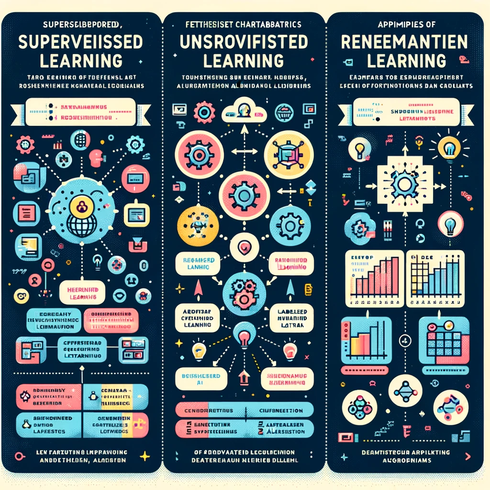
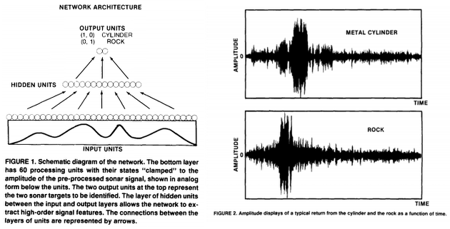
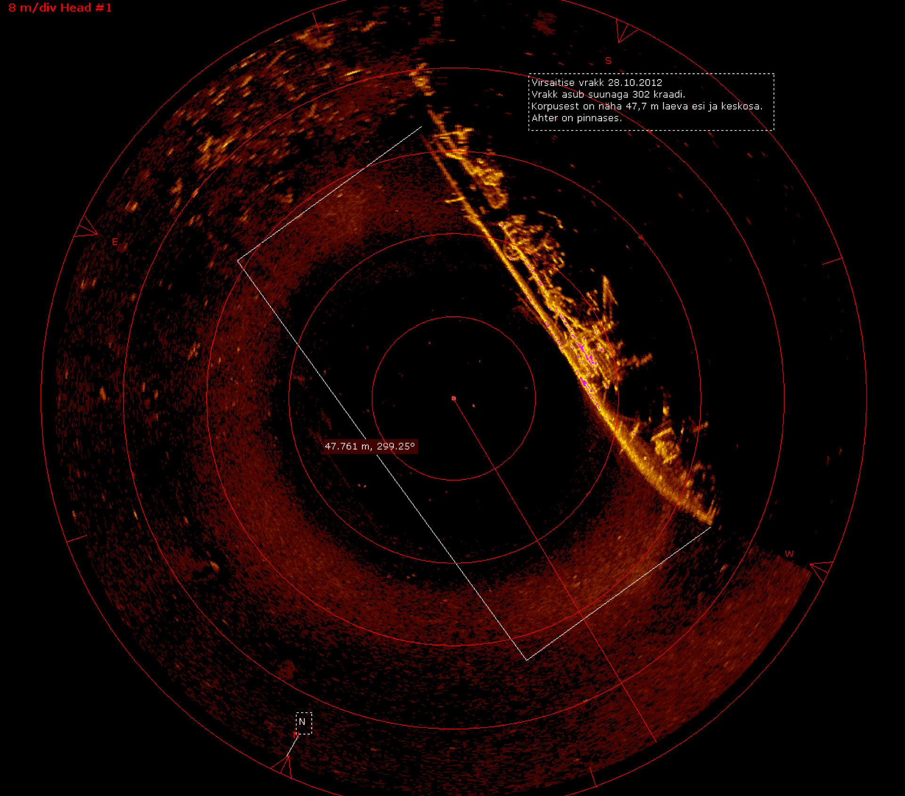

<!-- https://github.com/Eclectikus/playingsonar/blob/master/InfoSonar.Rmd -->

```{r child = "../setup.Rmd"}
```

```{r packages, echo = FALSE, message=FALSE, warning=FALSE}
library(tidyverse)
library(caret)
library(e1071)

# Remember to compile
# xaringan::inf_mr(cast_from = "..")
```


class: middle
# Machine Learning $in$ Theory

---

## What is Machine Learning?

- Machine Learning is a subset of data science focused on models and algorithms that allow computers to:
  - "Learn" from data without being explicitly programmed for specific tasks
  - Identify patterns and make decisions based on data
  - Apply learned patterns from past data to new, unseen situations
  - Improve performance with experience


---
### Machine Learning vs. Traditional Statistics
.pull-left[
**Statistical Inference**: Focuses on inference, explanation, and uncertainty
- Asks questions like:
  - "Why did this happen?"
  - "Are these groups different?"
- Focus on hypothesis testing
- Emphasis on model assumptions
- Goal: understand relationships
- Primarily explanatory
- Concerned with p-values
]

--
.pull-right[
**Machine Learning**: Focuses on prediction and patterns
- Asks questions like:
  - "What will happen next?"
  -  "Which category does this belong to?"
- Focus on prediction accuracy
- Emphasis on out-of-sample performance
- Goal: make accurate predictions
- Primarily predictive
- Concerned with error rates
]

---

.pull-left-narrow[

```{r echo=FALSE, fig.align = "center",caption="DALLE rendition of Comparison Chart of Learning Types: This chart visually compares supervised, unsupervised, and reinforcement learning"}

```
]

.pull-right-wide[
- Three main types of machine learning:
  - Supervised learning: With labeled data
  - Unsupervised learning: Without labeled data
  - Reinforcement learning: Based on feedback from the environment

]


---

## The Machine Learning Process
.pull-left[

- Step 1: Collect and preprocess data.
- Step 2: Choose a model.
- Step 3: Train the model.
- Step 4: Evaluate the model.
- Step 5: Parameter tuning.
- Step 6: Prediction or deployment.
]

---

## Model Building: A Detailed Look

.pull-left[

- Choosing a Model: Based on the problem (classification, regression).
- Training: The model learns from the training data.
- Testing: The model is evaluated using unseen data.
]

.footnote[
Training involves adjusting parameters to minimize error.
Testing assesses how well the model generalizes.
]

---

## Evaluating Model Performance: The Confusion Matrix

.pull-right[

- True Positives (TP): Correctly predicted positive observations.
- True Negatives (TN): Correctly predicted negative observations.
- False Positives (FP): Incorrectly predicted positive observations.
- False Negatives (FN): Incorrectly predicted negative observations.

"The confusion matrix forms the foundation for deriving more complex evaluation metrics like accuracy, precision, and recall."
]


---

# Machine Learning $in$ Practice

---


## Machine Learning in Practice: Sonar Dataset

.pull-left[

- Objective: Differentiate between sonar signals bounced off a metal cylinder and those from a rock.
- Approach: Utilize a classification model to learn the differences based on signal patterns.
]

.pull-right[
```{r, echo=FALSE, fig.align = "center"}

```
]

---

# Preprocessing Explained

.pull-left[

Preprocessing transforms raw data into a format that improves the efficiency and accuracy of our model. This includes normalization, scaling, and handling missing values.
]

---

## Model Evaluation Metrics Explained

.pull-left[
- Accuracy: The proportion of total predictions that were correct.
- Precision: The proportion of positive identifications that were actually correct.
- Recall: The proportion of actual positives that were identified correctly.
]


.pull-right[

```{r, echo=FALSE, fig.align = "center"}

```
]

.footnote[

These metrics provide a comprehensive view of model performance across various aspects.
]


---


## Dataset Overview

.pull-left[
```{r echo=FALSE, fig.align = "center"}

```

]

.pull-right[
- Objective: Differentiate between Sonar signals bounced off a metal cylinder and those bounced off a roughly cylindrical rock.
- Features: Signal strength across various frequencies.
]

---

## Load the Sonar Data

The Sonar data is a classic dataset for binary classification (Gorman and Sejnowski, 1988).

It contains 208 observations of sonar signals bounced off a metal cylinder and a roughly cylindrical rock. The 60 numerical variables are the strength of the returns at different frequencies. The final variable is the Class, which is a factor with two levels: "R" for rock and "M" for metal.

.note[Gorman, R. P., and Sejnowski, T. J. (1988). "Analysis of Hidden Units in a Layered Network Trained to Classify Sonar Targets" in Neural Networks, Vol. 1, [pp. 75-89](http://citeseerx.ist.psu.edu/viewdoc/download?doi=10.1.1.299.8959&rep=rep1&type=pdf). Same authors almost a year later published: [Learned Classification of Sonar Targets Using a Massively Parallel Network](https://papers.cnl.salk.edu/PDFs/Learned%20Classification%20of%20Sonar%20Targets%20Using%20a%20Massively%20Parallel%20Network%201988-3231.pdf)]


```{r sonar-data, echo=FALSE, fig.align = "center", out.width = "90%", fig.cap = "Sonar data"}
library(kableExtra)
library(mlbench)
data(Sonar)
glimpse(Sonar) %>% 
  kable()

```

---

## Preprocessing for Machine Learning


## Splitting the Dataset

.medi.pull-left[
```{r}
set.seed(123)
index <- createDataPartition(Sonar$Class, 
                             p = 0.75,
                             list = FALSE)
trainData <- Sonar[index, ]
testData <- Sonar[-index, ]
```
]

.pull-right[
- `set.seed(123)`: Ensures reproducibility of the sample
- `createDataPartition()`: Splits the data into training and test sets, with 75% of data for training
- trainData contains `r nrow(trainData)` observations.
- testData contains `r nrow(testData)` observations.
]

---

# Preprocessing: Centering and Scaling

.pull-left-wide[
```{r preprocessing}

preProcValues <- trainData %>% select (-Class) %>% 
  preProcess(method = c("center", "scale"))

trainDataPreprocessed <- predict(preProcValues,
                                 trainData)
testDataPreprocessed <- predict(preProcValues,
                                testData)
```
]
.pull-right-narrow[

- `preProcess()`: Prepares the data for modeling by centering and scaling. Only does so to the training data. The can be estimated from the training data and applied to any data set with the same variables.
- `predict()`: Applies the preprocessing steps to both training and testing sets.
Ensures that all features contribute equally to the model. Nothing is recomputed when using the predict function.
]

---

# Preprocessing: The Outcome


# to do Code to show the effect of preprocessing, such as comparing the range of values before and after preprocessing.

.tip[
Preprocessing can significantly impact model performance by normalizing feature scales.
]
---


 Building a Model with `caret`
 
 
---


## Model Training: Linear Discriminant Analysis

```{r}
# Building a model using caret
# For this example, we'll use a simple linear discriminant analysis (LDA) model
set.seed(123)
fitControl <- trainControl(method = "cv", number = 10) # 10-fold cross-validation

modelLDA <- train(Class ~ ., data=trainDataPreprocessed, method="lda", trControl=fitControl)

```
.pull-right[
trainControl(): Configures the training process, here specifying 10-fold cross-validation.
train(): Trains the model using the specified method, in this case, LDA (Linear Discriminant Analysis).
Cross-validation helps in assessing the model's ability to generalize.
]

---

## Model Training: Result

```{r}
print(modelLDA)
```

---

## Evaluating Model Performance: The Confusion Matrix

.pull-left[
```{r}

```
]

.pull-right[
True Positives (TP): Correctly predicted positive observations.
True Negatives (TN): Correctly predicted negative observations.
False Positives (FP): Incorrectly predicted positive observations.
False Negatives (FN): Incorrectly predicted negative observations.
"The confusion matrix forms the foundation for deriving more complex evaluation metrics like accuracy, precision, and recall."
]


```{r}

# Predicting on the test dataset
predictions <- predict(modelLDA, testDataPreprocessed)

# Model performance
confusionMatrix(predictions, testDataPreprocessed$Class)

```

```{r}
ggplot(trainDataPreprocessed, aes(x=V1, fill=Class)) + 
    geom_density(alpha=0.5) +
    labs(title="Density Plot of Feature V1 by Class", x="Feature V1", y="Density")
```

---

## Model Evaluation Metrics Explained

.pull-left[

Accuracy: The proportion of total predictions that were correct.
Precision: The proportion of positive identifications that were actually correct.
Recall: The proportion of actual positives that were identified correctly.
]


---

# Sources

- [Eclectikus](https://github.com/Eclectikus)'s Playing with Sonar ([link](https://github.com/Eclectikus/playingsonar))

