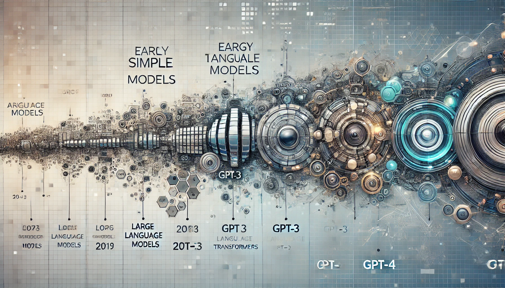
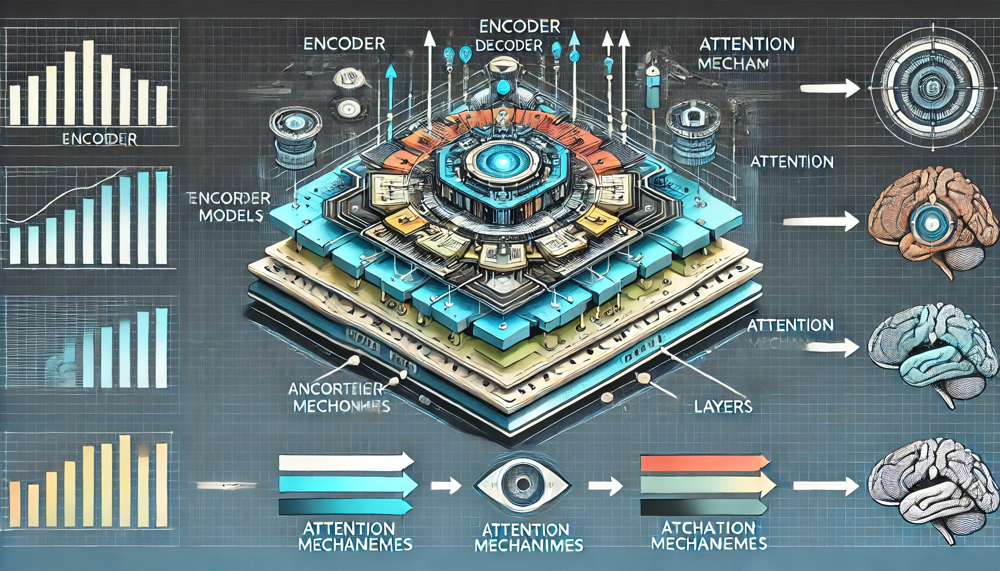

```{r child = "../setup.Rmd"}
```

```{r packages, echo = FALSE, message=FALSE, warning=FALSE}
library(openintro)
library(tidymodels)
library(DT)
library(emo)
library(openintro)
library(viridis)
# Remember to compile
# xaringan::inf_mr(cast_from = "..")
```


class: middle
# Getting Started with Large Language Models

---

## What are Large Language Models?

.pull-left[
- Large Language Models (LLMs) 
  - are a type of artificial intelligence designed to 
    - understand and 
    - generate human language. 
- These advanced AI systems are trained on *vast* amounts of text data.
]

--

.pull-right[
**Key characteristics:**
- Massive scale (billions of parameters)
- Self-supervised learning
- Ability to generate human-like (generate coherent, contextually relevant) text
- Versatility across various language tasks

- Versatile applications and examples
  - GPT (Generative Pre-trained Transformer)
  - BERT (Bidirectional Encoder Representations from Transformers)
  - T5 (Text-to-Text Transfer Transformer)
]

---

# Evolution of LLMs
.pull-left[
**Early approaches (1960s-2000s):**
- Rule-based systems (1960s-1980s)
    - ELIZA: Simple pattern matching with templated responses
    - SHRDLU: Understanding commands through syntax rules
- Statistical models (1990s-2000s)
    - N-grams: Word prediction based on previous few words
    - Hidden Markov Models: Adding probability to language patterns
- Limited by manual rules and sparse data
]

.pull-right[
**The transformer revolution (2017):**
- "Attention is All You Need" paper
- Parallel processing of text
- Breakthrough in handling context

```{r, echo=FALSE, out.width="90%", align="center"}

```


.footnote.tiny[
Image Source: DALL-E <!-- Based on the following prompt: "A visual timeline showcasing the evolution of large language models. The timeline starts from early simple models, progressing through key milestones such as the introduction of transformers, GPT-3, and up to GPT-4. Each milestone is marked with distinct icons and dates, illustrating the increasing complexity and capabilities of these models. The background features a blend of abstract digital patterns representing data and artificial intelligence. The color scheme is professional with shades of blue and gray, with highlighted elements in contrasting colors to emphasize progress." -->
]
]
---


# Key Milestones in LLM Development

.pull-left.medi[
## Foundational models:
- BERT (2018): Bidirectional understanding
- GPT series (2018-present): Increasingly powerful generative models
- T5 (2019): Text-to-Text Transfer Transformer
]
--
.pull-right.medi[
## Recent breakthroughs
  - Nov 2022: OpenAI’s LLM ChatGPT (Chat Generative Pre-Trained Transformer)
  - Dec/January 2023: Stanford CRFM and MosaicML's BioMedLM (Biomedical Language Model)
    - Domain-specific LLMs for biomedical research (trained on PubMed)
  - Feb 2023: Meta AI's LLaMA (Large Language Model Meta AI)
  - March 2023: OpenAI's GPT-4
  - May 2023: Google's LaMDA (Language Model for Dialogue Applications)
]
.footnote[Timeline resource: [Alan D. Thompson's timeline of AI](https://lifearchitect.ai/timeline/) and [table of models](https://lifearchitect.ai/models-table/)
]

---

class: middle
# How LLMs Work: Core Concepts

---


## The Core Concept: Next-Token Prediction

pull-left[
**The fundamental task:**
- Given a sequence of words, predict what comes next
- Example:
  - Input: "The capital of France is"
  - Prediction: "Paris" (with high confidence)

**Learning approach:**
- From explicit rules to learning patterns
- Self-supervised learning from vast text corpora
]

.pull-right[
**This simple objective leads to:**
- Understanding of grammar and syntax
- Acquisition of factual knowledge
- Reasoning capabilities
- Contextual awareness

.question[
How can this seemingly simple prediction task lead to such sophisticated language abilities?
]
]


]
--
.pull-right[
**This simple task leads to:**
- Grammar understanding
- Factual knowledge
- Reasoning capabilities
- Context awareness

.question[
How can this single objective (next-word prediction) lead to such versatile abilities?
]
]

---

## How LLMs Process Language

.pull-left[
- LLMs don't process raw text directly
- Text is split into "tokens"
  - Words, subwords, or characters
  - Example: "psychology" → ["psycho", "logy"]
- Different models use different tokenization methods
  - GPT models: Byte-Pair Encoding (BPE)
  - BERT: WordPiece
]

.pull-right[
- Tokens converted to vector representations
- Context window limits how much text can be processed
  - GPT-3.5: ~4,000 tokens
  - GPT-4: 8,000-32,000 tokens
  - Claude: Up to 100,000 tokens
- Models predict tokens based on previous tokens
]

---

# Architecture of LLMs

.pull-left[
Key components:
- **Transformer architecture**
  - Neural network design specialized for sequential data
  - Introduced in "Attention is All You Need" (2017)
  - Processes entire sequences at once, not one-by-one
  - Stacks of identical layers that transform data
- Self-attention mechanism
- Positional encoding
- Layer normalization
- Feed-forward neural networks
]

.pull-right[
```{r,echo=FALSE}

```
]

--

.footnote[
Image Source: DALL-E: Based on the following prompt: "A detailed infographic highlighting the architecture of transformer models. The diagram includes key components such as the encoder, decoder, attention mechanisms, and layers. Arrows indicate the flow of information between these components. The background features a modern design with subtle tech-related patterns. Use professional colors like shades of blue and gray, with important elements highlighted in contrasting colors to draw attention."
]

---


class: middle
# LLM Training Process

---

## LLM Training: Three-Stage Process

.pull-left[
1. **Pre-training**
   - Self-supervised learning on massive text corpus
   - Learns statistical patterns in language

2. **Supervised Fine-Tuning (SFT)**
   - Human-labeled examples of desired outputs
   - Aligns with human instructions

3. **Reinforcement Learning from Human Feedback (RLHF)**
   - Human preferences used to refine model
   - Rewards helpful, truthful, harmless outputs
]

.pull-right[
```{r echo=FALSE, out.width="90%",error=TRUE}
# This would be an image showing the three-stage training process
knitr::include_graphics("img/llm-training-stages.png")
```
]

---

## Pre-training: Learning from Data

.pull-left[
**Training objective:**
- Next token prediction
- Model learns to predict what comes next in a sequence
- Example: "The capital of France is ___" → "Paris"

**Data sources:**
- Books, articles, websites
- Social media, forums
- Code repositories
- Wikipedia
- Scientific literature
]

.pull-right[
**Scale:**
- Hundreds of billions to trillions of tokens
- GPT-3: 300B tokens
- PaLM: 780B tokens
- GPT-4: Estimated trillions of tokens

**Computational requirements:**
- Thousands of GPUs/TPUs
- Weeks to months of training time
- Massive energy consumption
  - GPT-3: ~1,287 MWh (equivalent to 120+ US homes' annual usage)
]

---

## Fine-tuning: Aligning with Human Intent

.pull-left[
**Supervised Fine-Tuning (SFT):**
- Human-written examples of desired outputs
- Model learns to follow instructions
- Much smaller dataset than pre-training
  - Thousands to millions of examples
]

.pull-right[
**Reinforcement Learning from Human Feedback (RLHF):**
1. Generate multiple responses to prompts
2. Human labelers rank responses by quality
3. Train reward model on these preferences
4. Use reinforcement learning to optimize model against reward function

**Result:** More helpful, accurate, and safe outputs
]

---

## Challenges in LLM Training

- **Catastrophic forgetting**
  - Model loses previously learned knowledge during fine-tuning
  - Addressed through careful parameter updates
- **Reward hacking**
  - Model optimizes for reward signals rather than true intentions
  - Requires robust reward modeling
- **Data contamination**
  - Test datasets appearing in training data
  - Inflated benchmark performance
- **Evaluation methods**
  - Perplexity (how well model predicts text)
  - Benchmark datasets (MMLU, HumanEval, TruthfulQA)
  - Human evaluations and red teaming

---

# Applications in Data Science

LLMs can be used for various tasks in data science:

- Text generation and summarization
- Sentiment analysis
- Named Entity Recognition (NER)
- Question answering
- Text classification
- Language translation
---

## Limitations of LLMs

.pull-left[
- **Hallucinations**
  - Generation of plausible but false information
  - Critical concern for research applications
- **Bias**
  - Models inherit biases from training data
  - Can perpetuate stereotypes and inequalities
]
--
.pull-right[
- **Context window limitations**
  - Cannot process unlimited amounts of text
  - May miss important context
- **Computational costs**
  - API usage can be expensive
  - Local deployment requires significant resources
]

---

class: middle

# Ethical Considerations

---

## Ethics and Responsible Use

- **Privacy concerns**
  - Sensitive data in prompts
  - Data retention policies
  - Re-identification risks
- **Academic integrity**
  - Proper attribution
  - Transparency about AI use
  - Maintaining research standards
- **Misinformation risks**
  - Fact-checking importance
  - Critical evaluation of outputs
  - Responsibility in publishing


---

class: middle

# Wrapping Up...

---

# Sources

- Claude Sonnet 3.5. on 07/18/2024
- TBD

---
