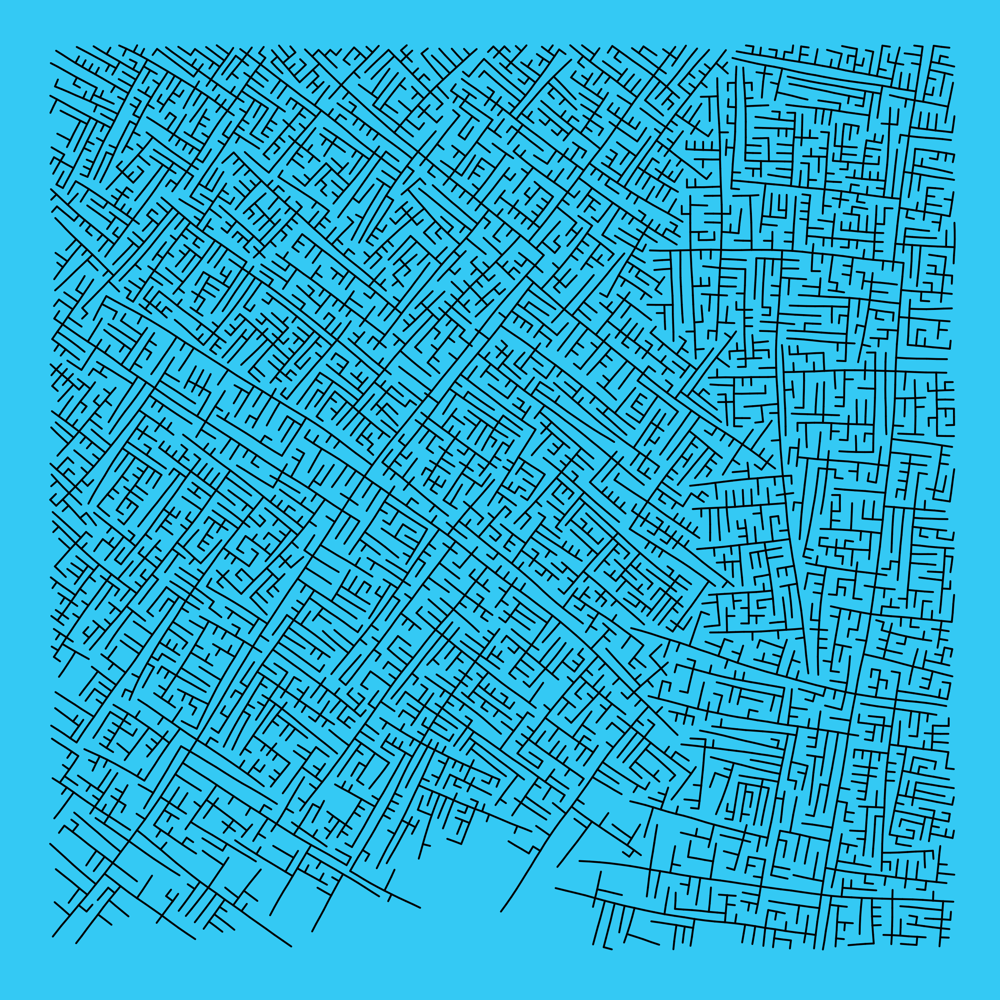
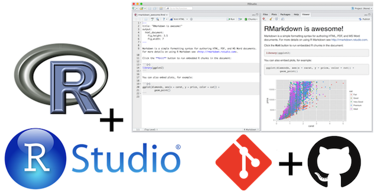
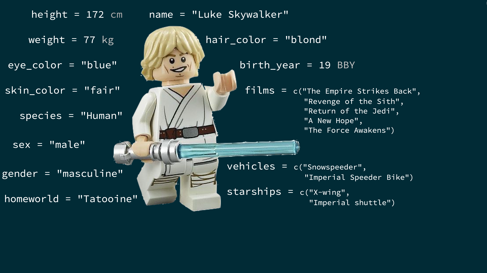
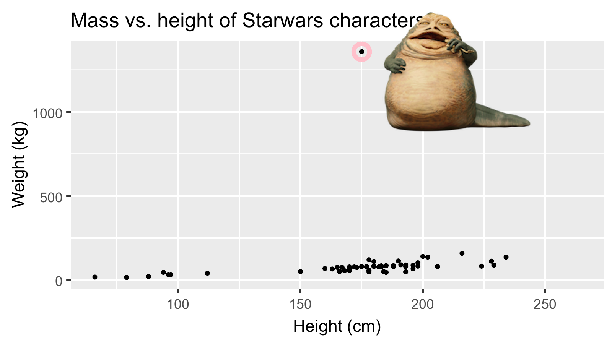
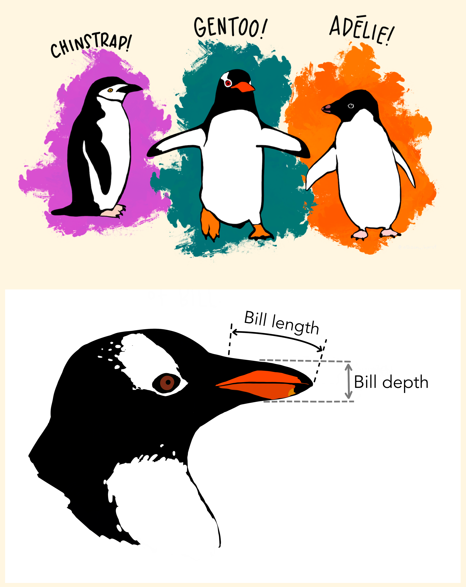
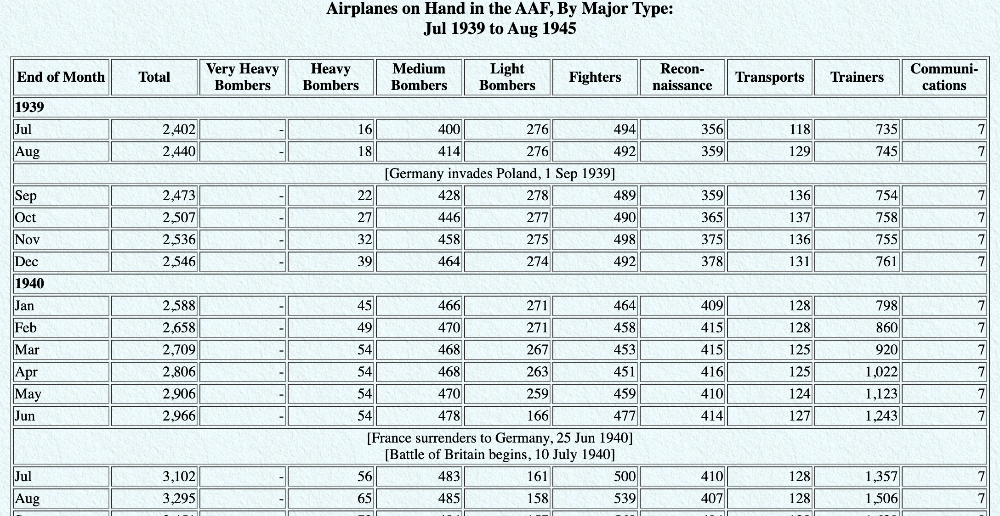
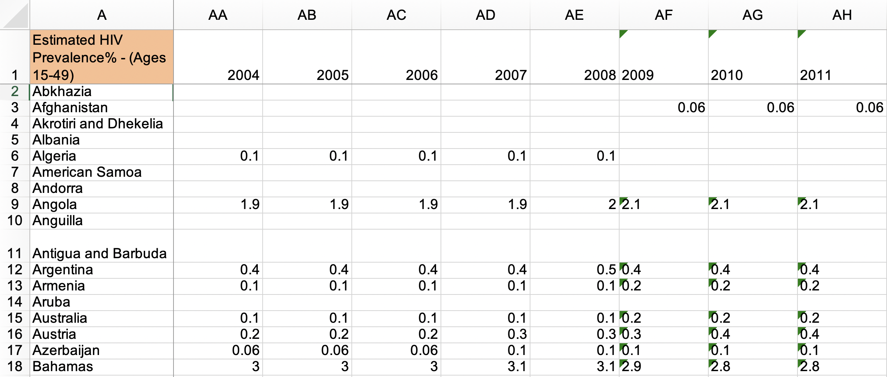
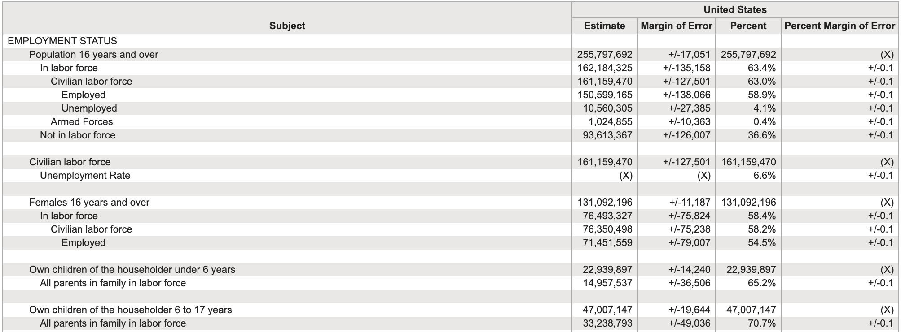

---

```{r child = "./setup.Rmd",echo = F}
```

```{r packages, echo=FALSE, message=FALSE, warning=FALSE,include=FALSE}
# Remember to compile
#xaringan::inf_mr(cast_from = "..")
#       slideNumberFormat: ""  
library(tidyverse)

if (!require("emo")) devtools::install_github("hadley/emo")
if (!require("jasmines")) devtools::install_github("djnavarro/jasmines")
if (!require("mathart")) devtools::install_github("marcusvolz/mathart")
if (!require("fontawesome")) devtools::install_github("rstudio/fontawesome")
if (!require("nycsquirrels18")) devtools::install_github("mine-cetinkaya-rundel/nycsquirrels18") 
if (!require("dsbox")) devtools::install_github("rstudio-education/dsbox")
if (!require("gradethis")) devtools::install_github("rstudio-education/gradethis")

library(DT)
library(Tmisc)
library(dsbox)
library(emo)
library(fontawesome)
library(here)
library(htmltools)
library(htmlwidgets)
library(kableExtra)
library(knitr)
library(magick)
library(openintro)
library(palmerpenguins)
library(readxl)
library(reshape2)
library(rvest)
library(scales)
library(skimr)

conflict_prefer("col_double", "readr")
```

class: center, middle 

# Data Science for Psychologists Workshop
## APS Annual Convention
### Mason Garrison
#### Assistant Professor of Quantitative Psychology
#### Wake Forest University


---

class: middle

# A Little About Me

---

# Who Am I?

.pull-left-wide[
- My name is S. Mason Garrison
- I'm an Assistant Professor of Quantitative Psychology 
  - at Wake Forest University
- I'm a Quantitative Psychologist and 
  - Behavior Geneticist by training.
]

.center[
```{r echo=FALSE, out.width="30%",fig.align = 'center'}
knitr::include_graphics("img/greenmason.jpg")
```
]
---


## My Work

<!-- rewrite
- In addition to my work as an assistant professor, I'm also deeply involved in research, focused primarily on how we can leverage data science to improve our understanding of psychological phenomena
- My substantive research interests span several areas, including individual differences, health inequity, and diversity science

 -->

---

## Why I'm Here Today

<!-- rewrite -->
- I'm passionate about sharing my love for R with others, especially those within the field of psychology.
- I believe that the tools and methodologies of data science can significantly enhance our ability to conduct impactful research in psychology
- I'm excited to be here and share this journey with you!

---
<!-- rewrite
## Fun Facts About Me

- I'm a cat lover! (as you might have guessed from my use of `r emo::ji('cat')`)
- I enjoy hiking and being in nature during my downtime
- I'm a coffee enthusiast – I love exploring new blends and brewing methods. Happy to chat about coffee during breaks!

---
 -->
class: middle

# Workshop Overview!

---

# Workshop Overview

- .large[<i class="fa fa-database fa"></i> = Introduction to R and the tidyverse]
--

- .large[<i class="fa fa-flask fa"></i> = Data Wrangling]
--

- .large[<i class="fa fa-code fa"></i> = Data Visualization]
--


<br><br><br><br><br><br><br>

.small[
.center[
[DataScience4Psych.github.io/DataScience4Psych/](https://DataScience4Psych.github.io/DataScience4Psych/)
]
]

---

# Introduction to R and the tidyverse
.pull-left[
- .large[Getting started with R and RStudio]
- .large[Understanding the structure and philosophy of the tidyverse]
- .large[Learning basic R syntax and operations]
]
---

# Data Wrangling
.pull-left[
- .large[Importing and exporting data in various formats]
- .large[Cleaning, transforming, and reshaping data]
]
---

# Data Visualization

.pull-left[
- .large[Creating static and interactive visualizations using ggplot2]
- .large[Customizing visual elements to enhance your plots]
- .large[Interpreting and describing visualizations]
]
.center.pull-right[

```{r echo=FALSE, out.width="95%",fig.align = 'left'}
# r code to generate this figure is plot_metro.R

```
]

---
class: middle

# Hello world!

---

## What is data science?

- <i class="fa fa-database fa"></i> + <i class="fa fa-flask fa"></i> = data science?
--

- <i class="fa fa-database fa"></i> + <i class="fa fa-code fa"></i> = data science?
--

- <i class="fa fa-database fa"></i> + <i class="fa fa-user fa"></i> + <i class="fa fa-code fa"></i> = data science?
--

- <i class="fa fa-database fa"></i> + <i class="fa fa-users fa"></i> + <i class="fa fa-code fa"></i> = data science?
--

<br>
<br>
.large[
Data science is an exciting discipline that allows you to turn raw data into understanding, insight, and knowledge. We're going to learn to do this in a `tidy` way -- more on that later!
]
---

# What is this course?

This course is an adaptation of my introduction to data science that is designed for psychologists. It emphasizes statistical thinking and best practices.
<br><br>
--

**Q - What data science background does this course assume?**  
A - None.
<br>
--

**Q - Is this an intro CS course?**  
A - Although statistics and computer science $\ne$ data science, they are very closely related and have tremendous of overlap. Hence, this course is a great way to get comfortable with those topics. However this course is **not** your typical course.
<br>
--

**Q - Will we be doing computing?**   
A - Yes.
<br>
--


**Q - What computing language will we learn?**  
A - R.
<br>
--

**Q: Why not language X?**  
A: We can discuss that *remotely* over `r emo::ji("coffee")`.


---

## Where is this course?

<br><br><br><br><br><br><br>

.large[
.center[
[DataScience4Psych.github.io/DataScience4Psych/](https://DataScience4Psych.github.io/DataScience4Psych/)
]
]

---
class: middle

# Introduction to R and the tidyverse

- Getting started with R and RStudio
- Understanding the structure and philosophy of the tidyverse
- Learning basic R syntax and operations


---

class: middle

# R and RStudio

---

## What is R/RStudio?

- R is a statistical programming language
- RStudio is a convenient interface for R (an integrated development environment, IDE)
- At its simplest:
    - R is like a car’s engine
    - RStudio is like a car’s dashboard

```{r fig.align="center", echo=FALSE, out.width="66%"}
knitr::include_graphics("img/engine-dashboard.png")
```


---

## Let's take a tour - R / RStudio

.center[

]

- Console
- Using R as a calculator
- Environment
- Loading and viewing a data frame
- Accessing a variable in a data frame
- R functions


---

## Working with R at the command line 

- Launch RStudio/R.
- Notice the default panes:
    - Console (entire left)
    - Environment/History (tabbed in upper right)
    - Files/Plots/Packages/Help (tabbed in lower right)


--

- FYI: You can change the default location of the panes, among many other things
  - [Customizing RStudio](https://support.rstudio.com/hc/en-us/articles/200549016-Customizing-RStudio)

---

## Working with R at the command line (pt 2)

- Go into the Console, where we interact with the live R process.
- Make an assignment and then inspect the object you just created:

```{r start_rbasics}
x <- 3 * 4
x
```

- All R statements where you create objects -- "assignments" -- have this form:

```{r eval = FALSE}
objectName <- value
```

- Read this as 'x gets 12'

<!---
and in my head I hear, e.g., "x gets 12".

You will make lots of assignments and the operator `<-` is a pain to type. Don't be lazy and use `=`, although it would work, because it will just sow confusion later. Instead, utilize RStudio's keyboard shortcut: Alt + - (the minus sign).
-->


---

## R essentials

A short list (for now):

- Functions are (most often) verbs, followed by what they will be applied to in parentheses:

```{r eval=FALSE}
do_this(to_this)
do_that(to_this, to_that, with_those)
```

--

- Columns (variables) in data frames are accessed with `$`:

```{r eval=FALSE}
dataframe$var_name
```

--

- Packages are installed with the `install.packages` function and loaded with the `library` function, once per session:

```{r eval=FALSE}
install.packages("package_name")
library(package_name)
```

---

## tidyverse

.pull-left[
.center[
```{r echo=FALSE,fig.align='center', out.width="50%"}

```
]
]
.pull-right[
.center[
[tidyverse.org](https://www.tidyverse.org/)
]

- The tidyverse is an opinionated collection of R packages designed for data science. 
- All packages share an underlying philosophy and a common grammar. 
]

---

class: middle

# R Markdown

---


## R Markdown

- Fully reproducible reports -- each time you knit the analysis is ran from the beginning
- Simple markdown syntax for text
- Code goes in chunks, defined by three backticks, narrative goes outside of chunks

---

## Let's take a tour - R Markdown


.center[

]

Concepts introduced:

- Copying a project of mine
- Knitting documents
- R Markdown and (some) R syntax

---

.your-turn[

- The Bechdel test asks whether a work of fiction features at least two women who talk to each other about something other than a man, and there must be two women named characters.
- Go to github page and fork the assignment `Bechdel + R Markdown`. 
- Open and knit the R Markdown document `bechdel.Rmd` and follow along with the instructions.
]

---

class: middle

# Wrapping Up...


---

class: center, middle 

# Meet the toolkit <br> `r emo::ji('hammer_and_pick')`

---


class: middle

# Reproducible data analysis

---

## Reproducibility checklist

.question[
What does it mean for a data analysis to be "reproducible"?
]

--

Near-term goals:

- Are the tables and figures reproducible from the code and data?
- Does the code actually do what you think it does?
- In addition to what was done, is it clear **why** it was done? 
(e.g., how were parameter settings chosen?)

Long-term goals:

- Can the code be used for other data?
- Can you extend the code to do other things?

---

## Toolkit



- Scriptability $\rightarrow$ R
- Literate programming (code, narrative, output in one place) $\rightarrow$ R Markdown
- Version control $\rightarrow$ Git / GitHub


---

class: middle

# Toolkit overview

---

```{r echo=FALSE, out.width="100%"}

```

---

```{r echo=FALSE, out.width="100%"}

```

---

```{r echo=FALSE, out.width="100%"}
knitr::include_graphics("img/whole-game-03.png")
```

---

```{r echo=FALSE, out.width="100%"}
knitr::include_graphics("img/whole-game-04.png")
```

---

class: middle

# R and RStudio

---

## What is R/RStudio?

- R is a statistical programming language
- RStudio is a convenient interface for R (an integrated development environment, IDE)
- At its simplest:
    - R is like a car’s engine
    - RStudio is like a car’s dashboard

```{r fig.align="center", echo=FALSE, out.width="66%"}
knitr::include_graphics("img/engine-dashboard.png")
```


---

## Let's take a tour - R / RStudio

.center[

]

- Console
- Using R as a calculator
- Environment
- Loading and viewing a data frame
- Accessing a variable in a data frame
- R functions


---

## Working with R at the command line 

- Launch RStudio/R.
- Notice the default panes:
    - Console (entire left)
    - Environment/History (tabbed in upper right)
    - Files/Plots/Packages/Help (tabbed in lower right)


--

- FYI: You can change the default location of the panes, among many other things
  - [Customizing RStudio](https://support.rstudio.com/hc/en-us/articles/200549016-Customizing-RStudio)

---

## Working with R at the command line (pt 2)

- Go into the Console, where we interact with the live R process.
- Make an assignment and then inspect the object you just created:

```{r start_rbasics2}
x <- 3 * 4
x
```

- All R statements where you create objects -- "assignments" -- have this form:

```{r eval = FALSE}
objectName <- value
```

- Read this as 'x gets 12'

<!---
and in my head I hear, e.g., "x gets 12".

You will make lots of assignments and the operator `<-` is a pain to type. Don't be lazy and use `=`, although it would work, because it will just sow confusion later. Instead, utilize RStudio's keyboard shortcut: Alt + - (the minus sign).
-->


---

## R essentials

A short list (for now):

- Functions are (most often) verbs, followed by what they will be applied to in parentheses:

```{r eval=FALSE}
do_this(to_this)
do_that(to_this, to_that, with_those)
```

--

- Columns (variables) in data frames are accessed with `$`:

```{r eval=FALSE}
dataframe$var_name
```

--

- Packages are installed with the `install.packages` function and loaded with the `library` function, once per session:

```{r eval=FALSE}
install.packages("package_name")
library(package_name)
```

---

## tidyverse

.pull-left[

]

.pull-right[
.center[
[tidyverse.org](https://www.tidyverse.org/)
]

- The tidyverse is an opinionated collection of R packages designed for data science. 
- All packages share an underlying philosophy and a common grammar. 
]

---

class: middle

# R Markdown

---


## R Markdown

- Fully reproducible reports -- each time you knit the analysis is ran from the beginning
- Simple markdown syntax for text
- Code goes in chunks, defined by three backticks, narrative goes outside of chunks

---

## Let's take a tour - R Markdown


.center[

]

Concepts introduced:

- Copying a project of mine
- Knitting documents
- R Markdown and (some) R syntax

---

.your-turn[

- The Bechdel test asks whether a work of fiction features at least two women who talk to each other about something other than a man, and there must be two women named characters.
- Go to github page and fork the assignment `Bechdel + R Markdown`. 
- Open and knit the R Markdown document `bechdel.Rmd` and follow along with the instructions.
]

---

class: middle

# Wrapping Up...

---
## R Markdown help

.pull-left[
.center[
[R Markdown cheat sheet](https://github.com/rstudio/cheatsheets/raw/master/rmarkdown-2.0.pdf)
]

]
.pull-right[
.center[
Markdown Quick Reference  
`Help -> Markdown Quick Reference`
]

]

---

## Workspaces

Remember this, and expect it to bite you a few times as you're learning to work 
with R Markdown: The workspace of your R Markdown document is separate from the Console!

- Run the following in the console
```{r eval = FALSE}
x <- 2
x * 3
```
.question[
All looks good, eh?
]

- Then, add the following chunk in your R Markdown document
```{r eval = FALSE}
x * 3
```
.question[
What happens? Why the error?
]

---

## How will we use R Markdown?

- Every assignment / report / project / etc. is an R Markdown document
- You'll have a template R Markdown document to start with
- The amount of scaffolding in the template will decrease over the semester

---
class: middle

# Wrapping Up... R and R Markdown


---
class: middle

# Getting help in R

---

## Reading help files

```{r echo=FALSE, out.width="50%"}
knitr::include_graphics("img/r-help.png")
```


---

## Asking good questions

.pull-left[
- **Good:** Describe your intention and include your code and the error
- **Better:** Describe your intention and create a minimum working example
- **Best:** Write a **rep**roducible **ex**ample (reprex) -- we'll introduce this concept more formally and teach you the tools for it a little later in the semester
]
--
.pull-right[

- Use code formatting
- For issues with R code: copy / paste your code and resulting error, don't use screenshots!
]

---

# Sources

- Mine Çetinkaya-Rundel's Data Science in a Box ([link](https://datasciencebox.org/))
- Kieran Healy's [Data Visualization: A practical introduction](http://socviz.co/appendix.html#a-little-more-about-r)
- [Jenny Bryan's Stat545](https://stat545.com)
- [Modern Dive](https://moderndive.com/)

---
class: middle

# Wrapping Up... Getting help in R


---
class: center, middle 

# "Data and visualization <br> `r emo::ji('chart')`"

---


class: middle

# Exploratory data analysis

---


.pull-left[ 
> "We will be exploring numbers. We need to handle them easily and look at them effectively. Techniques for handling and looking — whether graphical, arithmetic, or intermediate — will be important."
]

.pull-right[
```{r echo=FALSE, out.width="90%"}
knitr::include_graphics("img/orangebook.png")
```
] 


---


## What is EDA?

- Exploratory data analysis (EDA) is an approach to analyzing data sets to summarize its main characteristics.
- Today, we'll be focusing on the visual aspects
- But we might also calculate summary statistics and perform data wrangling/ manipulation/transformation at (or before) this stage of the analysis. 
  - That's what we'll focus on next.

---

class: middle

# Data visualization

---

## Data visualization


> "The simple graph has brought more information to the data analyst's mind than any other device."

> John Tukey

- Data visualization is the creation and study of the visual representation of data.
- Many tools for visualizing data (R is one of them) exist, as do many approaches/systems within R for making data visualizations (**ggplot2** is one of them, and that's what we're going to use).

---

## ggplot2 $\in$ tidyverse

.pull-left[
```{r echo=FALSE, out.width="80%"}
knitr::include_graphics("img/ggplot2-part-of-tidyverse.png")
```
] 
.pull-right[ 
- **ggplot2** is tidyverse's data visualization package 
- `gg` in "ggplot2" stands for Grammar of Graphics 
- Inspired by the book **Grammar of Graphics** by Leland Wilkinson
]

---

## Grammar of Graphics

.pull-left-narrow[
A grammar of graphics is a tool to concisely describe the components of a graphic
]
.pull-right-wide[
```{r echo=FALSE, out.width="90%"}

```
]

.footnote[ Source: [BloggoType](http://bloggotype.blogspot.com/2016/08/holiday-notes2-grammar-of-graphics.html)]

---

class: middle

# A First (and Reproducible) Example

---

## Reading in the Data

+ Heights of the highest points by state

```{r echo=TRUE}
## 
## load required packages and data
library(tidyverse)
options(tibble.print_min = 10)
heights = read_csv("data/highest-points-by-state.csv")
## switch from feet to meters
heights$elevation = heights$elevation * .3048
```
---
## Taking a look
```{r echo=TRUE}
heights
```

---
## Taking another look
```{r echo=TRUE}
arrange(heights, elevation)
```

---
## Taking another another look
```{r echo=TRUE}
arrange(heights, desc(elevation))
```

---
## Taking another³ look... thoughtfully

Goals:
+ Write down the set of numbers, keeping as much detail as
possible
+ Pack the numbers efficiently, so you can see all of them at once


---

## Taking another³ look: Stem and Leaf
.pull-left[
```{r echo=TRUE, out.width="80%"}
stem(heights$elevation)
```
]
--

.pull-right[ 
<br><br><br><br>
+ Notice that parts of the numbers (the beginnings) are
repeated.
+ The first digit of each number is printed at the beginning
of the line, the remainder at the ends.
+ The first digit is the "stem", the remainder are the "leaves".
]
---

# What have we learned?

The stem-and-leaf plot shows that there are three groups of
states:
+ Alaska
+ The western and Rocky Mountain states (California, Colorado, Washington, Wyoming, Hawaii, Utah, New Mexico, Nevada, Montana, Idaho, Arizona, Oregon)
+ All the other states

--
```{r echo=FALSE}
stem(heights$elevation)
```
---

## Taking another⁴ look: Density

Compare the stem-and-leaf plot with a density estimate

```{r echo=TRUE, out.width="60%"}
ggplot(heights, aes(x = elevation)) + geom_density()
```
--

Alaska?

---
## Taking another⁴ look: Density+

Compare the stem-and-leaf plot with a density estimate

```{r echo=TRUE, out.width="60%"}
ggplot(heights, aes(x = elevation)) + geom_density() + geom_rug()
```


Alaska!

---
class: middle

# Wrapping Up... 

---

class: middle

# What is in a dataset?

---

## Dataset terminology

- Each row is an **observation**
- Each column is a **variable**

.small[

```{r message=FALSE}
starwars
```

]

---

## Luke Skywalker



---

## What's in the Star Wars data?

Take a `glimpse` at the data:

```{r}
glimpse(starwars)
```

---

.question[
How many rows and columns does this dataset have?
What does each row represent?
What does each column represent?
]

```{r eval = FALSE}
?starwars
```

```{r echo=FALSE}

```

---

.question[
How many rows and columns does this dataset have?
]

.pull-left[
```{r}
nrow(starwars) # number of rows
ncol(starwars) # number of columns
dim(starwars)  # dimensions (row column)
```
]

---

## Mass vs. height

.question[ 
How would you describe the relationship between mass and height of Starwars characters?
What other variables would help us understand data points that don't follow the overall trend?
Who is the not so tall but really chubby character?
]

```{r fig.width = 8, warning = FALSE, echo=FALSE, out.width = "50%"}
ggplot(data = starwars, mapping = aes(x = height, y = mass)) +
  geom_point() +
  labs(title = "Mass vs. height of Starwars characters",
       x = "Height (cm)", y = "Weight (kg)") +
  geom_point(data = starwars %>% filter(name == "Jabba Desilijic Tiure"), size = 5, pch = 1, color = "pink", stroke = 3)
```

---

## Jabba!

```{r echo = FALSE, warning = FALSE, cache = FALSE, out.width = "80%"}
jabba <- image_read("img/jabba.png")

fig <- image_graph(width = 1600, height = 900, res = 200)
ggplot(data = starwars, mapping = aes(x = height, y = mass)) +
  geom_point() +
  labs(title = "Mass vs. height of Starwars characters",
       x = "Height (cm)", y = "Weight (kg)") +
  geom_point(data = starwars %>% filter(name == "Jabba Desilijic Tiure"), size = 5, pch = 1, color = "pink", stroke = 3)
dev.off()

out <- fig %>% image_composite(jabba, offset = "+1000+30")

image_write(out, "img/jabbaplot.png", format = "png")

```

---


## Mass vs. height

```{r mass-height, fig.width = 8, out.width = "50%"}
ggplot(data = starwars, mapping = aes(x = height, y = mass)) +
  geom_point() +
  labs(title = "Mass vs. height of Starwars characters",
       x = "Height (cm)", y = "Weight (kg)")
```

---

.question[ 
- What are the functions doing the plotting?
- What is the dataset being plotted?
- Which variables map to which features (aesthetics) of the plot?
- What does the warning mean?<sup>+</sup>
]

```{r ref.label="mass-height", fig.show = "hide"}
```

.footnote[
<sup>+</sup>Suppressing warning to subsequent slides to save space
]

---

## Hello ggplot2!

.pull-left-wide[
- `ggplot()` is the main function in ggplot2
- Plots are constructed in layers
- Structure of the code for plots can be summarized as

```{r eval = FALSE}
ggplot(data = [dataset], 
       mapping = aes(x = [x-variable], y = [y-variable])) +
   geom_xxx() +
   other options
```

- The ggplot2 package comes with the tidyverse

```{r}
library(tidyverse)
```

- For help with ggplot2, see [ggplot2.tidyverse.org](http://ggplot2.tidyverse.org/)
]

---
class: middle

# Wrapping Up... 


---

class: middle

# Why do we visualize?

---

## Anscombe's quartet

```{r quartet-for-show, eval = FALSE, echo = FALSE}
library(Tmisc)
quartet
```

.pull-left[
```{r quartet-view1, echo = FALSE}
quartet[1:22,]
```
] 
.pull-right[
```{r quartet-view2, echo = FALSE}
quartet[23:44,]
```
]

---

## Summarizing Anscombe's quartet

```{r quartet-summary}
quartet %>%
  group_by(set) %>%
  summarize(
    mean_x = mean(x), 
    mean_y = mean(y),
    sd_x = sd(x),
    sd_y = sd(y),
    r = cor(x, y)
  )
```

---

## Visualizing Anscombe's quartet

```{r quartet-plot, echo = FALSE, out.width = "80%", fig.asp = 0.5}
ggplot(quartet, aes(x = x, y = y)) +
  geom_point() +
  facet_wrap(~ set, ncol = 4)
```

---
class: middle

# Wrapping Up...


---
class: center, middle 

# Visualizing data with ggplot2<br> `r emo::ji('palette')`

---


class: middle

# ggplot2 `r emo::ji("heart")` `r emo::ji("penguin")`

---

## ggplot2 $\in$ tidyverse

.pull-left-narrow[
```{r echo=FALSE}
knitr::include_graphics("img/ggplot2-part-of-tidyverse.png")
```
] 
.pull-right-wide[ 
- **ggplot2** is tidyverse's data visualization package 
- Structure of the code for plots can be summarized as

```{r eval = FALSE}
ggplot(data = [dataset], 
     mapping = aes(x = [x-variable], 
                   y = [y-variable])) +
   geom_xxx() +
   other options
```
]

---

## Data: Palmer Penguins

Measurements for penguin species, island in Palmer Archipelago, size (flipper length, body mass, bill dimensions), and sex.


.pull-left[
```{r echo=FALSE, out.width="80%"}

```
]

---

## Data: Palmer Penguins

Measurements for penguin species, island in Palmer Archipelago, size (flipper length, body mass, bill dimensions), and sex.


```{r}
library(palmerpenguins)
glimpse(penguins)
```


---

# Plot

```{r ref.label = "penguins", echo = FALSE, warning = FALSE, out.width = "70%", fig.width = 8}
```


---

# Code

```{r penguins, fig.show = "hide", out.width="80%"}
ggplot(data = penguins, 
       mapping = aes(x = bill_depth_mm, y = bill_length_mm,
                     color = species)) +
  geom_point() +
  labs(title = "Bill depth and length",
       subtitle = "Dimensions for Adelie, Chinstrap, and Gentoo Penguins",
       x = "Bill depth (mm)", y = "Bill length (mm)",
       color = "Species")
```

---
class: middle

# Wrapping Up...

---
class: middle

# Coding out loud

---

.midi[
> **Start with the `penguins` data frame**
]

.pull-left[
```{r penguins-0, fig.show="hide", warning=FALSE}
ggplot(data = penguins) #<<
```
]
.pull-right[
```{r ref.label = "penguins-0", echo = FALSE, warning = FALSE, out.width = "100%", fig.width = 8}
```
]

---

.midi[
> Start with the `penguins` data frame,
> **map bill depth to the x-axis**
]

.pull-left[
```{r penguins-1, fig.show = "hide", warning = FALSE}
ggplot(data = penguins,
       mapping = aes(x = bill_depth_mm)) #<<
```
]
.pull-right[
```{r ref.label = "penguins-1", echo = FALSE, warning = FALSE, out.width = "100%", fig.width = 8}
```
]

---

.midi[
> Start with the `penguins` data frame,
> map bill depth to the x-axis
> **and map bill length to the y-axis.**
]

.pull-left[
```{r penguins-2, fig.show = "hide", warning = FALSE}
ggplot(data = penguins,
       mapping = aes(x = bill_depth_mm,
                     y = bill_length_mm)) #<<
```
]
.pull-right[
```{r ref.label = "penguins-2", echo = FALSE, warning = FALSE, out.width = "100%", fig.width = 8}
```
]

---

.midi[
> Start with the `penguins` data frame,
> map bill depth to the x-axis
> and map bill length to the y-axis. 
> **Represent each observation with a point**
]

.pull-left[
```{r penguins-3, fig.show = "hide", warning = FALSE}
ggplot(data = penguins,
       mapping = aes(x = bill_depth_mm,
                     y = bill_length_mm)) + 
  geom_point() #<<
```
]
.pull-right[
```{r ref.label = "penguins-3", echo = FALSE, warning = FALSE, out.width = "100%", fig.width = 8}
```
]

---

.midi[
> Start with the `penguins` data frame,
> map bill depth to the x-axis
> and map bill length to the y-axis. 
> Represent each observation with a point
> **and map species to the color of each point.**
]

.pull-left[
```{r penguins-4, fig.show = "hide", warning = FALSE}
ggplot(data = penguins,
       mapping = aes(x = bill_depth_mm,
                     y = bill_length_mm,
                     color = species)) + #<<
  geom_point()
```
]
.pull-right[
```{r ref.label = "penguins-4", echo = FALSE, warning = FALSE, out.width = "100%", fig.width = 8}
```
]

---

.midi[
> Start with the `penguins` data frame,
> map bill depth to the x-axis
> and map bill length to the y-axis. 
> Represent each observation with a point
> and map species to the color of each point.
> **Title the plot "Bill depth and length"**
]

.pull-left[
```{r penguins-5, fig.show = "hide", warning = FALSE}
ggplot(data = penguins,
       mapping = aes(x = bill_depth_mm,
                     y = bill_length_mm,
                     color = species)) +
  geom_point() +
  labs(title = "Bill depth and length") #<<
```
]
.pull-right[
```{r ref.label = "penguins-5", echo = FALSE, warning = FALSE, out.width = "100%", fig.width = 8}
```
]

---

.midi[
> Start with the `penguins` data frame,
> map bill depth to the x-axis
> and map bill length to the y-axis. 
> Represent each observation with a point
> and map species to the color of each point.
> Title the plot "Bill depth and length", 
> **add the subtitle "Dimensions for Adelie, Chinstrap, and Gentoo Penguins"**
]

.pull-left[
```{r penguins-6, fig.show = "hide", warning = FALSE}
ggplot(data = penguins,
       mapping = aes(x = bill_depth_mm,
                     y = bill_length_mm,
                     color = species)) +
  geom_point() +
  labs(title = "Bill depth and length",
       subtitle = "Dimensions for Adelie, Chinstrap, and Gentoo Penguins") #<<
```
]
.pull-right[
```{r ref.label = "penguins-6", echo = FALSE, warning = FALSE, out.width = "100%", fig.width = 8}
```
]

---

.midi[
> Start with the `penguins` data frame,
> map bill depth to the x-axis
> and map bill length to the y-axis. 
> Represent each observation with a point
> and map species to the color of each point.
> Title the plot "Bill depth and length", 
> add the subtitle "Dimensions for Adelie, Chinstrap, and Gentoo Penguins", 
> **label the x and y axes as "Bill depth (mm)" and "Bill length (mm)", respectively**
]

.pull-left[
```{r penguins-7, fig.show = "hide", warning = FALSE}
ggplot(data = penguins,
       mapping = aes(x = bill_depth_mm,
                     y = bill_length_mm,
                     color = species)) +
  geom_point() +
  labs(title = "Bill depth and length",
       subtitle = "Dimensions for Adelie, Chinstrap, and Gentoo Penguins",
       x = "Bill depth (mm)", y = "Bill length (mm)") #<<
```
]
.pull-right[
```{r ref.label = "penguins-7", echo = FALSE, warning = FALSE, out.width = "100%", fig.width = 8}
```
]

---

.midi[
> Start with the `penguins` data frame,
> map bill depth to the x-axis
> and map bill length to the y-axis. 
> Represent each observation with a point
> and map species to the color of each point.
> Title the plot "Bill depth and length", 
> add the subtitle "Dimensions for Adelie, Chinstrap, and Gentoo Penguins", 
> label the x and y axes as "Bill depth (mm)" and "Bill length (mm)", respectively,
> **label the legend "Species"**
]

.pull-left[
```{r penguins-8, fig.show = "hide", warning = FALSE}
ggplot(data = penguins,
       mapping = aes(x = bill_depth_mm,
                     y = bill_length_mm,
                     color = species)) +
  geom_point() +
  labs(title = "Bill depth and length",
       subtitle = "Dimensions for Adelie, Chinstrap, and Gentoo Penguins",
       x = "Bill depth (mm)", y = "Bill length (mm)",
       color = "Species") #<<
```
]
.pull-right[
```{r ref.label = "penguins-8", echo = FALSE, warning = FALSE, out.width = "100%", fig.width = 8}
```
]

---

.midi[
> Start with the `penguins` data frame,
> map bill depth to the x-axis
> and map bill length to the y-axis. 
> Represent each observation with a point
> and map species to the color of each point.
> Title the plot "Bill depth and length", 
> add the subtitle "Dimensions for Adelie, Chinstrap, and Gentoo Penguins", 
> label the x and y axes as "Bill depth (mm)" and "Bill length (mm)", respectively,
> label the legend "Species", 
> **and add a caption for the data source.**
]

.pull-left[
```{r penguins-9, fig.show = "hide", warning = FALSE}
ggplot(data = penguins,
       mapping = aes(x = bill_depth_mm,
                     y = bill_length_mm,
                     color = species)) +
  geom_point() +
  labs(title = "Bill depth and length",
       subtitle = "Dimensions for Adelie, Chinstrap, and Gentoo Penguins",
       x = "Bill depth (mm)", y = "Bill length (mm)",
       color = "Species",
       caption = "Source: Palmer Station LTER / palmerpenguins package") #<<
```
]
.pull-right[
```{r ref.label = "penguins-9", echo = FALSE, warning = FALSE, out.width = "100%", fig.width = 8}
```
]

---

.midi[
> Start with the `penguins` data frame,
> map bill depth to the x-axis
> and map bill length to the y-axis. 
> Represent each observation with a point
> and map species to the color of each point.
> Title the plot "Bill depth and length", 
> add the subtitle "Dimensions for Adelie, Chinstrap, and Gentoo Penguins", 
> label the x and y axes as "Bill depth (mm)" and "Bill length (mm)", respectively,
> label the legend "Species", 
> and add a caption for the data source.
> **Finally, use a discrete color scale that is designed to be perceived by viewers with common forms of color blindness.**
]

.pull-left[
```{r penguins-10, fig.show = "hide", warning = FALSE}
ggplot(data = penguins,
       mapping = aes(x = bill_depth_mm,
                     y = bill_length_mm,
                     color = species)) +
  geom_point() +
  labs(title = "Bill depth and length",
       subtitle = "Dimensions for Adelie, Chinstrap, and Gentoo Penguins",
       x = "Bill depth (mm)", y = "Bill length (mm)",
       color = "Species",
       caption = "Source: Palmer Station LTER / palmerpenguins package") +
  scale_color_viridis_d() #<<
```
]
.pull-right[
```{r ref.label = "penguins-10", echo = FALSE, warning = FALSE, out.width = "100%", fig.width = 8}
```
]

---

# Plot

```{r ref.label="penguins-10-nohighlight", echo = FALSE, warning = FALSE, out.width = "70%", fig.width = 8}
```

---

# Code

```{r penguins-10-nohighlight, fig.show = "hide"}
ggplot(data = penguins,
       mapping = aes(x = bill_depth_mm,
                     y = bill_length_mm,
                     color = species)) +
  geom_point() +
  labs(title = "Bill depth and length",
       subtitle = "Dimensions for Adelie, Chinstrap, and Gentoo Penguins",
       x = "Bill depth (mm)", y = "Bill length (mm)",
       color = "Species",
       caption = "Source: Palmer Station LTER / palmerpenguins package") +
  scale_color_viridis_d()
```

---

# Narrative

.midi[
+ Start with the `penguins` data frame,
map bill depth to the x-axis
and map bill length to the y-axis. 
+ Represent each observation with a point
and map species to the color of each point.
+ Title the plot "Bill depth and length", 
add the subtitle "Dimensions for Adelie, Chinstrap, and Gentoo Penguins", 
label the x and y axes as "Bill depth (mm)" and "Bill length (mm)", respectively,
label the legend "Species", 
and add a caption for the data source.
+ Finally, use a discrete color scale that is designed to be perceived by viewers with common forms of color blindness.
]

---

## Argument names

.tip[
You can omit the names of first two arguments when building plots with `ggplot()`.
]

.pull-left[
```{r named-args, eval = FALSE}
ggplot(data = penguins,
       mapping = aes(x = bill_depth_mm,
                     y = bill_length_mm,
                     color = species)) +
  geom_point() +
  scale_color_viridis_d()
```
]
.pull-right[
```{r not-named-args, eval = FALSE}
ggplot(penguins,
       aes(x = bill_depth_mm,
           y = bill_length_mm,
           color = species)) +
  geom_point() +
  scale_color_viridis_d()
```
]

---

class: middle

# Wrapping Up...

---

class: middle

# Aesthetics

---

## Aesthetics options

Commonly used characteristics of plotting characters that can be **mapped to a specific variable** in the data are

- `color`
- `shape`
- `size`
- `alpha` (transparency)

---

## Color

.pull-left[
```{r color, fig.show = "hide", warning = FALSE}
ggplot(penguins,
       aes(x = bill_depth_mm, 
           y = bill_length_mm,
           color = species)) + #<<
  geom_point() +
  scale_color_viridis_d()
```
]
.pull-right[
```{r ref.label = "color", echo = FALSE, warning = FALSE, out.width = "100%"}
```
]

---

## Shape

Mapped to a different variable than `color`

.pull-left[
```{r shape-island, fig.show = "hide", warning = FALSE}
ggplot(penguins,
       aes(x = bill_depth_mm, 
           y = bill_length_mm,
           color = species,
           shape = island)) + #<<
  geom_point() +
  scale_color_viridis_d()
```
]
.pull-right[
```{r ref.label = "shape-island", echo = FALSE, warning = FALSE, out.width = "100%"}
```
]

---

## Shape

Mapped to same variable as `color`

.pull-left[
```{r shape-species, fig.show = "hide", warning = FALSE}
ggplot(penguins,
       aes(x = bill_depth_mm, 
           y = bill_length_mm,
           color = species,
           shape = species)) + #<<
  geom_point() +
  scale_color_viridis_d()
```
]
.pull-right[
```{r ref.label = "shape-species", echo = FALSE, warning = FALSE, out.width = "100%"}
```
]

---

## Size

.pull-left[
```{r size, fig.show = "hide", warning = FALSE}
ggplot(penguins,
       aes(x = bill_depth_mm, 
           y = bill_length_mm,
           color = species,
           shape = species,
           size = body_mass_g)) + #<<
  geom_point() +
  scale_color_viridis_d()
```
]
.pull-right[
```{r ref.label = "size", echo = FALSE, warning = FALSE, out.width = "100%"}
```
]

---

## Alpha

.pull-left[
```{r alpha, fig.show = "hide", warning = FALSE}
ggplot(penguins,
       aes(x = bill_depth_mm, 
           y = bill_length_mm,
           color = species,
           shape = species,
           size = body_mass_g,
           alpha = flipper_length_mm)) + #<<
  geom_point() +
  scale_color_viridis_d()
```
]
.pull-right[
```{r ref.label = "alpha", echo = FALSE, warning = FALSE, out.width = "100%"}
```
]

---

.pull-left[
**Mapping**

```{r warning = FALSE, out.width = "100%"}
ggplot(penguins,
       aes(x = bill_depth_mm,
           y = bill_length_mm,
           size = body_mass_g, #<<
           alpha = flipper_length_mm)) + #<<
  geom_point()
```
]
.pull-right[
**Setting**

```{r warning = FALSE, out.width = "100%"}
ggplot(penguins,
       aes(x = bill_depth_mm,
           y = bill_length_mm)) + 
  geom_point(size = 2, alpha = 0.5) #<<
```
]

---

## Mapping vs. setting

- **Mapping:** Determine the size, alpha, etc. of points based on the values of a variable in the data
  - goes into `aes()`
- **Setting:** Determine the size, alpha, etc. of points **not** based on the values of a variable in the data
  - goes into `geom_*()` 
     - (in the previous example, we used `geom_point()` , 
         - but we'll learn about other geoms soon!)
  
---

class: middle

# Faceting

---

## Faceting

- Smaller plots that display different subsets of the data
- Useful for exploring conditional relationships and large data

---

### Plot
```{r ref.label = "facet", echo = FALSE, warning = FALSE, out.width = "70%"}
```

---

### Code

```{r facet, fig.show = "hide"}
ggplot(penguins, aes(x = bill_depth_mm, y = bill_length_mm)) + 
  geom_point() +
  facet_grid(species ~ island) #<<
```

---

## Various ways to facet


In the next few slides describe what each plot displays. Think about how the code relates to the output.

.question[
**Note:** The plots in the next few slides do not have proper titles, axis labels, etc. because we want you to figure out what's happening in the plots.
But you should always label your plots!
]

---

```{r warning = FALSE}
ggplot(penguins, aes(x = bill_depth_mm, y = bill_length_mm)) + 
  geom_point() +
  facet_grid(species ~ sex) #<<
```

---

```{r warning = FALSE}
ggplot(penguins, aes(x = bill_depth_mm, y = bill_length_mm)) + 
  geom_point() +
  facet_grid(sex ~ species) #<<
```

---

```{r warning = FALSE, fig.asp = 0.5}
ggplot(penguins, aes(x = bill_depth_mm, y = bill_length_mm)) + 
  geom_point() +
  facet_wrap(~ species) #<<
```

---

```{r warning = FALSE, fig.asp = 0.5}
ggplot(penguins, aes(x = bill_depth_mm, y = bill_length_mm)) + 
  geom_point() +
  facet_grid(. ~ species) #<<
```

---

```{r warning = FALSE}
ggplot(penguins, aes(x = bill_depth_mm, y = bill_length_mm)) + 
  geom_point() +
  facet_wrap(~ species, ncol = 2) #<<
```

---

## Faceting summary

- `facet_grid()`:
    - 2d grid
    - `rows ~ cols`
    - use `.` for no split
- `facet_wrap()`: 1d ribbon wrapped according to number of rows and columns specified or available plotting area

---

## Facet and color

.pull-left-narrow[
```{r facet-color-legend, fig.show = "hide", warning = FALSE}
ggplot(
  penguins, 
  aes(x = bill_depth_mm, 
      y = bill_length_mm, 
      color = species)) + #<<
  geom_point() +
  facet_grid(species ~ sex) +
  scale_color_viridis_d() #<<
```
]
.pull-right-wide[
```{r ref.label = "facet-color-legend", echo = FALSE, warning = FALSE, out.width = "100%"}
```
]

---

## Facet and color, no legend

.pull-left-narrow[
```{r facet-color-no-legend, fig.show = "hide", warning = FALSE}
ggplot(
  penguins, 
  aes(x = bill_depth_mm, 
      y = bill_length_mm, 
      color = species)) +
  geom_point() +
  facet_grid(species ~ sex) +
  scale_color_viridis_d() +
  guides(color = FALSE) #<<
```
]
.pull-right-wide[
```{r ref.label = "facet-color-no-legend", echo = FALSE, warning = FALSE, out.width = "100%"}
```
]

---

class: middle

# Wrapping Up...
---

class: center, middle 

# Visualizing numerical data<br> `r emo::ji('numbers')`

---


```{r data, echo=FALSE, message=FALSE, warning=FALSE}

loans_full_schema <- loans_full_schema %>%
  mutate(grade = factor(grade, ordered = TRUE))
```

class: middle

# Terminology

---

## Number of variables involved

- Univariate data analysis - distribution of single variable
- Bivariate data analysis - relationship between two variables
- Multivariate data analysis - relationship between many variables at once, 
  - usually focusing on the relationship between two while conditioning for others

---

## Types of variables

- **Numerical variables** can be classified as **continuous** or **discrete** based on whether or not the variable can take on an infinite number of values or only non-negative whole numbers, respectively.
- If the variable is **categorical**, we can determine if it is **ordinal** based on whether or not the levels have a natural ordering.

---

class: middle

# Data

---

## Data: Lending Club

.pull-left-wide[

- Thousands of loans made through the Lending Club,
  - a platform that allows individuals to lend to each other
- Not all loans are created equal 
  - ease of getting a loan depends on (apparent) ability to repay the loan
- Data includes loans *made* 
  - (these data are not loan applications)
]
.pull-right-narrow[
```{r echo=FALSE, out.width = "100%"}
knitr::include_graphics("img/lending-club.png")
```
]

---

## Take a peek at data

```{r output.lines=15}
library(openintro)
glimpse(loans_full_schema)
```

---

## Selected variables

```{r}
loans <- loans_full_schema %>%
  select(loan_amount, interest_rate, term, grade, 
         state, annual_income, homeownership, debt_to_income)
glimpse(loans)
```

---

## Selected variables

<br>

.midi[
variable        | description
----------------|-------------
`loan_amount`   |	Amount of the loan received, in US dollars
`interest_rate` |	Interest rate on the loan, in an annual percentage
`term`	        | The length of the loan, which is always set as a whole number of months
`grade`	        | Loan grade, which takes a values A through G and represents the quality of the loan and its likelihood of being repaid
`state`         |	US state where the borrower resides
`annual_income` |	Borrower’s annual income, including any second income, in US dollars
`homeownership`	| Indicates whether the person owns, owns but has a mortgage, or rents
`debt_to_income` | Debt-to-income ratio
]

---

## Variable types

<br>

variable        | type
----------------|-------------
`loan_amount`   |	numerical, continuous
`interest_rate` |	numerical, continuous
`term`	        | numerical, discrete
`grade`	        | categorical, ordinal
`state`         |	categorical, not ordinal
`annual_income` |	numerical, continuous
`homeownership`	| categorical, not ordinal
`debt_to_income` | numerical, continuous

---

class: middle

# Wrapping Up...

---

class: middle

# Visualizing numerical data

---

## Describing shapes of numerical distributions

- shape:
    - skewness: right-skewed, left-skewed, symmetric (skew is to the side of the longer tail)
    - modality: unimodal, bimodal, multimodal, uniform
- center: mean (`mean`), median (`median`), mode (not always useful)
- spread: range (`range`), standard deviation (`sd`), inter-quartile range (`IQR`)
- unusual observations

---

class: middle

# Histogram

---

## Histogram

```{r message = TRUE, out.width = "30%"}
ggplot(loans, aes(x = loan_amount)) +
  geom_histogram()
```

---

## Histograms and binwidth 

+ binwidth = 1000

```{r out.width = "30%"}
ggplot(loans, aes(x = loan_amount)) +
  geom_histogram(binwidth = 1000)
```

---

## binwidth = 5000
```{r out.width = "30%"}
ggplot(loans, aes(x = loan_amount)) +
  geom_histogram(binwidth = 5000)
```

---

## binwidth = 20000

```{r out.width = "50%"}
ggplot(loans, aes(x = loan_amount)) +
  geom_histogram(binwidth = 20000)
```

---

## Customizing histograms

.pull-left[
```{r ref.label = "hist-custom",out.width = "100%", echo = FALSE, warning = FALSE}
```

]
.pull-right[.small[
```{r hist-custom, fig.show = "hide", warning = FALSE}
ggplot(loans, aes(x = loan_amount)) +
  geom_histogram(binwidth = 5000) +
  labs( #<<
    x = "Loan amount ($)", #<<
    y = "Frequency", #<<
    title = "Amounts of Lending Club loans" #<<
  ) #<<
```
]
]


---

## Fill with a categorical variable

.pull-left[
```{r ref.label = "hist-fill",out.width = "100%", echo = FALSE, warning = FALSE}
```
]
.pull-right[.small[
```{r hist-fill, fig.show = "hide", warning = FALSE}
ggplot(loans, aes(x = loan_amount, 
                  fill = homeownership)) + #<<
  geom_histogram(binwidth = 5000,
                 alpha = 0.5) + #<<
  labs(
    x = "Loan amount ($)",
    y = "Frequency",
    title = "Amounts of Lending Club loans"
  )
```
]
]

---

## Facet with a categorical variable

.pull-left[
```{r ref.label = "hist-facet", out.width = "100%",echo = FALSE, warning = FALSE}
```
]
.pull-right[.small[
```{r hist-facet, fig.show = "hide", warning = FALSE}
ggplot(loans, aes(x = loan_amount, fill = homeownership)) + 
  geom_histogram(binwidth = 5000) +
  labs(
    x = "Loan amount ($)",
    y = "Frequency",
    title = "Amounts of Lending Club loans"
  ) +
  facet_wrap(~ homeownership, nrow = 3) #<<
```
]
]

---

class: middle

# Density plot

---

## Density plot

```{r,out.width = "50%"}
ggplot(loans, aes(x = loan_amount)) +
  geom_density()
```

---

## Density plots and adjusting bandwidth

.pull-left[
+ adjust = 0.5
```{r out.width = "50%"}
ggplot(loans, aes(x = loan_amount)) +
  geom_density(adjust = 0.5)
```
]
.pull-right[
+ adjust = 1
```{r out.width = "50%"}
ggplot(loans, aes(x = loan_amount)) +
  geom_density(adjust = 1) # default bandwidth
```
]
---

# adjust = 2
```{r out.width = "50%"}
ggplot(loans, aes(x = loan_amount)) +
  geom_density(adjust = 2)
```

---

## Customizing density plots

.pull-left[
```{r ref.label = "density-custom", echo = FALSE, warning = FALSE,out.width = "100%"}
```
]
.pull-right[.small[
```{r density-custom, fig.show = "hide", warning = FALSE}
ggplot(loans, aes(x = loan_amount)) +
  geom_density(adjust = 2) +
  labs( #<<
    x = "Loan amount ($)", #<<
    y = "Density", #<<
    title = "Amounts of Lending Club loans" #<<
  ) #<<
```
]
]

---

## Adding a categorical variable

.pull-left[
```{r ref.label = "density-cat", echo = FALSE, warning = FALSE,out.width = "100%"}
```
]
.pull-right[.small[
```{r density-cat, fig.show = "hide", warning = FALSE}
ggplot(loans, aes(x = loan_amount, 
                  fill = homeownership)) + #<<
  geom_density(adjust = 2, 
               alpha = 0.5) + #<<
  labs(
    x = "Loan amount ($)",
    y = "Density",
    title = "Amounts of Lending Club loans", 
    fill = "Homeownership" #<<
  )
```
]
]

---

class: middle

# Box plot

---

## Box plot

```{r}
ggplot(loans, aes(x = interest_rate)) +
  geom_boxplot()
```

---

## Box plot and outliers

```{r}
ggplot(loans, aes(x = annual_income)) +
  geom_boxplot()
```

---

## Customizing box plots

.pull-left[
```{r ref.label = "box-custom", echo = FALSE, warning = FALSE,out.width = "100%"}
```
]
.pull-right[.small[
```{r box-custom, fig.show = "hide", warning = FALSE}
ggplot(loans, aes(x = interest_rate)) +
  geom_boxplot() +
  labs(
    x = "Interest rate (%)",
    y = NULL,
    title = "Interest rates of Lending Club loans"
  ) +
  theme( #<<
    axis.ticks.y = element_blank(), #<<
    axis.text.y = element_blank() #<<
  ) #<<
```
]
]

---

## Adding a categorical variable

.pull-left[
```{r ref.label = "box-cat", echo = FALSE, warning = FALSE}
```
]
.pull-right[.small[
```{r box-cat, fig.show = "hide", warning = FALSE}
ggplot(loans, aes(x = interest_rate,
                  y = grade)) + #<<
  geom_boxplot() +
  labs(
    x = "Interest rate (%)",
    y = "Grade",
    title = "Interest rates of Lending Club loans",
    subtitle = "by grade of loan" #<<
  )
```
]
]

---

class: middle

# Relationships numerical variables

---

## Scatterplot

```{r warning = FALSE}
ggplot(loans, aes(x = debt_to_income, y = interest_rate)) +
  geom_point()
```

---

## Hex plot

```{r warning = FALSE}
ggplot(loans, aes(x = debt_to_income, y = interest_rate)) +
  geom_hex()
```

---

## Hex plot

```{r warning = FALSE}
ggplot(loans %>% filter(debt_to_income < 100), 
       aes(x = debt_to_income, y = interest_rate)) +
  geom_hex()
```

---


# Sources

- Mine Çetinkaya-Rundel's Data Science in a Box ([link](https://datasciencebox.org/))

---
class: center, middle 

#  Visualizing categorical data<br> `r emo::ji('cat')`

---


```{r packages2, echo=FALSE, message=FALSE, warning=FALSE}
library(tidyverse)
library(openintro)
loans_full_schema <- loans_full_schema %>%
  mutate(grade = factor(grade, ordered = TRUE))
```

class: middle

# Recap

---

## Variables

- **Numerical** variables can be classified as **continuous** or **discrete** based on whether or not the variable can take on an infinite number of values or only non-negative whole numbers, respectively.
- If the variable is **categorical**, we can determine if it is **ordinal** based on whether or not the levels have a natural ordering.

---

### Remember this Data?

```{r message=FALSE}
library(tidyverse)
starwars
```


---
### Perhaps now?
```{r}
glimpse(starwars)
```

---

#### Recode hair color

```{r }
starwars <- starwars %>%
  mutate(hair_color2 =
           fct_other(hair_color,
                     keep = c("black", "brown", "brown", "blond")
           )
  )
```
---


class: middle

# Bar plot

---

## Bar plot

```{r out.width="55%"}
ggplot(data = starwars, mapping = aes(x = gender)) +
  geom_bar()
```

---

## Segmented bar plot: counts

```{r out.width="55%"}

ggplot(data = starwars, mapping = aes(x = gender, 
                  fill = hair_color))+ #<<
  geom_bar()

```

---


## Segmented bar plots

```{r out.width="55%"}
ggplot(data = starwars, mapping = aes(x = gender, 
	   fill = hair_color2))+ #<<
  geom_bar()
```

---

## Segmented bar plots

```{r out.width="55%"}
ggplot(data = starwars, mapping = aes(x = gender, 
	   fill = hair_color2))+ #<<
  geom_bar()+ #<<
  coord_flip()
```

---

## Segmented bar plots: proportions

```{r out.width="45%"}
ggplot(data = starwars,
       mapping = aes(x = gender, fill = hair_color2)) +
  geom_bar(position = "fill") +
  coord_flip()
labs(y = "proportion")
```


---

.question[
    Which bar plot is a more useful representation for visualizing the relationship between gender and hair color?
  ]

.pull-left[
```{r echo=FALSE, out.width = "100%"}
ggplot(data = starwars, mapping = aes(x = gender, 
                  fill = hair_color2)) +
  geom_bar() +
  coord_flip()
```
]
.pull-right[
```{r echo=FALSE, out.width = "100%"}
ggplot(data = starwars, mapping = aes(x = gender, 
                  fill = hair_color2)) +
  geom_bar(position = "fill") +
  coord_flip() +
  labs(y = "proportion")
```
]

---

## Customizing bar plots

.pull-left[
```{r ref.label = "bar-custom", echo = FALSE, warning = FALSE}
```
]
.pull-right[.small[
```{r bar-custom, fig.show = "hide", warning = FALSE}
ggplot(starwars, aes(y = gender, #<<
                  fill = hair_color2)) +
  geom_bar(position = "fill") +
  labs( #<<
    x = "Proportion", #<<
    y = "Gender", #<<
    fill = "Hair Color", #<<
    title = "Hair Colors of Starwars", #<<
    subtitle = "by gender" #<<
  ) #<<
```
]


---

.your-turn[

    Time to actually play around with the Star Wars dataset!

      - Go to class git repo ([github.com/DataScience4Psych](https://github.com/DataScience4Psych)) and start `AE 03 - StarWars + Data visualization`.
    - Open the R Markdown document and complete the exercise (and if time allows, the stretch goal exercise).]

---


class: middle

# Relationships between numerical and categorical variables

---

## Already talked about...

- Coloring and faceting histograms and density plots
- Side-by-side box plots

---

## Violin plots

```{r warning = FALSE}
ggplot(loans, aes(x = homeownership, y = loan_amount)) +
  geom_violin()
```

---

## Ridge plots

```{r warning = FALSE}
library(ggridges)
ggplot(loans, aes(x = loan_amount, y = grade, fill = grade, color = grade)) + 
  geom_density_ridges(alpha = 0.5)
```

---


# Sources

- Mine Çetinkaya-Rundel's Data Science in a Box ([link](https://datasciencebox.org/))

---

class: middle

# Wrapping Up...

---

class: center, middle 

#  Tidy data <br> `r emo::ji('wrench')`

---


## Tidy data

>Happy families are all alike; every unhappy family is unhappy in its own way. 
>
>Leo Tolstoy

--

.pull-left[

**Characteristics of tidy data:**

- Each variable forms a column.
- Each observation forms a row.
- Each type of observational unit forms a table.
]

--
.pull-right[
**Characteristics of untidy data:**

!@#$%^&*()
]

---

## 

.question[
What makes this data not tidy?
]

```{r hyperwar-airplanes-on-hand, echo=FALSE, out.width="90%", fig.align = "center", caption = "WW2 Army Air Force combat aircraft", out.width = "70%"}

```

.footnote[
Source: [Army Air Forces Statistical Digest, WW II](https://www.ibiblio.org/hyperwar/AAF/StatDigest/aafsd-3.html)
]

---

.question[
What makes this data not tidy?
]

<br>

```{r hiv-est-prevalence-15-49, echo=FALSE, out.width="95%", fig.align = "center", caption = "Estimated HIV prevalence among 15-49 year olds", out.width = "70%"}

```

.footnote[
Source: [Gapminder, Estimated HIV prevalence among 15-49 year olds](https://www.gapminder.org/data)
]

---

.question[
What makes this data not tidy?
]

<br>

```{r us-general-economic-characteristic-acs-2017, echo=FALSE, out.width="95%", fig.align = "center", caption = "US General Economic Characteristics, ACS 2017", out.width = "85%"}

```

.footnote[
Source: [US Census Fact Finder, General Economic Characteristics, ACS 2017](https://factfinder.census.gov/faces/tableservices/jsf/pages/productview.xhtml?pid=ACS_17_5YR_DP03)
]

---

## Displaying vs. summarizing data


.pull-left[
```{r echo=FALSE}
starwars %>%
  select(name, height, mass)
```
]
.pull-right[
```{r echo=FALSE}
starwars %>%
  group_by(gender) %>%
  summarize(avg_ht = mean(height, na.rm = TRUE))
```
]

---


.pull-left[
```{r eval=FALSE}
starwars %>%
  select(name, height, mass)
```
]
.pull-right[
```{r eval=FALSE}
starwars %>%
  group_by(gender) %>%
  summarize(
    avg_ht = mean(height, na.rm = TRUE)
    )
```
]
---

class: middle

# Wrapping Up...
---

class: middle

# Data structures in R

---
## Data structures in R
Three main ways to store data:

- Matrix: 
  - Requires all the elements to be of the same type (e.g. numeric or character)
- Data frame: 
  - Allows for mixed types of variables
- Tibble: 
  - Like a data frame, but works more consistently

---
## Tibbles

Tibbles are a better version of data frames.

- The [documentation](https://tibble.tidyverse.org/) describes them as 

--
>"data.frames for the lazy and surly: 
>
>they do less 
>
>(i.e. they don’t change variable names or types,
>
>and don’t do partial matching)
>
>and complain more
>s
>(e.g. when a variable does not exist)."

---

## Two other advantages:

1. They subset more consistently: 
  - when you use square brackets to subset a tibble, 
      - you always get another tibble. 
  - With data frames, you sometimes get a vector and sometimes get a data frame.
2. They print more elegantly.

--

#### Compared to base R
+ Base R functions, (including those for data frames), 
  + try to guess what you want to do.
+ Sometimes, this "helpful" guessing  leads to unexpected outcomes, 
  + so tibbles have done away with most of that.

---

## Tibbles don't change names

. . .
.midi[
```{r}
library(tidyverse)
(df = data.frame("a" = 1:5, "b 2" = 5:1))
(ti = tibble("a" = 1:5, "b 2" = 5:1))
```
]
---

## Tibbles complain about bad column names

. . .

```{r}
df$c
ti$c
```

---

## Tibbles subset consistently

. . .

```{r}
df[,1]
ti[,1]
```

---

## Tibbles don't *do* partial matching

. . .

```{r}
df$b
ti$b
```

---

## Tibbles don't coerce strings to factors

Previously...
```{r}
df = data.frame(l1 = letters[1:5])
```
```{r,include=FALSE}
df = data.frame(l1 = letters[1:5],stringsAsFactors = TRUE)
```
The most annoying thing about data frames:
```{r}
df$l2 = letters[1:5]
class(df$l1)
class(df$l2)
```

---

# Tibbles don't have this problem
```{r}
## but with tibbles it's all the same
ti = tibble(l1 = letters[1:5])
ti$l2 = letters[1:5]
class(ti$l1)
class(ti$l2)
```

---

# Sources

- Mine Çetinkaya-Rundel's Data Science in a Box ([link](https://datasciencebox.org/))
- Julia Fukuyama's EDA ([link](https://jfukuyama.github.io/))


---

class: middle

# Wrapping Up...

---

## Ok...So... technically... 

Base R has fixed this issue...

```{r}
df = data.frame(l1 = letters[1:5])
df$l2 = letters[1:5]
class(df$l1)
class(df$l2)
```


---
class: center, middle 

#  Grammar of data wrangling <br> `r emo::ji('tool')`


---


## A grammar of data wrangling...

... based on the concepts of functions as verbs that manipulate data frames

.pull-left[
```{r dplyr-part-of-tidyverse, echo=FALSE, out.width="70%", caption = "dplyr is part of the tidyverse"}

```
]
.pull-right[
.midi[
- `select`: pick columns by name
- `arrange`: reorder rows
- `slice`: pick rows using index(es)
- `filter`: pick rows matching criteria
- `distinct`: filter for unique rows
- `mutate`: add new variables
- `summarize`: reduce variables to values
- `group_by`: for grouped operations
- ... (many more)
]
]

---

## Rules of **dplyr** functions

- First argument is *always* a data frame
- Subsequent arguments say what to do with that data frame
- Always return a data frame
- Don't modify in place

---

## Data: Hotel bookings

- Data from two hotels: one resort and one city hotel
- Observations: Each row represents a hotel booking
- Goal for original data collection: Development of prediction models to classify a hotel booking's likelihood to be canceled ([Antonia et al., 2019](https://www.sciencedirect.com/science/article/pii/S2352340918315191#bib5))

```{r message=FALSE}
hotels <- read_csv("data/hotels.csv")
```

.footnote[
Source: [TidyTuesday](https://github.com/rfordatascience/tidytuesday/blob/master/data/2020/2020-02-11/readme.md)
]

---

## First look: Variables

```{r output.lines=15}
names(hotels)
```

---

## Second look: Overview

```{r output.lines=15}
glimpse(hotels)
```

---

## Select a single column

View only `lead_time` (number of days between booking and arrival date):

```{r}
select(hotels, lead_time)
```

---

## Select a single column

.pull-left[
```{r eval=FALSE}
select( #<<
  hotels, 
  lead_time
  )
```
]
.pull-right[
- Start with the function (a verb): `select()`
]

---

## Select a single column

.pull-left[
```{r eval=FALSE}
select( 
  hotels, #<<
  lead_time
  )
```
]
.pull-right[
- Start with the function (a verb): `select()`
- First argument: data frame we're working with , `hotels`
]

---

## Select a single column

.pull-left[
```{r eval=FALSE}
select( 
  hotels, 
  lead_time #<<
  )
```
]
.pull-right[
- Start with the function (a verb): `select()`
- First argument: data frame we're working with , `hotels`
- Second argument: variable we want to select, `lead_time`
]

---

## Select a single column

.pull-left[
```{r}
select( 
  hotels, 
  lead_time
  )
```
]
.pull-right[
- Start with the function (a verb): `select()`
- First argument: data frame we're working with , `hotels`
- Second argument: variable we want to select, `lead_time`
- Result: data frame with `r nrow(hotels)` rows and 1 column
]

---

.tip[
dplyr functions always expect a data frame and always yield a data frame.
]

```{r}
select(hotels, lead_time)
```

---

## Select multiple columns


View only the `hotel` type and `lead_time`:

--

.pull-left[
```{r}
select(hotels, hotel, lead_time)
```
]
--
.pull-right[
.question[
What if we wanted to select these columns, and then arrange the data in descending order of lead time?
]
]

---

## Data wrangling, step-by-step

.pull-left[
Select:
```{r}
hotels %>%
  select(hotel, lead_time)
```
]

--
.pull-right[
Select, then arrange:
```{r}
hotels %>%
  select(hotel, lead_time) %>%
  arrange(desc(lead_time))
```
]
---

class: middle

# Wrapping Up...

---

class: middle

# Pipes

---

## What is a pipe?

In programming, a pipe is a technique for passing information from one process to another.

--

.pull-left[
- Start with the data frame `hotels`, and pass it to the `select()` function,
]
.pull-right[
.small[
```{r}
hotels %>% #<<
  select(hotel, lead_time) %>%
  arrange(desc(lead_time))
```
]
]

---

## What is a pipe?

In programming, a pipe is a technique for passing information from one process to another.

.pull-left[
- Start with the data frame `hotels`, and pass it to the `select()` function,
- then we select the variables `hotel` and `lead_time`,
]
.pull-right[
.small[
```{r}
hotels %>%
  select(hotel, lead_time) %>% #<<
  arrange(desc(lead_time))
```
]
]

---

## What is a pipe?

In programming, a pipe is a technique for passing information from one process to another.

.pull-left[
- Start with the data frame `hotels`, and pass it to the `select()` function,
- then we select the variables `hotel` and `lead_time`,
- and then we arrange the data frame by `lead_time` in descending order.
]
.pull-right[
.small[
```{r}
hotels %>%
  select(hotel, lead_time) %>% 
  arrange(desc(lead_time)) #<<
```
]
]

---

## Aside

The pipe operator is implemented in the package **magrittr**, though we don't need to load this package explicitly since **tidyverse** does this for us.

--

.question[
Any guesses as to why the package is called magrittr?
]

--

.pull-left[
```{r magritte, echo=FALSE, out.width="90%", caption = "Magritte's pipe"}

```
]
.pull-right[
```{r magrittr, echo=FALSE, out.width="100%", caption = "magrittr's pipe"}

```
]

---

## How does a pipe work?

- You can think about the following sequence of actions - find keys, 
unlock car, start car, drive to work, park.

--
- Expressed as a set of nested functions in R pseudocode this would look like:
```{r eval=FALSE}
park(drive(start_car(find("keys")), to = "work"))
```

--
- Writing it out using pipes give it a more natural (and easier to read) 
structure:
```{r eval=FALSE}
find("keys") %>%
  start_car() %>%
  drive(to = "work") %>%
  park()
```

---
## What about other arguments?

Use the dot to

- send results to a function argument other than first one or 
- use the previous result for multiple arguments

```{r fig.height=1.8, fig.width = 3.75}
hotels %>%
  filter(hotel == "Resort Hotel") %>%
  lm(adr ~ lead_time, data = .) #<<
```

---
## A note on piping and layering

- `%>%` used mainly in **dplyr** pipelines, *we pipe the output of the previous line of code as the first input of the next line of code*

--
- `+` used in **ggplot2** plots is used for "layering", *we create the plot in layers, separated by `+`*

---

## dplyr

.midi[
`r emo::ji("x")`

```{r error=TRUE}
hotels +
  select(hotel, lead_time)
```

`r emo::ji("white_check_mark")`

```{r eval=FALSE}
hotels %>%
  select(hotel, lead_time)
```

```{r echo=FALSE, output.lines=6}
hotels %>%
  select(hotel, lead_time)
```
]

---

## ggplot2

.midi[
`r emo::ji("x")`

```{r error=TRUE}
ggplot(hotels, aes(x = hotel, fill = deposit_type)) %>%
  geom_bar()
```

`r emo::ji("white_check_mark")`

```{r out.width="25%"}
ggplot(hotels, aes(x = hotel, fill = deposit_type)) +
  geom_bar()
```
]

---

## Code styling

Many of the styling principles are consistent across `%>%` and `+`:

- always a space before
- always a line break after (for pipelines with more than 2 lines)

`r emo::ji("x")`

```{r eval=FALSE}
ggplot(hotels,aes(x=hotel,y=deposit_type))+geom_bar()
```

`r emo::ji("white_check_mark")`

```{r eval=FALSE}
ggplot(hotels, aes(x = hotel, y = deposit_type)) + 
  geom_bar()
```

---

# Sources

- Mine Çetinkaya-Rundel's Data Science in a Box ([link](https://datasciencebox.org/))


---
class: middle

# Wrapping Up...

---
class: center, middle 

# Hands on Data Wrangling <br> `r emo::ji('wrench')`


---


class: middle

# Working with a single data frame

---

class: middle

.hand[You...]

.huge-blue[have] .hand[a single data frame]

.huge-pink[want] .hand[to slice it, and dice it, and juice it, and process it]

---

## `select` to keep variables
```{r message=FALSE,echo=FALSE}
hotels <- read_csv("data/hotels.csv")
```
.medi[
```{r}
hotels %>%
  select(hotel, lead_time) #<<
```
]
---

## `select` to exclude variables

.small[
```{r}
hotels %>%
  select(-agent) #<<
```
]

---

## `select` a range of variables
.medi[
```{r}
hotels %>%
  select(hotel:arrival_date_month) #<<
```
]
---

## `select` variables with certain characteristics
.medi[
```{r}
hotels %>%
  select(starts_with("arrival")) #<<
```
]
---

## `select` variables with certain characteristics
.medi[
```{r}
hotels %>%
  select(ends_with("type")) #<<
```
]
---

## Select helpers

- `starts_with()`: Starts with a prefix
- `ends_with()`: Ends with a suffix
- `contains()`: Contains a literal string
- `num_range()`: Matches a numerical range like x01, x02, x03
- `one_of()`: Matches variable names in a character vector
- `everything()`: Matches all variables
- `last_col()`: Select last variable, possibly with an offset
- `matches()`: Matches a regular expression (a sequence of symbols/characters expressing a string/pattern to be searched for within text)

.footnote[
See help for any of these functions for more info, e.g. `?everything`.
]

---

## `arrange` in ascending / descending order

.pull-left[
```{r}
hotels %>%
  select(adults, children, babies) %>%
  arrange(babies) #<<
```
]
.pull-right[
```{r}
hotels %>%
  select(adults, children, babies) %>%
  arrange(desc(babies)) #<<
```
]

---

## `slice` for certain row numbers

.midi[
```{r}
# first five
hotels %>%
  slice(1:5) #<<
```
]

---

.tip[
+ In R, you can use the `#` (hashtag or pound sign, depending on your age 
`r emo::ji("stuck_out_tongue_winking_eye")`) for adding comments to your code. 
Any text following `#` will be printed as is, and won't be run as R code.
+ This symbol is useful for leaving comments in your code and for temporarily disabling 
certain lines of code while debugging.
]
--
.xsmall[
```{r}
hotels %>%
  # slice the first five rows  # this line is a comment
  #select(hotel) %>%           # this one doesn't run
  slice(1:5)                   # this line runs
```
]

---

## `slice` for certain row numbers

.small[
```{r}
# last five
last_row <- nrow(hotels)         # nrow() gives the number of rows in a data frame
hotels %>%
  slice((last_row - 4):last_row) #<<
```
]

---

## `filter` to select a subset of rows

.small[
```{r}
# bookings in City Hotels
hotels %>%
  filter(hotel == "City Hotel") #<<
```
]

---

## `filter` for many conditions at once
.medi[
```{r}
hotels %>%
  filter( 
    adults == 0,     #<<
    children >= 1    #<<
    ) %>% 
  select(adults, babies, children)
```
]
---

## `filter` for more complex conditions
.midi[
```{r}
# bookings with no adults and some children or babies in the room
hotels %>%
  filter( 
    adults == 0,     
    children >= 1 | babies >= 1     # | means or  #<<
    ) %>%
  select(adults, babies, children)
```
]
---

## Logical operators in R

<br>

operator    | definition                   || operator     | definition
------------|------------------------------||--------------|----------------
`<`         | less than                    ||`x`&nbsp;&#124;&nbsp;`y`     | `x` OR `y` 
`<=`        |	less than or equal to        ||`is.na(x)`    | test if `x` is `NA`
`>`         | greater than                 ||`!is.na(x)`   | test if `x` is not `NA`
`>=`        |	greater than or equal to     ||`x %in% y`    | test if `x` is in `y`
`==`        |	exactly equal to             ||`!(x %in% y)` | test if `x` is not in `y`
`!=`        |	not equal to                 ||`!x`          | not `x`
`x & y`     | `x` AND `y`                  ||              |

---

.your-turn[

Time to actually play around with the Hotels dataset!

- Go to class git repo ([github.com/DataScience4Psych](https://github.com/DataScience4Psych)) and start `AE 04 - Hotels + Data wrangling`.
- Open the R Markdown document and complete Exercises 1 - 4.

]

---

class: middle

# Pause ...

---

```{r include=FALSE}
options(dplyr.print_max = 20)
```


class: middle

# Moving Along...

---

## `distinct` to filter for unique rows

... and `arrange` to order alphabetically

.small[
.pull-left[
```{r}
hotels %>% 
  distinct(market_segment) %>% #<<
  arrange(market_segment)
```
]
.pull-right[
```{r}
hotels %>% 
  distinct(hotel, market_segment) %>% #<<
  arrange(hotel, market_segment)
```
]
]

---

## `count` to create frequency tables

.pull-left[
```{r}
# alphabetical order by default
hotels %>%
  count(market_segment) #<<
```
]
--
.pull-right[
```{r}
# descending frequency order
hotels %>%
  count(market_segment, sort = TRUE) #<<
```
]

---

## `count` and `arrange`

.pull-left[
```{r}
# ascending frequency order
hotels %>%
  count(market_segment) %>%
  arrange(n) #<<
```
]
.pull-right[
```{r}
# descending frequency order
# just like adding sort = TRUE
hotels %>%
  count(market_segment) %>%
  arrange(desc(n)) #<<
```
]

---

## `count` for multiple variables
.medi[
```{r}
hotels %>%
  count(hotel, market_segment) #<<
```
]
---

## order matters when you `count`

.midi[
.pull-left[
```{r}
# hotel type first
hotels %>%
  count(hotel, market_segment) #<<
```
]
.pull-right[
```{r}
# market segment first
hotels %>%
  count(market_segment, hotel) #<<
```
]
]

---

.your-turn[

Time to actually play around with the Hotels dataset!

- Go to class git repo ([github.com/DataScience4Psych](https://github.com/DataScience4Psych)) and start `AE 04 - Hotels + Data wrangling`.
- Open the R Markdown document and complete Exercises 5 and 6.
]

---

class: middle

# Pause until you're ready ...


---

## `mutate` to add a new variable
.medi[
```{r}
hotels %>%
  mutate(little_ones = children + babies) %>% #<<
  select(children, babies, little_ones) %>%
  arrange(desc(little_ones))
```
]
---


## Little ones in resort and city hotels

.midi[
.pull-left[
```{r}
# Resort Hotel
hotels %>%
  mutate(little_ones = children + babies) %>%
  filter(
    little_ones >= 1,
    hotel == "Resort Hotel"
    ) %>%
  select(hotel, little_ones)
```
]
.pull-right[
```{r}
# City Hotel
hotels %>%
  mutate(little_ones = children + babies) %>%
  filter(
    little_ones > 1,
    hotel == "City Hotel"
    )  %>%
  select(hotel, little_ones)
```
]
]

---

.question[
What is happening in the following chunk?
]

.midi[
```{r}
hotels %>%
  mutate(little_ones = children + babies) %>%
  count(hotel, little_ones) %>%
  mutate(prop = n / sum(n))
```
]

---

# `summarize` for summary stats

```{r}
# mean average daily rate for all bookings
hotels %>%
  summarize(mean_adr = mean(adr)) #<<
```

--

<br>

.tip[
`summarize()` changes the data frame entirely, it collapses rows down to a single 
summary statistic, and removes all columns that are irrelevant to the calculation.
]

---

.tip[
`summarize()` also lets you get away with being sloppy and not naming your new 
column, but that's not recommended!
]

.midi[
`r emo::ji("x")`

```{r}
hotels %>%
  summarize(mean(adr))
```

`r emo::ji("white_check_mark")`

```{r}
hotels %>%
  summarize(mean_adr = mean(adr))
```
]

---

# `group_by` for grouped operations

```{r}
# mean average daily rate for all booking at city and resort hotels
hotels %>%
  group_by(hotel) %>% #<<
  summarize(mean_adr = mean(adr))
```

---

## Calculating frequencies

The following two give the same result, so `count` is simply short for `group_by` then determine frequencies 

.pull-left[
```{r}
hotels %>%
  group_by(hotel) %>%
  summarize(n = n())
```
]
.pull-right[
```{r}
hotels %>%
  count(hotel)
```
]

---

# Multiple summary statistics

`summarize` can be used for multiple summary statistics as well

```{r}
hotels %>%
  summarize(
    min_adr = min(adr),
    mean_adr = mean(adr),
    median_adr = median(adr),
    max_adr = max(adr)
    )
```

---

.your-turn[

Time to actually play around with the Hotels dataset!

- Go to class git repo ([github.com/DataScience4Psych](https://github.com/DataScience4Psych)) and start `AE 04 - Hotels + Data wrangling`.
- Open the R Markdown document and complete Exercises 7 and 8.
]


---
# Sources

- Mine Çetinkaya-Rundel's Data Science in a Box ([link](https://datasciencebox.org/))

---

class: middle

# Wrapping Up...
---
class: center, middle 

# Working with multiple data frames<br> `r emo::ji('handshake')`

---


```{r packages4, echo=FALSE, message=FALSE, warning=FALSE}
library(tidyverse)
library(knitr)
options(
  dplyr.print_min = 10, 
  dplyr.print_max = 10
  )

# Remember to compile
#xaringan::inf_mr(cast_from = "..")
```

class: middle

# .hand[We...]

.huge[.green[have]] .hand[multiple data frames]

.huge[.pink[want]] .hand[to bring them together]

---

```{r include=FALSE}
professions <- read_csv("data/scientists/professions.csv")
dates <- read_csv("data/scientists/dates.csv")
works <- read_csv("data/scientists/works.csv")
```

## Data: Women in science 

Information on 10 women in science who changed the world

.small[
```{r echo=FALSE}
professions %>% select(name) %>% kable()
```
]


.footnote[
Source: [Discover Magazine](https://www.discovermagazine.com/the-sciences/meet-10-women-in-science-who-changed-the-world)
]

---

## Inputs

+ Professions
```{r}
professions
```

---
## Inputs

+ Dates
```{r}
dates
```

---

## Inputs

+ Works

```{r}
works
```

---

## Desired output

```{r echo=FALSE}
professions %>%
  left_join(dates) %>%
  left_join(works)
```

---

## Inputs, reminder

.pull-left[.midi[
```{r}
names(professions)
names(dates)
names(works)
```
]
]
.pull-right[
```{r}
nrow(professions)
nrow(dates)
nrow(works)
```
]

---

class: middle

# Joining data frames

---

## Joining data frames

```{r eval=FALSE}
something_join(x, y)
```

- `left_join()`: all rows from x
- `right_join()`: all rows from y
- `full_join()`: all rows from both x and y
- `semi_join()`: all rows from x where there are matching values in y, keeping just columns from x
- `inner_join()`: all rows from x where there are matching values in y, return 
all combination of multiple matches in the case of multiple matches
- `anti_join()`: return all rows from x where there are not matching values in y, never duplicate rows of x
- ...
 
---

## Setup

For the next few slides...

.pull-left[
```{r echo=FALSE}
x <- tibble(
  id = c(1, 2, 3),
  value_x = c("x1", "x2", "x3")
  )
```
```{r}
x
```
]
.pull-right[
```{r echo=FALSE}
y <- tibble(
  id = c(1, 2, 4),
  value_y = c("y1", "y2", "y4")
  )
```
```{r}
y
```
]

---

## `left_join()`

.pull-left[
```{r echo=FALSE, out.width="80%", out.extra ='style="background-color: #FDF6E3"'}
include_graphics("img/left-join.gif")
```
]
.pull-right[
```{r}
left_join(x, y)
```
]

---

## `left_join()`

```{r}
professions %>%
  left_join(dates) #<<
```

---

## `right_join()`

.pull-left[
```{r echo=FALSE, out.width="80%", out.extra ='style="background-color: #FDF6E3"'}
include_graphics("img/right-join.gif")
```
]
.pull-right[
```{r}
right_join(x, y)
```
]

---

## `right_join()`


```{r}
professions %>%
  right_join(dates) #<<
```

---

## `full_join()`

.pull-left[
```{r echo=FALSE, out.width="80%", out.extra ='style="background-color: #FDF6E3"'}

```
]
.pull-right[
```{r}
full_join(x, y)
```
]

---

## `full_join()`

```{r}
dates %>%
  full_join(works) #<<
```

---

## `inner_join()`

.pull-left[
```{r echo=FALSE, out.width="80%", out.extra ='style="background-color: #FDF6E3"'}

```
]
.pull-right[
```{r}
inner_join(x, y)
```
]

---

## `inner_join()`

```{r}
dates %>%
  inner_join(works) #<<
```

---

## `semi_join()`

.pull-left[
```{r echo=FALSE, out.width="80%", out.extra ='style="background-color: #FDF6E3"'}

```
]
.pull-right[
```{r}
semi_join(x, y)
```
]

---

## `semi_join()`

```{r}
dates %>%
  semi_join(works) #<<
```

---

## `anti_join()`

.pull-left[
```{r echo=FALSE, out.width="80%", out.extra ='style="background-color: #FDF6E3"'}
include_graphics("img/anti-join.gif")
```
]
.pull-right[
```{r}
anti_join(x, y)
```
]

---

## `anti_join()`

```{r}
dates %>%
  anti_join(works) #<<
```

---

## Putting it altogether

```{r}
professions %>%
  left_join(dates) %>%
  left_join(works)
```

---
class: middle

# Wrapping Up...

---

class: middle

# Case studies

---

## Case: Student records

- Have:
  - Enrollment: official university enrollment records
  - Survey: Student provided info missing students who never filled it out and including students who filled it out but dropped the class
- Want: Survey info for all enrolled in class 

--

```{r include=FALSE}
enrollment <- read_csv("data/students/enrollment.csv")
survey <- read_csv("data/students/survey.csv")
```

.pull-left[
```{r message = FALSE}
enrollment
```
]
.pull-right[
```{r message = FALSE}
survey
```
]

---

## Student records

+ In class
```{r}
enrollment %>% 
  left_join(survey, by = "id") #<<
```
]

---

## Student records

+ Survey missing
```{r}
enrollment %>% 
  anti_join(survey, by = "id") #<<
```
---

## Student records

+ Dropped
```{r}
survey %>% 
  anti_join(enrollment, by = "id") #<<
```

---

class: middle

# Case study: Grocery sales

---

## Grocery sales

- Have:
  - Purchases: One row per customer per item, listing purchases they made
  - Prices: One row per item in the store, listing their prices
- Want: Total revenue

--

```{r include=FALSE}
purchases <- read_csv("data/sales_d10/purchases.csv")
prices <- read_csv("data/sales_d10/prices.csv")
```

.pull-left[
```{r message = FALSE}
purchases
```
]
.pull-right[
```{r message = FALSE}
prices
```
]

---

## Grocery sales

+ Total revenue

.pull-left[
```{r}
purchases %>% 
  left_join(prices) #<<
```
]

.pull-right[
```{r}
purchases %>% 
  left_join(prices) %>%
  summarize(total_revenue = sum(price)) #<<
```
]

---

## Grocery sales

+ Revenue per customer

.pull-left[
```{r}
purchases %>% 
  left_join(prices)
```
]
.pull-right[
```{r}
purchases %>% 
  left_join(prices) %>%
  group_by(customer_id) %>% #<<
  summarize(total_revenue = sum(price))
```
]


---


# Sources

- Mine Çetinkaya-Rundel's Data Science in a Box ([link](https://datasciencebox.org/))

---

class: middle

# Wrapping Up...
---

class: center, middle 

# Data types and recoding <br> `r emo::ji('minidisc')`

---


class: middle

# Why should you care about data types?

---

## Example: Cat lovers

A survey asked respondents their name and number of cats. The instructions said to enter the number of cats as a numerical value.
.medi[
```{r message=FALSE}
cat_lovers <- read_csv("data/cat-lovers.csv")
```
]
```{r echo=FALSE}
cat_lovers
```

---

## Oh why won't you work?!

```{r}
cat_lovers %>%
  summarize(mean_cats = mean(number_of_cats))
```

---
.medi[
```{r eval=FALSE}
?mean
```
]
```{r echo=FALSE, caption="Help for mean", out.width="75%", fig.align="center"}

```

---

## Oh why won't you still work??!!

```{r}
cat_lovers %>%
  summarize(mean_cats = mean(number_of_cats, na.rm = TRUE))
```

---

## Take a breath and look at your data

.question[
What is the type of the `number_of_cats` variable?
]

```{r}
glimpse(cat_lovers)
```

---

## Let's take another look

```{r tables,echo=FALSE,include=FALSE}
#broken
cat_lovers %>%
  datatable()
```

<div id="htmlwidget-4eb53065b7328530dcdf" style="width:100%;height:90%;" class="datatables html-widget"></div>
<script type="application/json" data-for="htmlwidget-4eb53065b7328530dcdf">{"x":{"filter":"none","data":[["1","2","3","4","5","6","7","8","9","10","11","12","13","14","15","16","17","18","19","20","21","22","23","24","25","26","27","28","29","30","31","32","33","34","35","36","37","38","39","40","41","42","43","44","45","46","47","48","49","50","51","52","53","54","55","56","57","58","59","60"],["Bernice Warren","Woodrow Stone","Willie Bass","Tyrone Estrada","Alex Daniels","Jane Bates","Latoya Simpson","Darin Woods","Agnes Cobb","Tabitha Grant","Perry Cross","Wanda Silva","Alicia Sims","Emily Logan","Woodrow Elliott","Brent Copeland","Pedro Carlson","Patsy Luna","Brett Robbins","Oliver George","Calvin Perry","Lora Gutierrez","Charlotte Sparks","Earl Mack","Leslie Wade","Santiago Barker","Jose Bell","Lynda Smith","Bradford Marshall","Irving Miller","Caroline Simpson","Frances Welch","Melba Jenkins","Veronica Morales","Juanita Cunningham","Maurice Howard","Teri Pierce","Phil Franklin","Jan Zimmerman","Leslie Price","Bessie Patterson","Ethel Wolfe","Naomi Wright","Sadie Frank","Lonnie Cannon","Tony Garcia","Darla Newton","Ginger Clark","Lionel Campbell","Florence Klein","Harriet Leonard","Terrence Harrington","Travis Garner","Doug Bass","Pat Norris","Dawn Young","Shari Alvarez","Tamara Robinson","Megan Morgan","Kara Obrien"],["0","0","1","3","3","2","1","1","0","0","0","0","1","3","3","2","1","1","0","0","1","1","0","0","4","0","0","0","0","0","0","0","0","0","0","0","0","0","0","0","0","0","1","3","3","2","1","1.5 - honestly I think one of my cats is half human","0","0","1","0","1","three","1","1","1","0","0","2"],["left","left","left","left","left","left","left","left","left","left","left","left","left","right","right","right","right","right","right","right","right","right","right","right","right","right","right","right","right","right","right","right","right","right","right","right","right","right","right","right","right","right","right","right","right","right","right","right","right","right","right","right","right","right","right","ambidextrous","ambidextrous","ambidextrous","ambidextrous","ambidextrous"]],"container":"<table class=\"display\">\n  <thead>\n    <tr>\n      <th> <\/th>\n      <th>name<\/th>\n      <th>number_of_cats<\/th>\n      <th>handedness<\/th>\n    <\/tr>\n  <\/thead>\n<\/table>","options":{"order":[],"autoWidth":false,"orderClasses":false,"columnDefs":[{"orderable":false,"targets":0}]}},"evals":[],"jsHooks":[]}</script>


---

## You might need to babysit your respondents

.midi[
```{r}
cat_lovers %>%
  mutate(number_of_cats = case_when(
    name == "Ginger Clark" ~ 2,
    name == "Doug Bass"    ~ 3,
    TRUE                   ~ as.numeric(number_of_cats)
    )) %>%
  summarize(mean_cats = mean(number_of_cats))
```
]

---

## Always you need to respect data types

```{r}
cat_lovers %>%
  mutate(
    number_of_cats = case_when(
      name == "Ginger Clark" ~ "2",
      name == "Doug Bass"    ~ "3",
      TRUE                   ~ number_of_cats
      ),
    number_of_cats = as.numeric(number_of_cats)
    ) %>%
  summarize(mean_cats = mean(number_of_cats))
```

---

## Now that we know what we're doing...

```{r}
cat_lovers <- cat_lovers %>% #<<
  mutate(
    number_of_cats = case_when(
      name == "Ginger Clark" ~ "2",
      name == "Doug Bass"    ~ "3",
      TRUE                   ~ number_of_cats
      ),
    number_of_cats = as.numeric(number_of_cats)
    )
```

---

## Moral of the story

- If your data does not behave how you expect it to, type coercion upon reading in the data might be the reason.
- Go in and investigate your data, apply the fix, *save your data*, live happily ever after.

---

class: middle

# Wrapping Up...

---


class: middle

.hand-blue[now that we have a good motivation for]  
.hand-blue[learning about data types in R]

<br>

.hand-blue[let's learn about data types in R!]

---

class: middle

# Data types

---

## Data types in R

- **logical**
- **double**
- **integer**
- **character**
- and some more, but we won't be focusing on those

---

## Logical & character

.pull-left[
**logical** - boolean values `TRUE` and `FALSE`

```{r}
typeof(TRUE)
```
]
.pull-right[
**character** - character strings

```{r}
typeof("hello")
```
]

---

## Double & integer

.pull-left[
**double** - floating point numerical values (default numerical type)

```{r}
typeof(1.335)
typeof(7)
```
]
.pull-right[
**integer** - integer numerical values (indicated with an `L`)

```{r}
typeof(7L)
typeof(1:3)
```
]

---

## Concatenation

Vectors can be constructed using the `c()` function.

```{r}
c(1, 2, 3)
c("Hello", "World!")
c(c("hi", "hello"), c("bye", "jello"))
```

---

## Converting between types

.hand[with intention...]

.medi.pull-left[
```{r}
x <- 1:3
x
typeof(x)
y <- as.character(x)
y
typeof(y)
```
]
--
.medi.pull-right[
```{r}
x <- c(TRUE, FALSE)
x
typeof(x)
y <- as.numeric(x)
y
typeof(y)
```
]

---

## Converting between types

.hand[without intention...]

R will happily convert between various types without complaint when different types of data are concatenated in a vector, and that's not always a great thing!

.pull-left[
```{r}
c(1, "Hello")
c(FALSE, 3L)
```
]
.pull-right[
```{r}
c(1.2, 3L)
c(2L, "two")
```
]

---

## Explicit vs. implicit coercion

Let's give formal names to what we've seen so far:

- **Explicit coercion** is when you call a function like `as.logical()`, `as.numeric()`, `as.integer()`, `as.double()`, or `as.character()`.
- **Implicit coercion** happens when you use a vector in a specific context that expects a certain type of vector. 

---

.medi.your-turn[
- [class git repo](https://github.com/DataScience4Psych) > `AE 05 - Hotels + Data types` > open `type-coercion.Rmd` and knit.
- What is the type of the given vectors? First, guess. Then, try it out in R. 
If your guess was correct, great! If not, discuss why they have that type.
]


.midi[
**Example:** Suppose we want to know the type of `c(1, "a")`. First, I'd look at: 

.pull-left[
```{r}
typeof(1)
```
]
.pull-right[
```{r}
typeof("a")
```
]

and make a guess based on these. Then finally I'd check:
.pull-left[
```{r}
typeof(c(1, "a"))
```
]
]

---

class: middle

# Wrapping Up...

---

class: middle

# Special values

---

## Special values

- `NA`: Not available
- `NaN`: Not a number
- `Inf`: Positive infinity
- `-Inf`: Negative infinity

--

.pull-left[
```{r}
pi / 0
0 / 0
```
]
.pull-right[
```{r}
1/0 - 1/0
1/0 + 1/0
```
]

---

## `NA`s are special `r emo::ji('snowflake')`s

```{r}
x <- c(1, 2, 3, 4, NA)
```

```{r}
mean(x)
mean(x, na.rm = TRUE)
summary(x)
```

---

## `NA`s are logical

R uses `NA` to represent missing values in its data structures.

```{r}
typeof(NA)
```

---

## Mental model for `NA`s

- Unlike `NaN`, `NA`s are genuinely unknown values
- But that doesn't mean they can't function in a logical way
- Let's think about why `NA`s are logical...

--

.question[
Why do the following give different answers?
]
.pull-left[
```{r}
# TRUE or NA
TRUE | NA
```
]
.pull-right[
```{r}
# FALSE or NA
FALSE | NA
```
]

$\rightarrow$ See next slide for answers...

---

- `NA` is unknown, so it could be `TRUE` or `FALSE`

.medi.pull-left[
- `TRUE` or `TRUE` is `TRUE` and `TRUE` or `FALSE` is also `TRUE`, and since both are `TRUE`
```{r}
TRUE | TRUE
FALSE | TRUE
```
]


.medi.pull-right[
- `FALSE` or `TRUE` is `TRUE` and `FALSE` or `FALSE` is also `FALSE`, so you you can't tell which should be the right answer
```{r}
FALSE | TRUE
FALSE | FALSE
```
]

- Doesn't make sense for mathematical operations but make sense in the context of missing data

---

class: middle

# Wrapping Up...

---

class: middle

# Data classes

---

## Data classes

We talked about *types* so far, next we'll introduce the concept of *classes*

- Vectors are like Lego building blocks
- We stick them together to build more complicated constructs, e.g. *representations of data*
- The **class** attribute relates to the S3 class of an object which determines its behaviour
  - You don't need to worry about what S3 classes really mean, but you can read more about it [here](https://adv-r.hadley.nz/s3.html#s3-classes) if you're curious
- Examples: factors, dates, and data frames
  
---

## Factors

R uses factors to handle categorical variables, variables that have a fixed and known set of possible values

```{r}
x <- factor(c("BS", "MS", "PhD", "MS"))
x
```

.pull-left[
```{r}
typeof(x)
```
]
.pull-right[
```{r}
class(x)
```
]


---

## More on factors

We can think of factors like character (level labels) and an integer (level numbers) glued together

```{r}
glimpse(x)
as.integer(x)
```

---

## Dates

```{r}
y <- as.Date("2020-01-01")
y
typeof(y)
class(y)
```

---

## More on dates

We can think of dates like an integer (the number of days since the origin, 1 Jan 1970) and an integer (the origin) glued together

```{r}
as.integer(y)
as.integer(y) / 365 # roughly 50 yrs
```

---

## Data frames

We can think of data frames like vectors of equal length glued together

```{r}
df <- data.frame(x = 1:2, y = 3:4)
df
```

.pull-left[
```{r}
typeof(df)
```
]
.pull-right[
```{r}
class(df)
```
]

---

## Lists

Lists are a generic vector container vectors of any type can go in them

```{r}
l <- list(
  x = 1:4,
  y = c("hi", "hello", "jello"),
  z = c(TRUE, FALSE)
)
l
```

---

## Lists and data frames

- A data frame is a special list containing vectors of equal length
- When we use the `pull()` function, we extract a vector from the data frame

```{r}
df

df %>%
  pull(y)
```


---

class: middle

# Wrapping Up...

---

class: middle

# Working with factors

---

## Read data in as character strings

```{r}
glimpse(cat_lovers)
```

---

## But coerce when plotting
.midi[
```{r out.width="65%"}
ggplot(cat_lovers, mapping = aes(x = handedness)) +
  geom_bar()
```
]

---

## Use forcats to manipulate factors
.midi[
```{r out.width="65%"}
cat_lovers %>%
  mutate(handedness = fct_infreq(handedness)) %>% #<<
  ggplot(mapping = aes(x = handedness)) +
  geom_bar()
```
]
---

## Come for the functionality

.pull-left[
... stay for the logo
]
.pull-right[
```{r echo=FALSE, out.width="75%"}

```
]

- Factors are useful when you have true categorical data and you want to override the ordering of character vectors to improve display
- They are also useful in modeling scenarios
- The **forcats** package provides a suite of useful tools that solve common problems with factors

---

.small.your-turn[
- [class git repo](https://github.com/DataScience4Psych) > `AE 05 - Hotels + Data types` > `hotels-forcats.Rmd` > knit
- Recreate the following. The x-axis first, then, as a stretch goal, the y-axis.
]


```{r echo=FALSE, out.width="95%", fig.asp=0.4}
hotels <- readr::read_csv("https://raw.githubusercontent.com/rfordatascience/tidytuesday/master/data/2020/2020-02-11/hotels.csv")
hotels %>%
  mutate(arrival_date_month = fct_relevel(arrival_date_month, month.name)) %>%
  group_by(hotel, arrival_date_month) %>%   # group by hotel type and arrival month
  summarize(mean_adr = mean(adr)) %>%       # calculate mean_adr for each group
  ggplot(aes(
    x = arrival_date_month,
    y = mean_adr,                           # y-axis is the mean_adr calculated above
    group = hotel,                          # group lines by hotel type
    color = hotel)                          # and color by hotel type
    ) +
  geom_line() +                             # use lines to represent data
  scale_y_continuous(labels = label_dollar()) +
  theme_minimal() +                         # use a minimal theme
  labs(x = "Arrival month",                 # customize labels
       y = "Mean ADR (average daily rate)",
       title = "Comparison of resort and city hotel prices across months",
       subtitle = "Resort hotel prices soar in the summer, yet city hotel prices remain\nconstant throughout the year",
       color = "Hotel type") +
  scale_x_discrete(guide = guide_axis(check.overlap = TRUE))
```

---

class: middle

# Wrapping Up...

---
class: middle

# Working with dates

---

## Make a date

.pull-left[
```{r echo=FALSE, out.width="67%", fig.align="center"}

```
]
.pull-right[
- **lubridate** is the tidyverse-friendly package that makes dealing with dates a little easier
- It's not one of the *core* tidyverse packages, hence it's installed with `install.packages("tidyverse)` but it's not loaded with it, and needs to be explicitly loaded with `library(lubridate)`
]

---

class: middle

.hand-blue[
we're just going to scratch the surface of working with dates in R here...
]

---

.question[
Calculate and visualize the number of bookings on any given arrival date.
]

```{r}
hotels %>%
  select(starts_with("arrival_"))
```

---

## Step 1. Put together dates.

.medi[
```{r}
library(glue)

hotels %>%
  mutate(
    arrival_date = glue("{arrival_date_year} {arrival_date_month} {arrival_date_day_of_month}") #<<
    ) %>% 
  select(starts_with("arrival_"))
```
]

---

## Step 2. Count number of bookings per date.

.medi[
```{r}
hotels %>%
  mutate(arrival_date = glue("{arrival_date_year} {arrival_date_month} {arrival_date_day_of_month}")) %>%
  count(arrival_date)
```
]

---

## Step 3. Visualize number of bookings per date.

.small[
```{r out.width="55%"}
hotels %>%
  mutate(arrival_date =  glue("{arrival_date_year} {arrival_date_month} {arrival_date_day_of_month}")) %>%
  count(arrival_date) %>%
  ggplot(aes(x = arrival_date, y = n, group = 1)) +
  geom_line()+
  theme_bw()
```
]

---

.hand[zooming in a bit...]

.question[
Why does the plot start with August when we know our data start in July? And why does 10 August come after 1 August?
]

.midi[
```{r out.width="70%", echo=FALSE}
hotels %>%
  mutate(arrival_date = glue("{arrival_date_year} {arrival_date_month} {arrival_date_day_of_month}")) %>%
  count(arrival_date) %>%
  slice(1:7) %>%
  ggplot(aes(x = arrival_date, y = n, group = 1)) +
  geom_line()+theme_bw()
```
]

---

## Step 1. `REVISED` Put together dates `as dates`.

.medi[
```{r}
library(lubridate)

hotels %>%
  mutate(
    arrival_date = ymd(glue("{arrival_date_year} {arrival_date_month} {arrival_date_day_of_month}")) #<<
    ) %>% 
  select(starts_with("arrival_"))
```
]

---

## Step 2. Count number of bookings per date.

.medi[
```{r}
hotels %>%
  mutate(arrival_date = ymd(glue("{arrival_date_year} {arrival_date_month} {arrival_date_day_of_month}"))) %>% 
  count(arrival_date)
```
]

---

## Step 3a. Visualize number of bookings per date.

.small[
```{r out.width="55%"}
hotels %>%
  mutate(arrival_date = ymd(glue("{arrival_date_year} {arrival_date_month} {arrival_date_day_of_month}"))) %>% 
  count(arrival_date) %>%
  ggplot(aes(x = arrival_date, y = n, group = 1)) +
  geom_line()+theme_bw()
```
]

---

## Step 3b. Visualize using a smooth curve.

.small[
```{r out.width="55%", message = FALSE}
hotels %>%
  mutate(arrival_date = ymd(glue("{arrival_date_year} {arrival_date_month} {arrival_date_day_of_month}"))) %>% 
  count(arrival_date) %>%
  ggplot(aes(x = arrival_date, y = n, group = 1)) +
  geom_smooth() +#<<
  theme_bw()
```
]


---


# Sources

- Mine Çetinkaya-Rundel's Data Science in a Box ([link](https://datasciencebox.org/))
- Julia Fukuyama's EDA ([link](https://jfukuyama.github.io/))


---

class: middle

# Wrapping Up...

---

class: center, middle 

# Importing data <br> `r emo::ji('up_arrow')`

---


class: middle

# Reading rectangular data into R

---

class: middle

.pull-left[
```{r echo=FALSE, out.width="80%"}

```
]
.pull-right[
```{r echo=FALSE, out.width="80%"}

```
]

---

## readr

- `read_csv()` - comma delimited files
- `read_csv2()` - semicolon separated files (common in countries where , is used as the decimal place)
- `read_tsv()` - tab delimited files
- `read_delim()` - reads in files with any delimiter
- `read_fwf()` - fixed width files
- `read_table()` - common variation of fixed width files where columns are separated by white space
- ...

---

## Reading data

```{r}
nobel <- read_csv(file = "data/nobel.csv")
```

---

.xxsmall[
```{r message=FALSE, results="md", echo=FALSE, render = normal_print}
width <- options()$width
options(width=120)
skim(nobel)
options(width = width)
```
]

---

## Writing data

- Write a file

```{r cache=FALSE}
df <- tribble(
  ~x, ~y,
  1,  "a",
  2,  "b",
  3,  "c"
)

write_csv(df, file = "data/df.csv")
```

---

- Check that it got written out

```{r}
fs::dir_ls("data")
```

---

.your-turn[
- [class git repo](https://github.com/DataScience4Psych) > `AE 06 - Nobels and sales + Data import` > open `nobels-csv.Rmd` and knit.
- Read in the `nobels.csv` file from the `data-raw/` folder.
- Split into two (STEM and non-STEM): 
  - Create a new data frame, `nobel_stem`, that filters for the STEM fields 
(Physics, Medicine, Chemistry, and Economics).
  - Create another data frame, `nobel_nonstem`, that filters for the remaining 
fields.  
- Write out the two data frames to `nobel-stem.csv` and `nobel-nonstem.csv`, 
respectively, to `data/`.

**Hint:** Use the `%in%` operator when filtering.
]

---

class: middle

# Pausing...

---

class: middle

# Variable names

---

```{r message=FALSE}
edi_airbnb <- read_csv("data/edi-airbnb.csv")
names(edi_airbnb)
```

--

... but R doesn't allow spaces in variable names

```{r error=TRUE}
ggplot(edi_airbnb, aes(x = Number of bathrooms, y = Price)) +
  geom_point()
```

---

## Option 1 - Define column names


```{r}
edi_airbnb_col_names <- read_csv("data/edi-airbnb.csv",
  col_names = c("id", "price", "neighbourhood", "accommodates",
                "bathroom", "bedroom", "bed", 
                "review_scores_rating", "n_reviews", "url"))

names(edi_airbnb_col_names)
```


---

## Option 2 - Format text to snake_case

```{r warning=FALSE}
edi_airbnb_cleaned_names <- edi_airbnb %>%
  janitor::clean_names()

names(edi_airbnb_cleaned_names)
```

---

class: middle

# Wrapping Up...


---

class: middle

# Variable types

---

.question[
Which class is `x`? Why?
]

.pull-left[
<br><br><br>
```{r echo=FALSE, out.width="100%"}
knitr::include_graphics("img/df-na.png")
```
]
.pull-right[
```{r message=FALSE}
read_csv("data/df-na.csv")
```
]

---

## Option 1. Explicit NAs

```{r eval=FALSE}
read_csv("data/df-na.csv", 
         na = c("", "NA", ".", "9999", "Not applicable"))
```

.pull-left[
<br>
```{r echo=FALSE, out.width="100%"}
knitr::include_graphics("img/df-na.png")
```
]
.pull-right[
```{r echo=FALSE,message=FALSE}
read_csv("data/df-na.csv", 
  na = c("", "NA", ".", "9999",
         "Not applicable"))
```
]

---

## Option 2. Specify column types

.midi[
```{r}
read_csv("data/df-na.csv", 
  col_types = list(col_double(), col_character(), col_character()))
```
]

---

## Column types

.small[
**type function**  | **data type**
------------------ | -------------
`col_character()`  | character
`col_date()`       | date
`col_datetime()`   | POSIXct (date-time)
`col_double()`     | double (numeric)
`col_factor()`     | factor
`col_guess()`      | let readr guess (default)
`col_integer()`    | integer
`col_logical()`    | logical
`col_number()`     | numbers mixed with non-number characters
`col_numeric()`    | double or integer
`col_skip()`       | do not read
`col_time()`       | time
]

---

# Pause the video...

.your-turn[
- [class git repo](https://github.com/DataScience4Psych) > `AE 06 - Nobels and sales + Data import` > open `food-excel.Rmd` and knit. Work on **Exercise 1**.
- Read in the Excel file called `favourite-food.xlsx` from the `data-raw/` folder.
- Clean up `NA`s and make sure you're happy with variable types.
- Convert SES (socio economic status) to a factor variables with levels in the 
following order: `Low`, `Middle`, `High`.
- Write out the resulting data frame to `favourite-food.csv` in the `data/` folder.
- Finally, read `favourite-food.csv` back in from  the `data/` folder and observe the variable types. Are they as you left them?
]

---


class: middle

# Ready to move forward?

---


## `read_rds()` and `write_rds()`

- CSVs can be unreliable for saving interim results if there is specific 
variable type information you want to hold on to.
- An alternative is RDS files, you can read and write them with `read_rds()` and 
`write_rds()`, respectively.

```{r eval=FALSE}
read_rds(path)
write_rds(x, path)
```

---

.your-turn[
- [class git repo](https://github.com/DataScience4Psych) > `AE 06 - Nobels and sales + Data import` > open `food-excel.Rmd` and knit. Work on **Exercise 2**.
- Repeat the first three steps from Exercise 1.
- Write out the resulting data frame to `favourite-food.rds` in the `data/` folder.
- Read `favourite-food.rds` back in from  the `data/` folder and observe the 
variable types.  Are they as you left them?
]

---


class: middle

# Ready to move forward?

---

.pull-left[
.your-turn[
- [class git repo](https://github.com/DataScience4Psych) > `AE 06 - Nobels and sales + Data import` > open `sales-excel.Rmd` and knit. 
- Load the `sales.xlsx` file from the `data-raw/` folder, using appropriate 
arguments for the `read_excel()` function such that it looks like the following.
]
]
.medi[
.pull-right[
```{r echo=FALSE}
sales <- read_excel("data/sales.xlsx", skip = 3, col_names = c("id", "n"))
sales
```
]
]
---

.pull-left[
.your-turn[
- [class git repo](https://github.com/DataScience4Psych) > `AE 06 - Nobels and sales + Data import` > open `sales-excel.Rmd` and knit. 
- Manipulate the sales data such that it looks like the following.
]
]
.pull-right[
```{r echo=FALSE}
sales %>%
  mutate(
    is_brand_name = str_detect(id, "Brand"),
    brand = if_else(is_brand_name, id, NA_character_)
  ) %>%
  fill(brand) %>%
  filter(!is_brand_name) %>%
  select(brand, id, n) %>%
  mutate(
    id = as.numeric(id),
    n = as.numeric(n)
  )
```
]

---

class: middle

# Wrapping Up...

---

class: middle

# Importing many files

---
.medi[
```{r message=FALSE}
sales_files <- fs::dir_ls("data/sales")
sales_files

#library(vroom)
sales <- vroom::vroom(sales_files, id = "filename")
sales
```
]
---

## vroom vroom!!

.pull-left[
```{r echo=FALSE, out.width="80%"}

```
]
.pull-right[
- **vroom** is most useful for reading large amounts of data in, fast!
- and it has nice bells-and-whistles like delimiter guessing, reading many files in at once, etc.
- Learn more at [vroom.r-lib.org](https://vroom.r-lib.org/)
]

---

class: middle

# Other types of data

---

## Other types of data

- **googlesheets4:** Google Sheets
- **haven**: SPSS, Stata, and SAS files
- **DBI**, along with a database specific backend (e.g. RMySQL, RSQLite, RPostgreSQL etc): 
  - allows you to run SQL queries against a database and return a data frame
- **jsonline**: JSON
- **xml2**: xml
- **rvest**: web scraping
- **httr**: web APIs
- **sparklyr**: data loaded into spark


---
# Sources

- Mine Çetinkaya-Rundel's Data Science in a Box ([link](https://datasciencebox.org/))

---

class: middle

# Wrapping Up...
---

class: center, middle 

# Deeper Dive into ggplot <br> `r emo::ji('ocean')`

---


class: middle

# Deep Diving into Grammar of Graphics

---

## What does "grammar of graphics" mean?

* The analogy with English grammar, 
  * or any language's grammar, 
  * is that it allows you to put together component parts
  
--

+ Better than "grammar of graphics" might be the 
  * "orthogonal components of graphics," 
  * but that doesn't have the same alliterative appeal.


--

+ The power of the grammar of graphics is that it is modular: 
  * different aspects of the plot can be specified independently of each other.


---

## An example

+ As an example, the coordinate system is specified separately 
  * from the geometric object used to represent the points.
+ We have three representations of the same data, where
  * the only difference between them 
  * is the coordinate system used to represent them.

.medi[
```{r fig.show = "hide"}
bar_plot = ggplot(diamonds) + 
    aes(x ="", fill = clarity)+
    geom_bar(width = 1, position = "stack")
bar_plot
bar_plot + coord_polar()
bar_plot + coord_polar(theta = "y")
```
]
---

```{r}
bar_plot
```

---

```{r}
bar_plot + coord_polar()
```

---

```{r}
bar_plot + coord_polar(theta = "y")
```

---

## Again, the same dataset

Again, the same dataset, three different coordinate systems, very different representations:

```{r fig.show = "hide"}
dodged_bar_plot = ggplot(diamonds) +
    geom_bar(aes(x = "", fill = clarity), width = 1, position = "dodge")
dodged_bar_plot
dodged_bar_plot + coord_polar()
dodged_bar_plot + coord_polar(theta = "y")
```
---

```{r}
dodged_bar_plot
```

---

```{r}
dodged_bar_plot + coord_polar()
```

---

```{r}
dodged_bar_plot + coord_polar(theta = "y")
```

---

class: middle

# Wrapping Up...

---

class: middle

# What are the components of a plot?

---

## Components of a plot

+ A default dataset and set of mappings from variables to aesthetics.
+ One or more _layers_, each of which contains
--

  + one geometric (`geom_*`) object, 
  + one statistical transformation (`stat_*`), 
  + one position adjustment (`position_*`), 
+ and one dataset and set of aesthetic mappings.
--

+ One scale for each aesthetic mapping.
+ A coordinate system (`coord_*`).
+ A facet specification (`facet_*`).
--

.tip[
Layers are the most important and involved part of the plot.
]


---

## What is a layer?

- data and aesthetic mapping
- statistical transformation (stat)
- geometric object (geom)
- position adjustment

--

```{r}
p = ggplot(diamonds, aes(x = color, y = clarity)) + geom_point()
p$layers
```

---

## Data and aesthetic mapping

+ Data: self evident. For ggplot the data needs to be formatted as a tibble or a data.frame.
+ Aesthetic mapping: Less evident
--

  + Describes how variables in the dataset are mapping 
     + to "aesthetic" attributes of the plot.
  + "Aesthetic" here means perceivable:
     + something you can observe on the plot.
  
---

## Aesthetic/perceivable attributes
+ Examples include
  * position along the $x$-axis, 
  * color, 
  * shape, 
  * position along the $y$-axis, 
  * opacity, 
  * linetype

---

## Data and aesthetic mapping go together

* They are not independent of each other:
* the aesthetic mapping takes variables in your data and 
  + maps them to aesthetics/perceivable parts of the plot and 
  + is therefore specific to a dataset.

---

class: middle

# Wrapping Up...

---

class: middle

# Stats, Geoms, and Positions

---

# Statistical transformation

A statistical transformation is some transformation of the data.


--
<br>
.footnote[
These stat transformations and position adjustments can overlap. Often there is more than one way to create the same plot.
]


---


## Geometric objects

Geometric objects (`geom_*`) control the type of plot you create. 

Examples are:
- Points, text 
  * (zero-dimensional geometric objects)
- Line, path 
  * (one-dimensional geometric objects)
- Polygon, interval 
  * (two-dimensional geometric objects)
- More complicated: boxplot

---

## Relationship between stats and geoms

- Every statistic has a default geometric object, 
  - and every geometric object has a default statistic.
- Stats and geoms are not completely orthogonal: 
  - not every combination is valid 
  - (although many are).

---

## For example:
- `stat_bin` and `geom_bar` 
  - is valid and 
  - standard for a histogram.
- `stat_bin` and `geom_point` or `stat_bin` + `geom_line` 
  - are valid 
  - but non-standard combinations.
    - They give a plot that is resembles a histogram  
      - (interpretable that same way, too)
- `stat_identity` and  `geom_boxplot`
  - is invalid, because 
  - boxplot needs certain computed quantities from the data.

---

## Position adjustment

Used to avoid "collisions" in the plot objects:

- In bar plots where one of the aesthetics is height, 
  - the bars would often be plotted over each other. 
  - In this case we use the "dodge" or "stack" position adjustments.
- If we have issues with overplotting (multiple points in exactly the same place), 
  - we can use the "jitter" position adjustment 
    - to randomly move the points a small amount.
---
.medi[.pull-right-wide[
```{r}
(p = ggplot(diamonds, aes(x = color, y = price)) + 
  geom_boxplot())
```
]

.pull-left-narrow[
```{r}
p$layers
```
]
]
---

```{r}
ggplot(diamonds,aes(x = color, y = price, color = clarity)) + 
  geom_boxplot(position = "identity")
```

---

```{r}
ggplot(diamonds,aes(x = color, y = price, color = clarity)) + 
         geom_boxplot(position = "dodge")
```

.footnote[`position = "dodge"` is the default for boxplots, so you don't need to specify it.]

---

```{r}
ggplot(diamonds,aes(x = color, y = price, color = clarity)) + 
         geom_boxplot(position = position_dodge(width = 1))
```

.footnote[`position = "dodge"` is the default for boxplots, so you don't need to specify it.]

---

class: middle

# Wrapping Up...

---

class: middle

# Scales and Coordinates

---

## Scales

+ So far, we've defined aesthetic mappings that specify,
  + which perceivable aspects of the plot correspond 
  + to which variables.
--

+ However, perceivable aspects of the plot 
  + can be mapped to variables many other ways.

---

## For example

+ If we have a categorical variable that takes values "A" and "B" to the color aesthetic, 
  + that means that color is going to represent 
  + whether variable took value "A" or "B". 
+ But we could do that in a practically infinite number of ways
--


+ e.g.
  - A maps to "red", B maps to "black"
  - A maps to "green", B maps to "blue"
  - A maps to "purple", B maps to "gold"
--


- ... You probably get the picture

---

## Modernized ggplot

- *Now*, ggplot has good default mappings from values into aesthetic space, 
  - but you will sometimes want to set them by hand.
--

- To do so, you use the `scale_*` functions.
--

- The *old* version of ggplot had poor mappings from continuous values to colors,
  - and the [viridis](https://cran.r-project.org/web/packages/viridis/index.html) color scheme was much better. 
- The most recent version of ggplot uses viridis by default 
  - for both continuous values and ordered factors.

---

## Coordinate system

Another aspect of the plot that can be specified independently of everything else is the coordinate system.

+ `coord_cartesian` is the default, 
  - and is almost always what you want.
--


+ `coord_flip` is sometimes useful:
  - for example, boxplots require the explanatory variable to be mapped to x, 
  - so if you want a horizontal boxplot you need to use `coord_flip`.
--
+ `coord_polar` will often make your plots look cooler 
  * and more difficult to read. 
  * Not usually recommended.
---

## Faceting

Allows you to make small multiples of plots.

+ Other grammars/plotting systems implement faceting with a fancy coordinate system, 
+ but it turns out that it's easier to use if you think about it separately.
--

+ Each facet plots a subset of the data, 
  - and it takes as input
    - what variable(s) to use to make the subsets and 
    - how to lay out the subsets.
---

## Facet options

- `facet_wrap`:
  - Lays out the plots for each subset sequentially.
--

- `facet_grid`: 
  - Subsets the data according to two separate variables. 
  
  
--

+ The facet position along the $x$-axis represents levels of one variable, 
  - and the facet position along the $y$-axis represents levels of the other variable.

---

class: middle

# Wrapping Up...

---

class: middle

# How this all works

---

## The long way

- One way to specify a ggplot is to 
  - specify all of the components we've seen.
- If you understand all the parts, 
  - this way is probably the least confusing method to specify a ggplot.
- The problem is that it's verbose.

---

## Verbose

- Suppose we want to make a plot with points and a smoother 
  - from the diamonds dataset. 
- We can specify data, mapping, geom, stat, and positions for each layer, 
  - along with scales and the coordinate system as follows:
  
--

.midi[  
```{r verbose, fig.show = "hide"}
ggplot() +
    layer(
        data = diamonds, mapping = aes(x = carat, y = price),
        geom = "point", stat = "identity", position = "identity") +
    layer(
        data = diamonds, mapping = aes(x = carat, y = price),
        geom = "smooth", position = "identity", stat = "smooth", params = list(method = "lm")) +
    scale_x_log10() + scale_y_log10() + coord_cartesian()
```
]

---

```{r ref.label="verbose", out.width="85%", echo = FALSE}
```

---

## Defaults make the code shorter

The more standard way of writing the same plot would be:
.medi[
```{r}
p = ggplot(data = diamonds, aes(x = carat, y = price)) +
    geom_point() +
    stat_smooth(method = "lm") +
    scale_x_log10() +
    scale_y_log10()
```
]
--

This code is still fairly long, but we don't have to specify...
- position: Default for both `geom_point` and `stat_smooth` is `position = "identity"`.
- stat, for `geom_point`: The default stat for `geom_point` is `stat = "identity"`.
- geom, for `stat_smooth`: The default geom for `stat_smooth` is `geom_smooth`.
- coordinate system: `coord_cartesian` is always the default.

---

You can check what stat, geom, and position is used for each of the layers:
.medi[
```{r}
names(p)
```
.medi[
```{r}
p$layers
```
]

---

class: middle

# Wrapping Up...

---

class: middle

# Minard on Napoleon's invasion of Russia

---

## Minard on Napoleon's invasion of Russia

One of [the most famous statistical graphics, created by Charles Minard](https://en.wikipedia.org/wiki/Charles_Joseph_Minard) depicts Napoleon's 1812 invasion of and retreat from Russia.

.center[
```{r echo=FALSE, out.width="80%"}
knitr::include_graphics("img/Minard.png")
```
]

---

## Minard on Napoleon's invasion of Russia

One of [the most famous statistical graphics, created by Charles Minard](https://en.wikipedia.org/wiki/Charles_Joseph_Minard) depicts Napoleon's 1812 invasion of and retreat from Russia.

.center[
```{r echo=FALSE, out.width="81%"}

```
]

---
.medi[
```{r,minardpt1, out.width="55%"}
minard = read_csv("data/minard.csv");minard_cities = read_csv("data/minard-cities.csv")
(plot_troops = ggplot(minard) +
                      geom_path(aes(x = long, y = lat,
                                    color = direction,
                                    size = surviv,
                                    group = division)))
```
]

---

Let's add another layer for the cities:
.medi[
```{r,minardpt2, out.width="55%"}
(plot_both = plot_troops +
              geom_text(aes(x = long, y = lat, label = city),
              data = minard_cities, size = 3))
```
]

.footnote[Notice: we have a new dataset for this layer.]

---

## Next Steps

Some things that are still not great about this plot:

.pull-left[
- We would like the colors 
  - for advance and retreat to be gray and red.
- We want the line widths to be 
  - proportional to the number of survivors.
- We would like the line ends to be
  - round instead of square.
]
.pull-right[
```{r ref.label="minardpt2", out.width="99%", echo = FALSE}
```
]

---

## An improved version of the plot, with better scales:

.small[.pull-left-narrow[
```{r minardpt3, fig.show = "hide"}
ggplot(minard) +
    geom_path(aes(x = long, 
                  y = lat, 
                  color = direction, 
                  size = surviv^2, 
                  group = division), 
              lineend = "round") +
    geom_text(aes(x = long,
                  y = lat,
                  label = city),
              data = minard_cities, 
              size = 3) + 
    scale_size(range = c(.18, 15), 
               breaks = (1:3 * 10^5)^2, 
               labels = 
                 scales::comma(1:3 * 10^5),
                 "Survivors") +
    scale_color_manual(values = c("grey50",
                                  "red"), 
                       breaks = c("A",
                                  "R"), 
                       labels = c("Advance",
                                  "Retreat"),
                       "") +
    xlab(NULL) + ylab(NULL) +
    theme(axis.text = element_blank(), 
          axis.ticks = element_blank(), 
          panel.grid = element_blank())
```
]]
.pull-right-wide[
```{r ref.label="minardpt3", out.width="99%", echo = FALSE}
```
]
---

.your-turn[
]

- Try creating a histogram on the diamonds dataset, for example with...


```{r} 
p = ggplot() + geom_histogram(aes(x = carat), data = diamonds)
```


- Re-write this using the `layer` function. 

.tip[
- If you don't know what the default values for some of the aspects of the plot, examine `p$layers`
- Remember that a histogram is a plot with `stat_bin` and `geom_bar`. 
]

---

.your-turn[
]

.pull-left-narrow[
```{r,echo=FALSE,out.width="99%"} 

(p = ggplot() + geom_histogram(aes(x = carat), data = diamonds))

```
]

- Modify your histogram code so that it uses a different geom, for example `geom_line` or `geom_point`.
- This change should be simple once you have the `layer` specification of a histogram.
- In your histogram, 
      - add an aesthetic mapping from one of the factor variables (maybe color or clarity) to the color aesthetic.

.question[What is the default position adjustment for a histogram? 
]

.tip[- Try changing the position adjustment to something different 
    - (try `position_dodge`).]

---

## Difficult Stretch Goal

- Recreate the Minard map more precisely. 
- Add text for the number of troops surviving on each segment, 
    - and add the time and temperature data to the bottom of the plot.

---

## ggplot and EDA

Remember our passage from Tukey:

> *Exploratory data analysis is detective work*... As all detective stories remind us, many of the circumstances surrounding a crime are accidental or misleading. Equally, many of the indications to be discerned in bodies of data are accidental or misleading. To accept all appearances as conclusive would be destructively foolish, either in crime detection or in data analysis. *To fail to collect all appearances because some -- or even most -- are only accidents would, however, be gross misfeasance deserving (and often receiving) appropriate punishment.*

---

# Concluding Thoughts

- The flexibility in the grammar of graphics allows us to collect many more "appearances" in the data than we would be able to,
    - if we just have access to a handful of named plots.
--

- Many of the plots that we can make with ggplot are not useful, 
    - but the point is to try visualizing the data in many different ways.
- ggplot opens up a very large space of statistical graphics to us for not very much effort.

---

# Sources

- Mine Çetinkaya-Rundel's Data Science in a Box ([link](https://datasciencebox.org/))
- Julia Fukuyama's EDA ([link](https://jfukuyama.github.io/))
---

class: middle

# Wrapping Up...
---

class: center, middle 

# Tips for effective data visualization <br> `r emo::ji('nail_polish')`


---


class: middle

# Designing effective visualizations

---

## Keep it simple

.pull-left-narrow[
```{r pie-3d, echo = FALSE, out.width="100%"}

```
]
.pull-right-wide[
```{r pie-to-bar, echo = FALSE, out.width="100%"}
d <- tribble(
  ~category, ~value,
  "Cutting tools", 0.03,
  "Buildings and administration", 0.22,
  "Labor", 0.31,
  "Machinery", 0.27,
  "Workplace materials", 0.17
)
ggplot(d, aes(x = fct_reorder(category, value), y = value)) +
  geom_col() +
  theme_minimal() +
  coord_flip() +
  labs(x = "", y = "")
```
]


---

## Use	color	to	draw	attention

<br>

.pull-left[
```{r echo = FALSE, out.width="100%"}
d %>%
  mutate(category = str_replace(category, " ", "\n")) %>%
  ggplot(aes(x = category, y = value, fill = category)) +
  geom_col() +
  theme_minimal() +
  labs(x = "", y = "") +
  theme(legend.position = "none")
```
]
.pull-right[
```{r echo = FALSE, out.width="100%"}
ggplot(d, aes(x = fct_reorder(category, value), y = value, fill = category)) +
  geom_col() +
  theme_minimal() +
  coord_flip() +
  labs(x = "", y = "") +
  scale_fill_manual(values = c("red", rep("gray", 4))) +
  theme(legend.position = "none")
```
]


---

## Tell a story

```{r echo = FALSE, out.width = "95%"}
knitr::include_graphics("img/time-series-story.png")
```

.footnote[
Credit: Angela Zoss and Eric Monson, Duke DVS
]

---

class: middle

# Wrapping Up...

---

class: middle

# Principles for effective visualizations

---

## Principles	for	effective	visualizations

- Order matters
- Put long categories on the y-axis
- Keep	scales consistent
- Select meaningful colors
- Use meaningful and nonredundant labels

---

## Data

In September 2019, YouGov survey asked 1,639 GB adults the following question:

.pull-left[
> In hindsight, do you think Britain was right/wrong to vote to leave EU?
>
>- Right to leave  
>- Wrong to leave  
>- Don't know

]
.pull-right[
```{r echo=FALSE}
brexit <- tibble(
  opinion = c(
    rep("Right", 664), rep("Wrong", 787), rep("Don't know", 188)
    ),
  region = c(
    rep("london", 63), rep("rest_of_south", 241), rep("midlands_wales", 145), rep("north", 176), rep("scot", 39),
    rep("london", 110), rep("rest_of_south", 257), rep("midlands_wales", 152), rep("north", 176), rep("scot", 92),
    rep("london", 24), rep("rest_of_south", 49), rep("midlands_wales", 57), rep("north", 48), rep("scot", 10)
    )
)
```

```{r echo = FALSE, out.width="100%"}
ggplot(brexit, aes(x = opinion)) +
  geom_bar()
```
]

.footnote[ 
Source: [YouGov Survey Results](https://d25d2506sfb94s.cloudfront.net/cumulus_uploads/document/x0msmggx08/YouGov%20-%20Brexit%20and%202019%20election.pdf), retrieved Oct 7, 2019
]

---

class: middle

# Order matters

---

## Alphabetical order is rarely ideal

.medi.pull-left[
```{r alphaorder, fig.show = "hide"}
ggplot(brexit, aes(x = opinion)) +
  geom_bar()
```
]
.pull-right-wide[
```{r ref.label="alphaorder", echo = FALSE,out.width="85%"}
```
]
---

## Order by frequency

`fct_infreq`: Reorder factors' levels by frequency

.midi[
```{r out.width="60%"}
ggplot(brexit, aes(x = fct_infreq(opinion))) +
  geom_bar()
```
]

---

## Clean up labels
.medi.pull-left[
```{r cleanlabs, fig.show = "hide"}
ggplot(brexit, aes(x = opinion)) +
  geom_bar() +
  labs( #<<
    x = "Opinion", #<<
    y = "Count" #<<
  ) #<<
```
]
.pull-right[
```{r ref.label="cleanlabs", echo = FALSE,out.width="100%"}
```
]
---

## Alphabetical order is rarely ideal

.midi.pull-left-narrow[
```{r alphabs, fig.show = "hide"}
ggplot(brexit, aes(x = region)) +
  geom_bar()
```
]

.pull-right-wide[
```{r ref.label="alphabs", echo = FALSE,out.width="100%"}
```
]


---


## Use inherent level order

`fct_relevel`: Reorder factor levels using a custom order


```{r eval=TRUE}
brexit <- brexit %>%
  mutate(
    region = fct_relevel( #<<
      region,
      "london", "rest_of_south", "midlands_wales", "north", "scot"
    )
  )
```

---
.pull-left-wide[
```{r echo=FALSE, out.width="120%"}
ggplot(brexit, aes(x = region)) +
  geom_bar()
```
]
---
## Clean up labels

`fct_recode`: Change factor levels by hand

```{r}
brexit <- brexit %>%
  mutate(
    region = fct_recode( #<<
      region,
      London = "london",
      `Rest of South` = "rest_of_south",
      `Midlands / Wales` = "midlands_wales",
      North = "north",
      Scotland = "scot"
    )
  )
```

---

## Clean!

```{r out.width="75%", echo=FALSE}
ggplot(brexit, aes(x = region)) +
  geom_bar()
```

---

class: middle

# Put long categories on the y-axis

---

## Long categories can be hard to read

```{r out.width="75%", echo=FALSE}
ggplot(brexit, aes(x = region)) +
  geom_bar()
```

---

## Move them to the y-axis
.medi[
```{r out.width="55%"}
ggplot(brexit, aes(x = region)) +
  geom_bar() +
  coord_flip()  #<<
```
]
---

## Move them to the y-axis
.medi[
```{r out.width="55%"}
ggplot(brexit, aes(y = region)) + #<<
  geom_bar()
```
]

---

## And reverse the order of levels
`fct_rev`: Reverse order of factor levels


.medi.pull-left[
```{r fct_rev, fig.show = "hide"}
ggplot(brexit, aes(y = fct_rev(region))) + #<<
  geom_bar()
```
]
.pull-right[
```{r ref.label="fct_rev", echo = FALSE,out.width="100%"}
```
]


---

## Clean up labels

.medi.pull-left[
```{r fct_revclean, fig.show = "hide"}
ggplot(brexit, aes(y = fct_rev(region))) +
  geom_bar() +
  labs( #<<
    x = "Count", #<<
    y = "Region" #<<
  ) #<<
```
]
.pull-right[
```{r ref.label="fct_revclean", echo = FALSE, out.width="100%"}
```
]


---

class: middle

# Pick a purpose

---

## Segmented bar plots can be hard to read

.medi.pull-left-wide[
```{r segbar, fig.show = "hide"}
ggplot(brexit, aes(y = region, fill = opinion)) + #<<
  geom_bar()
```
]
.pull-right[
```{r ref.label="segbar", echo = FALSE, out.width="100%"}
```
]


---

```{r ref.label="segbar", echo = FALSE, out.width="80%"}
```

---

## Use facets

.medi.pull-left-wide[
```{r segbarfac, fig.show = "hide"}
ggplot(brexit, aes(y = opinion, fill = region)) +
  geom_bar() +
  facet_wrap(~region, nrow = 1) #<<
```
]
.pull-right[
```{r ref.label="segbarfac", echo = FALSE, out.width="100%"}
```
]
---

```{r ref.label="segbarfac", echo = FALSE, out.width="80%"}
```

---

## Avoid redundancy?

.medi.pull-left[
```{r redun, fig.show = "hide"}
ggplot(brexit, aes(y = opinion)) +
  geom_bar() +
  facet_wrap(~region, nrow = 1)
```
]
.pull-right[
```{r ref.label="redun", echo = FALSE, out.width="100%"}
```
]
---

```{r ref.label="redun", echo = FALSE, out.width="80%"}
```

---


## Redundancy can help tell a story

.medi.pull-left[
```{r facet-fill, fig.show = "hide"}
ggplot(brexit, aes(y = opinion, fill = opinion)) +
  geom_bar() +
  facet_wrap(~region, nrow = 1)
```
]
.pull-right[
```{r ref.label="facet-fill", echo = FALSE, out.width="100%"}
```
]
---

```{r ref.label="facet-fill", echo = FALSE, out.width="80%"}
```

---


## Be selective with redundancy

.medi.pull-left[
```{r hide-legend, fig.show = "hide"}
ggplot(brexit, aes(y = opinion, fill = opinion)) +
  geom_bar() +
  facet_wrap(~region, nrow = 1) +
  guides(fill = FALSE) #<<
```

]
.pull-right[
```{r ref.label="hide-legend", echo = FALSE, out.width="100%"}
```
]
---

```{r ref.label="hide-legend", echo = FALSE, out.width="80%"}
```

---

## Informative labels

.medi.pull-left[
```{r informative-label,fig.show = "hide"}
ggplot(brexit, aes(y = opinion, fill = opinion)) +
  geom_bar() +
  facet_wrap(~region, nrow = 1) +
  guides(fill = FALSE) +
  labs(
    title = "Was Britain right/wrong to vote to leave EU?", #<<
    x = NULL, y = NULL
  )
```
]
.pull-right[
```{r ref.label="informative-label", echo = FALSE, out.width="100%"}
```
]


---

```{r ref.label="informative-label", echo = FALSE, out.width="80%"}
```

---

## A bit more info

.medi[
```{r more-info,fig.show = "hide"}
ggplot(brexit, aes(y = opinion, fill = opinion)) +
  geom_bar() +
  facet_wrap(~region, nrow = 1) +
  guides(fill = FALSE) +
  labs(
    title = "Was Britain right/wrong to vote to leave EU?",
    subtitle = "YouGov Survey Results, 2-3 September 2019", #<<
    caption = "Source: https://d25d2506sfb94s.cloudfront.net/cumulus_uploads/document/x0msmggx08/YouGov%20-%20Brexit%20and%202019%20election.pdf", #<<
    x = NULL, y = NULL
  )
```
]

---

```{r ref.label="more-info", echo = FALSE, out.width="80%"}
```

---

## Let's do better

.medi[
```{r short-link,fig.show = "hide"}
ggplot(brexit, aes(y = opinion, fill = opinion)) +
  geom_bar() +
  facet_wrap(~region, nrow = 1) +
  guides(fill = FALSE) +
  labs(
    title = "Was Britain right/wrong to vote to leave EU?",
    subtitle = "YouGov Survey Results, 2-3 September 2019",
    caption = "Source: bit.ly/2lCJZVg", #<<
    x = NULL, y = NULL
  )
```

]

---

```{r ref.label="short-link", echo = FALSE, out.width="80%"}
```

---

## Fix up facet labels

.medi[
```{r label-wrap ,fig.show = "hide"}
ggplot(brexit, aes(y = opinion, fill = opinion)) +
  geom_bar() +
  facet_wrap(~region,
    nrow = 1,
    labeller = label_wrap_gen(width = 12) #<<
  ) + 
  guides(fill = FALSE) +
  labs(
    title = "Was Britain right/wrong to vote to leave EU?",
    subtitle = "YouGov Survey Results, 2-3 September 2019",
    caption = "Source: bit.ly/2lCJZVg",
    x = NULL, y = NULL
  )
```
]

---

```{r ref.label="label-wrap", echo = FALSE, out.width="80%"}
```

---
class: middle

# Select meaningful colors

---

## Rainbow colors are not always the right choice

.medi.pull-left[
```{r rainbow,fig.show = "hide"}
ggplot(brexit, aes(y= region, fill = opinion)) +
  geom_bar(position = "fill") 
```
]

.pull-right[

```{r ref.label="rainbow", echo = FALSE, out.width="100%"}
```

]

---

```{r ref.label="rainbow", echo = FALSE, out.width="80%"}
```

---

## Manually choose colors when needed

.midi.pull-left-wide[
```{r red-green,fig.show = "hide"}
ggplot(brexit, aes(y = opinion, fill = opinion)) +
  geom_bar() +
  facet_wrap(~region, nrow = 1, labeller = label_wrap_gen(width = 12)) +
  guides(fill = FALSE) +
  labs(title = "Was Britain right/wrong to vote to leave EU?",
       subtitle = "YouGov Survey Results, 2-3 September 2019",
       caption = "Source: bit.ly/2lCJZVg",
       x = NULL, y = NULL) +
  scale_fill_manual(values = c( #<<
    "Wrong" = "red", #<<
    "Right" = "green", #<<
    "Don't know" = "gray" #<<
  )) #<<
```
]

.pull-right-narrow[

```{r ref.label="red-green", echo = FALSE, out.width="100%"}
```

]

---
.center[
```{r ref.label="red-green", echo = FALSE, out.width="80%"}
```
]

---

## Choosing better colors

.center.large[
[colorbrewer2.org](https://colorbrewer2.org/)
]

```{r echo = FALSE, out.width = "60%"}

```

---

## Use better colors
.midi.pull-left-wide[
```{r color-brewer,fig.show = "hide"}
ggplot(brexit, aes(y = opinion, fill = opinion)) +
  geom_bar() +
  facet_wrap(~region, nrow = 1, labeller = label_wrap_gen(width = 12)) +
  guides(fill = FALSE) +
  labs(title = "Was Britain right/wrong to vote to leave EU?",
       subtitle = "YouGov Survey Results, 2-3 September 2019",
       caption = "Source: bit.ly/2lCJZVg",
       x = NULL, y = NULL) +
  scale_fill_manual(values = c(
    "Wrong" = "#ef8a62", #<<
    "Right" = "#67a9cf", #<<
    "Don't know" = "gray" #<<
  ))
```
]

.pull-right-narrow[

```{r ref.label="color-brewer", echo = FALSE, out.width="100%"}
```

]

---

.center[
```{r ref.label="color-brewer", echo = FALSE, out.width="80%"}
```
]

---

## Select theme

```{r theme,fig.show = "hide"}
ggplot(brexit, aes(y = opinion, fill = opinion)) +
  geom_bar() +
  facet_wrap(~region, nrow = 1, labeller = label_wrap_gen(width = 12)) +
  guides(fill = FALSE) +
  labs(title = "Was Britain right/wrong to vote to leave EU?",
       subtitle = "YouGov Survey Results, 2-3 September 2019",
       caption = "Source: bit.ly/2lCJZVg",
       x = NULL, y = NULL) +
  scale_fill_manual(values = c("Wrong" = "#ef8a62",
                               "Right" = "#67a9cf",
                               "Don't know" = "gray")) +
  theme_minimal() #<<
```


---

.center[
```{r ref.label="theme", echo = FALSE, out.width="80%"}
```
]

---


## Spot the Difference

.pull-right-narrow[
```{r ref.label="theme", echo = FALSE}
```
]

.pull-left-narrow[
```{r ref.label="color-brewer", echo = FALSE}
```
]

---

.your-turn[
### .hand[Your turn!]
.midi[
- `AE 07 - Brexit + Telling stories with dataviz` > `brexit.Rmd`. 
- Change the visualization in three different ways to tell slightly different stories with it each time.
]
]


---

## Viridis scale works well with ordinal data 
.medi.pull-left-wide[
```{r viridis,fig.show = "hide"}
ggplot(brexit, aes(y = region, fill = opinion)) +
  geom_bar(position = "fill") +
  scale_fill_viridis_d()
```
]
.pull-right[
```{r ref.label="viridis", echo = FALSE, out.width="100%"}
```
]


---
.center[
```{r ref.label="viridis", echo = FALSE, out.width="80%"}
```
]

---

### Clean up labels (Again)

```{r echo=FALSE, out.width="75%"}
ggplot(brexit, aes(y = region, fill = opinion)) +
  geom_bar(position = "fill") +
  scale_fill_viridis_d() +
  labs(
    title = "Was Britain right/wrong to vote to leave EU?",
    subtitle = "YouGov Survey Results, 2-3 September 2019",
    caption = "Source: bit.ly/2lCJZVg",
    x = NULL, y = NULL,fill=NULL
)
```


---

# Sources

- Mine Çetinkaya-Rundel's Data Science in a Box ([link](https://datasciencebox.org/))

---

class: middle

# Wrapping Up...
---

class: center, middle 

#  "Communicating data science results effectively <br> `r emo::ji('paper')`

---


class: middle

# Communicating data science results effectively

---

# Five core activities of data science

1. Stating and refining the question
1. Exploring the data
1. Building formal statistical models
1. Interpreting the results
1. Communicating the results

.center[
```{r echo=FALSE, out.height="100%"}

```
]
.footnote[
Roger D. Peng and Elizabeth Matsui. "The Art of Data Science." A Guide for Anyone Who Works with Data. Skybrude Consulting, LLC (2015).
]

---

class: middle

# Stating and refining the question

---

## Six types of questions

1. **Descriptive:** summarize a characteristic of a set of data
1. **Exploratory:** analyze to see if there are patterns, trends, or relationships between variables (hypothesis generating)
1. **Inferential:** analyze patterns, trends, or relationships in representative data from a population
1. **Predictive:** make predictions for individuals or groups of individuals
1. **Causal:** whether changing one factor will change another factor, on average, in a population
1. **Mechanistic:** explore "how" as opposed to whether

.footnote[
Jeffery T. Leek and Roger D. Peng. "What is the question?." Science 347.6228 (2015): 1314-1315.
]

---

## Ex: COVID-19 and Vitamin D

1. **Descriptive:** frequency of hospitalizations due to COVID-19 in a set of data collected from a group of individuals
--

1. **Exploratory:** examine relationships between a range of dietary factors and COVID-19 hospitalizations
--

1. **Inferential:** examine whether any relationship between taking Vitamin D supplements and COVID-19 hospitalizations found in the sample hold for the population at large

--
1. **Predictive:** what types of people will take Vitamin D supplements during the next year

--
1. **Causal:** whether people with COVID-19 who were randomly assigned to take Vitamin D supplements or those who were not are hospitalized

--
1. **Mechanistic:** how increased vitamin D intake leads to a reduction in the number of viral illnesses

---

## Questions to data science problems

- Do you have appropriate data to answer your question?
- Do you have information on confounding variables?
- Was the data you're working with collected in a way that introduces bias?

--
.pull-left[
.question[
- Suppose I want to estimate the average number of children in households in Winston-Salem. 
- I conduct a survey at an elementary school in Winston-Salem and ask those students: 
  - how many children, including themselves, live in their house.
- Then, I take the average of the responses. 
]
]

--
.pull-right[
.question[
- Is this a biased or an unbiased estimate of the number of children in households in Winston-Salem? 
- If biased, will the value be an overestimate or underestimate?
]
]
---

class: middle

# Exploratory data analysis

---

## Checklist

- Formulate your question
- Read in your data
- Check the dimensions
- Look at the top and the bottom of your data
- Validate with at least one external data source
- Make a plot
- Try the easy solution first

---

## Formulate your question

- Consider scope:
  - Are air pollution levels higher on the east coast than on the west coast?
  - Are hourly ozone levels on average higher in New York City than they are in Los Angeles?
  - Do counties in the eastern United States have higher ozone levels than counties in the western United States?
- Most importantly: "Do I have the right data to answer this question?"

---

## Read in your data

- Place your data in a folder called `data`
- Read it into R with `read_csv()` or friends (`read_delim()`, `read_excel()`, etc.)

```{r}
library(readxl)
fav_food <- read_excel("data/favorite-food.xlsx")
fav_food
```

---

## `clean_names()`

If the variable names are malformatted, use `janitor::clean_names()`

.small[
```{r message=FALSE, warning=FALSE}
library(janitor)
fav_food %>% clean_names()  
```
]

---

class: middle

# Wrapping Up...
---


class: middle

# Case study: NYC Squirrels!

---

## NYC Squirrels!

- [The Squirrel Census](https://www.thesquirrelcensus.com/) is a multimedia science, design, and storytelling project focusing on the Eastern gray (*Sciurus carolinensis*). They count squirrels and present their findings to the public.
- This table contains squirrel data for each of the 3,023 sightings, including location coordinates, age, primary and secondary fur color, elevation, activities, communications, and interactions between squirrels and with humans.

```{r}
#install_github("mine-cetinkaya-rundel/nycsquirrels18")
library(nycsquirrels18)
```

---

## Locate the codebook

[mine-cetinkaya-rundel.github.io/nycsquirrels18/reference/squirrels.html](https://mine-cetinkaya-rundel.github.io/nycsquirrels18/reference/squirrels.html)

<br><br>

--

## Check the dimensions

```{r}
dim(squirrels)
```

---

## Look at the top...

.midi[
```{r}
squirrels %>% head()
```
]

---

## ...and the bottom

.midi[
```{r}
squirrels %>% tail()
```
]

---

## Validate with at least one external data source

.medi[.pull-left-narrow[
```{r echo=FALSE}
squirrels %>%
  select(long, lat) %>%
  print(n = 15)
```
]
]
.pull-right-wide[
```{r echo=FALSE, out.width="100%"}

```
]

---

## Make a plot

.medi[.pull-right[
```{r sq-plot1, fig.show = "hide"}
ggplot(squirrels, aes(x = long, y = lat)) +
  geom_point(alpha = 0.2)
```
]
]
.pull-left-wide[
```{r ref.label="sq-plot1", echo = FALSE,out.width="90%"}
```
]


--

.pull-left-narrow[
**Hypothesis:** Squirrel sightings will have a higher density on the perimeter than inside the park.
]
---

## Try the easy solution first

.small[
.pull-right-narrow[
```{r easy-solution, fig.show = "hide"}
squirrels <- squirrels %>%
  separate(hectare, 
           into = c("NS", "EW"), 
           sep = 2, remove = FALSE) %>%
  mutate(where = 
        if_else(NS %in% c("01", "42") | 
                 EW %in% c("A", "I"),
                      "perimeter",
                      "inside")) 

ggplot(squirrels, aes(x = long, y = lat,
                      color = where)) +
  geom_point(alpha = 0.2)
```						  
]
]
.pull-left-wide[
```{r ref.label="easy-solution", echo =FALSE, out.width = "90%"}
```
]
					   
---

## Then go deeper...

.medi[.pull-left[
```{r hex-plot1, fig.show = "hide"}
hectare_counts <- squirrels %>%
  group_by(hectare) %>%
  summarize(n = n()) 

hectare_centroids <- squirrels %>%
  group_by(hectare) %>%
  summarize(
    centroid_x = mean(long),
    centroid_y = mean(lat))

squirrels %>%
  left_join(hectare_counts,
            by = "hectare") %>%
  left_join(hectare_centroids,
            by = "hectare") %>%
  ggplot(aes(x = centroid_x, 
             y = centroid_y, 
             color = n)) +
  geom_hex()
```
]		
]
.pull-right[
```{r ref.label="hex-plot1",out.width = "100%", echo = FALSE}
```
]
---

```{r eval=FALSE}
hectare_counts <- squirrels %>%
  group_by(hectare) %>%
  summarize(n = n()) 

hectare_centroids <- squirrels %>%
  group_by(hectare) %>%
  summarize(
    centroid_x = mean(long),
    centroid_y = mean(lat)
  )

squirrels %>%
  left_join(hectare_counts, by = "hectare") %>%
  left_join(hectare_centroids, by = "hectare") %>%
  ggplot(aes(x = centroid_x, y = centroid_y, color = n)) +
  geom_hex()
```

---

## The squirrel is staring at me!

.medi[
```{r}
squirrels %>%
  filter(str_detect(other_interactions, "star")) %>%
  select(shift, age, other_interactions)
```
]

---

## Communicating for your audience
.pull-left-narrow[
- Avoid: 
  - jargon, 
  - uninterpreted results, 
  - lengthy output
- Pay attention to: 
  - organization, 
  - presentation, 
  - flow
]

.pull-right-wide[
- Don't forget about: 
  - code style, 
  - coding best practices, 
  - meaningful commits
- Be open to: 
  - suggestions, 
    - feedback, 
    - taking (calculated) risks
]

---
# Sources

- Mine Çetinkaya-Rundel's Data Science in a Box ([link](https://datasciencebox.org/))
- Jeffery T. Leek and Roger D. Peng. "What is the question?." Science 347.6228 (2015): 1314-1315.
- Roger D. Peng and Elizabeth Matsui. "The Art of Data Science." A Guide for Anyone Who Works with Data. Skybrude Consulting, LLC (2015).
---

class: middle

# Wrapping Up...


---
class: center, middle 

# Functions and iteration <br> `r emo::ji('robot')`

---


class: middle


# Functions

---

## When should you write a function?
<br>
--
.pull-left[
```{r echo=FALSE, out.width="100%"}
knitr::include_graphics("img/funct-all-things.png")
```
]
--
.pull-right[

- When you've copied and pasted a block of code more than twice.
]

--

<br>
.question[
How many times will we need to copy and paste the code we developed to scrape data on all of the art??
]

---

## Why functions?

- Automate common tasks in a more powerful and general way than copy-and-pasting:
  - Give your function an evocative name that makes your code easier to understand
  - As requirements change, only need to update code in one place, instead of many
  - Eliminate chance of making incidental mistakes when you copy and paste
      - (for example... updating a variable name in one place, but not in another)
      
--

- Long-term
  - Improve your reach as a data scientist by writing functions (and packages!) that others use
  - Useful for internal lab management as well...


---

## Inputs

.question[
How many inputs does the following code have?
]

.midi[
```{r eval=FALSE}
## set url ----
first_info_url <- "https://collections.ed.ac.uk/art/record/22024?highlight=*:*"

## read page at url ----
page <- read_html(first_info_url)

## scrape headers ----
headers <- page %>%
  html_nodes("th") %>%
  html_text()

## scrape values ----
values <- page %>%
  html_nodes("td") %>%
  html_text() %>%
  str_squish()

## put together in a tibble and add link to help keep track ----
tibble(headers, values) %>%
  pivot_wider(names_from = headers, values_from = values) %>%
  add_column(link = first_info_url)
```
]

---

## Inputs

.question[
How many inputs does the following code have?
]

.midi[
```{r eval=FALSE}
## set url ----
first_info_url <- "https://collections.ed.ac.uk/art/record/22024?highlight=*:*" #<<

## read page at url ----
page <- read_html(first_info_url) #<<

## scrape headers ----
headers <- page %>%
  html_nodes("th") %>%
  html_text()

## scrape values ----
values <- page %>%
  html_nodes("td") %>%
  html_text() %>%
  str_squish()

## put together in a tibble and add link to help keep track ----
tibble(headers, values) %>%
  pivot_wider(names_from = headers, values_from = values) %>%
  add_column(link = first_info_url) #<<
```
]

---

## Turn your code into a function
.pull-left[
- Pick a short but informative **name**, preferably a verb.
]

.pull-right[
```{r eval=FALSE}
scrape_art_info <- 
  
  
  
  
  
  
```
]
---

## Turn your code into a function

.pull-left[
- Pick a short but informative **name**, preferably a verb.
- List inputs, or **arguments**, to the function inside `function`. If we had more arguments the call would look like `function(x, y, z)`.

]

.pull-right[

```{r eval=FALSE}
scrape_art_info <- function(x){
  
  
  
  
  
}  
```
]
---

## Turn your code into a function
.pull-left[
- Pick a short but informative **name**, preferably a verb.
- List inputs, or **arguments**, to the function inside `function`. If we had more the call would look like `function(x, y, z)`.
- Place the **code** you have developed in body of the function, a `{}` block that immediately follows `function(...)`.
]
.pull-right[
```{r eval=FALSE}
scrape_art_info <- function(x){

  # code we developed earlier 
  # to scrape info 
  # on single art piece goes here
  
}
```
]
---

.your-turn[
- [class git repo](https://github.com/DataScience4Psych) > `AE 09 - UoE Art + Functions`.
- Open `02-functionalize.R`
- Follow along, and fill in the blanks if you like
]

---

.midi[
```{r}
scrape_art_info <- function(x){
  
  # read page at url ----
  page <- read_html(x)
  
  # scrape headers ----
  headers <- page %>%
    html_nodes("th") %>%
    html_text()
  
  # scrape values ----
  values <- page %>%
    html_nodes("td") %>%
    html_text() %>%
    str_squish()

  # put together in a tibble and add link to help keep track ----
  tibble(headers, values) %>%
    pivot_wider(names_from = headers, values_from = values) %>%
    add_column(link = x)
  
}
```
]

---

class: middle

# Writing functions

---

## What goes in / what comes out?

- They take input(s) defined in the function definition

.medi[
```{r eval=FALSE}
function([inputs separated by commas]){
  # what to do with those inputs
}
```
]

- By default they return the last value computed in the function

.medi[
```{r eval=FALSE}
scrape_page <- function(x){
  # do bunch of stuff with the input...
  # return a tibble
  tibble(...)
}
```
]

 - You can define more outputs to be returned in a list as well as nice print methods 
   - (but we won't go there for now...)


---

.question[
What is going on here?
]

```{r}
add_2 <- function(x){
  x + 2
  1000
}
```

```{r}
add_2(3)
add_2(10)
```

---


## Naming functions

> "There are only two hard things in Computer Science: cache invalidation and naming things." 

>  -- Phil Karlton

---

## Naming functions

- Names should be short but clearly evoke what the function does

--
- Names should be verbs, not nouns

--
- Multi-word names should be separated by underscores (`snake_case` as opposed to `camelCase`)

--
- A family of functions should be named similarly (`scrape_page()`, `scrape_speech()` OR `str_remove()`, `str_replace()` etc.)

--
- Avoid overwriting existing (especially widely used) functions

```{r eval=FALSE}
# JUST DON'T
mean <- function(x){ 
  x * 3 
  }
```


---

class: middle

# Wrapping Up


---

class: middle

# Automation

---

## Define the task

- Goal: Scrape info on all 2909 art pieces in the collection
- So far:
.small[
```{r eval=FALSE}
scrape_art_info(uoe_art$link[1])
scrape_art_info(uoe_art$link[2])
scrape_art_info(uoe_art$link[3])
```
]
- What else do we need to do?
  - Run the `scrape_art_info()` function on all 2909 links
  - Combine the resulting data frames from each run into one giant data frame with 2909 rows
  
---

## Inputs

.question[
You now have a function that will scrape the relevant info on art pieces given the URL of its individual info page. Where can we get a list of URLs of each of the art pieces in the collection?
]

--

From the data frame you constructed previously: `uoe_art$link`

---

## Iteration

.question[
How can we tell R to apply the `scrape_art_info()` function to each link in `uoe_art$link`?
]

--

- Option 1: Write a **for loop**, i.e. explicitly tell R to visit a link, apply the function, store the result, then visit the next link, apply the function, append the result to the stored result from the previous link, and so on and so forth.
--

- Option 2: **Map** the function to each element in the list of links, and let R take care of the storing and appending of results.
--

- We'll go with Option 2!

---

## How does mapping work?

Suppose we have exam 1 and exam 2 scores of 4 students stored in a list...

```{r}
exam_scores <- list(
  exam1 <- c(80, 90, 70, 50),
  exam2 <- c(85, 83, 45, 60)
)
```

--

...and we find the mean score in each exam

```{r}
map(exam_scores, mean)
```

---

...and suppose we want the results as a numeric (double) vector

```{r}
map_dbl(exam_scores, mean)
```

...or as a character string

```{r}
map_chr(exam_scores, mean)
```

---

## `map_something`

Functions for looping over an object and returning a value (of a specific type):

* `map()` - returns a list
* `map_lgl()` - returns a logical vector
* `map_int()` - returns an integer vector
* `map_dbl()` - returns a double vector
* `map_chr()` - returns a character vector
* `map_df()` / `map_dfr()` - returns a data frame by row binding
* `map_dfc()` - returns a data frame by column binding
* ...

---


class: middle

# Deeper Dive into Functions...

---

## Writing and calling functions

- Why?
--

  - Make your code more readable.
--
  - Allows you to re-use related lines of code for slightly different tasks.

--

  - Makes testing your code easier.

---

## What is a function?

- A way of turning some inputs into some outputs.

- A way of tying together related pieces of code.

- An object.

---

## Function creation

Syntax for function creation:

```
f = function(arguments) {
	body
}
```

- `arguments` are assignments of values to variables.

- `body` is the code you want to execute.

---

So for example, if we return to our steak-cooking example from the first week, we might define the following function:

```{r}
steak_directions = function(temp, steak_type) {
    if(steak_type == "rare" & temp > 115) {
        return("take your steak off!")
    } else if(steak_type == "med_rare" & temp > 125) {
        return("take your steak off!")        
    } 
    "you can keep cooking"
}

```

--

We can see the arguments and body of the function using `formals` and `body`, respectively.

```{r}
formals(steak_directions)
body(steak_directions)
```
---

## Function arguments

Once you have a function, you call it by specifying the values for all of the arguments.

The values can be specified in two ways:

- By position: first argument is assigned to the first variable in the function definition, second argument to the second variable in the function definition, and so on

- By name: arguments are specified by name instead of being inferred based on position.

The two can be combined.
---

So for example, the following are all the same:

```{r}
steak_directions(temp = 120, steak_type = "rare")
steak_directions(steak_type = "rare", temp = 120)
steak_directions(120, "rare")
```

But this is of course different and will not work:
```{r,error=TRUE}
simulate_birthdays("rare", 120)
```

---

## Default arguments

When you define a function, you can set default values for any/all of the arguments.

When you call such a function, if you don't specify a value for that argument, it will automatically go to the default value.

--

For example, in the following function the default argument for `steak_type` is `"rare"`.

```{r}
steak_directions = function(temp, steak_type = "rare") {
    if(steak_type == "rare" & temp > 115) {
        return("take your steak off!")
    } else if(steak_type == "med_rare" & temp > 125) {
        return("take your steak off!")        
    } 
    "you can keep cooking"
}
```
--
If we don't specify `steak_type`, we will get results as if we had specified it to be `"rare"`, but we can also over-ride that argument if we set it explicitly:


```{r}
steak_directions(120, "rare")
steak_directions(120)
steak_directions(120, steak_type = "med_rare")
```


---

## Return values

When a function is called, the commands in the body of the function are executed, and a value is returned.

The return value is either:

- The value of last command executed, or

- A value set explicitly using the `return` syntax.

The commands in the body of the function are executed until a `return` statement is encountered or the the end of the body is reached, whichever comes first.

---


Let's think through what happens when we call the function these two ways:

```{r}
steak_directions = function(temp, steak_type = "rare") {
    if(steak_type == "rare" & temp > 115) {
        return("take your steak off!")
    } else if(steak_type == "med_rare" & temp > 125) {
        return("take your steak off!")        
    } 
    "you can keep cooking"
}
steak_directions(steak_type = "rare", temp = 120)
steak_directions(steak_type = "med_rare", temp = 120)
```
---
## Invisible return

Invisible return is a bit R-specific:

- If you use `invisible` instead of `return` in a function definition, the result will be discarded unless it is assigned.

- Although return is not usually something that you will use, some of the built-in functions use them.

--


```{r}
square_invisible = function(x) invisible(x^2)
square = function(x) x^2
```

--

If we call `square(4)` we get output: 16

```{r}
square(4)
```

--
But if we call `square_invisible(4)`, we don't see any output!
```{r}
square_invisible(4)
```

--

The square was computed though, and we can see this if we assign the output:

```{r}
xsquared = square_invisible(4)
xsquared
```

---

Another example: compare the two versions of oddcount:

```{r}
oddcount = function(x) {
    k = 0
    for(n in x) {
        if (n %% 2 == 1) k = k + 1
    }
    return(k)
}
oddcount(c(0, 5))
```

--


```{r}
oddcount = function(x) {
    k = 0
    for(n in x) {
        if (n %% 2 == 1) k = k + 1
    }
}
oddcount(c(0, 5))
oddcount_output = oddcount(c(0, 5))
oddcount_output
```

We get `NULL` for the value of `oddcount_output` because the last function to be evaluated in `oddcount` was technically the `for` function.

`for` returns `NULL` invisibly, so the second version of `oddcount` also returns `NULL` invisibly.

## Return values can be anything

- If you want to return multiple related pieces of information, you can put them in a list or other type of object.

--

- Your return value can even be another function!

```{r}
g = function() {
    t = function(x) x^2
    return(t)
}
g
g()
formals(g)
formals(g())
body(g)
body(g())
```

---

## Environments and scope

When you call a function, the commands in the function body are executed, but not in exactly the same way they would be if you simply ran them one at a time in an interactive R session.

The commands are executed in the function's _environment_.

## Environments

Ok, so what is an environment?

- An environment binds names to values.

--

- Every environment has a parent (except for the empty environment).

--

What are they good for?

- The purpose of environments is to describe where to look for variables.

- When you refer to any object, R first looks in the current environment for an object with that name.

- If it doesn't find an object with that name in the current environment, it looks in the parent environment, and continues until it runs out of parents or finds an object with the right name.

---

For example, have you ever wondered how R finds functions?

The function `lm` is not in the global environment, as we can see if we just call `ls`:

```{r}
ls()
```

---

But we are able to access it and, for instance, ask what its arguments are:

```{r}
head(formals(lm))
```

---

Functions live in environments corresponding to the package they are defined in. For `lm`, this is `stats`.

```{r}
environment(lm)
```

Package environments are all ancestral to the global environment, so when R found that lm wasn't defined in the global environment, it looked through the packages until it found lm defined in stats.


---

## Function environments

. . .

When a function is called, its body is evaluated in an execution environment whose parent is the function's environment.

```{r}
w = 12
f = function(y) {
    d = 8
    h = function() {
        return(d * (w + y))
    }
    cat("h's environment: ", "\n")
    print(environment(h))
    cat("h's parent environment:", "\n")
    print(parent.env(environment(h)))
    return(h())
}
f(1)
environment(f)
```

---
Compare with:

```{r,error=TRUE}
f = function(y) {
    d = 8
    return(h())
}

h = function() {
    cat("h's environment:", "\n")
    print(environment(h))
    cat("h's parent environment:", "\n")
    print(parent.env(environment(h)))
    return(d * (w + y))
}
f(5)
```


---

This perhaps seems overly baroque, but the take-home points about environments (and the reason why they are set up the way they are) are:

- Commands called in the body of the function usually have access to values of the variables in that function plus variables at higher levels.

- Variables defined in the body of a function go away after the function exits.

---

## Side effects

A function has a _side effect_ if it does anything other than compute a return value, for instance, if it changes the values of other variables in the environment it is defined in, or adds variables to the environment.

We generally don't want functions to have side effects, because they make code more confusing and more difficult to test.

In R, functions _can_ have side effects, but it is discouraged by both the language itself and by programming norms.


---

. . .

Remember that functions can see variables defined in the parent environments.

What they can't do is change the values of those variables (except with a special operator).

For example:


```{r,error=TRUE}
w = 12
f = function(y) {
   d = 8
   w = w + 1
   y = y - 2
   cat(sprintf("Value of w: %i", w))
   h = function() {
      return(d*(w+y))
   }
   return(h())
}
t = 4
f(t)
w
```

It looks like the value of `w` changed inside the function, but the value in the global environment was not actually changed.


---
# Sources

- Mine Çetinkaya-Rundel's Data Science in a Box ([link](https://datasciencebox.org/))
- Julia Fukuyama's EDA ([link](https://jfukuyama.github.io/))


---

class: middle

# Wrapping Up...


---
